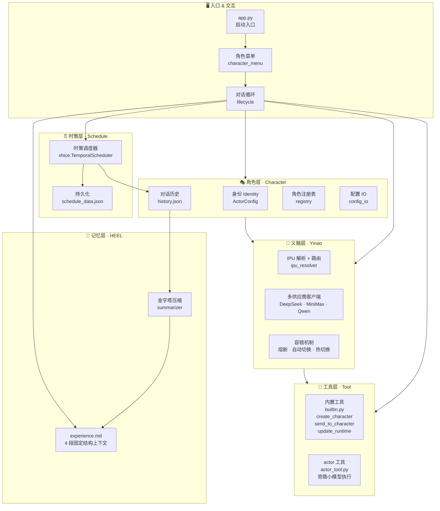

# 佳递叶思（Jardias）项目介绍

**[English Version](README_en.md)** | 中文版

## 特色功能示例指令：

### 自触发深度精炼
你创建一个角色2跟你讨论【价值的本质是什么】，直到你们达成共识，向我汇报。

### 双角色自我手术
你创建一个角色3，然后跟他讨论你们的详细配置，选择一个修改，然后对方验证修改的效果。

### 记忆管理
刚才那个话题你转为摘要，以避免占用上下文。
之前你摘要的话题，回忆一下，我想继续聊细节。
角色2，你跟角色1讨论一下我刚才跟他聊的内容。

### 语义调度
30秒后每15秒发送一个科学家名字给我（角色注意到缺少次数边界，主动询问）
20秒后，每隔1秒随便说一个水果，如果累计错过2次（比如网络延迟），剩下的就改为间隔10秒一次，总共10次。错过漏发的水果在第一次发现时与当次水果一起补发。
15秒后，每隔10秒随便说一个地名，持续20次，或者直到我开始准备休息的时候。

### 串联

（用户先对角色1说：）**50秒**后，每隔**2秒**随便说一个糖果，如果累计错过1次（比如网络延迟），剩下的就改为间隔10秒一次，总共10次。错过漏发的糖果在第一次发现时与当次糖果一起补发。
30秒后每15秒发送一个科学家名字给我
15秒后，每隔10秒随便说一个地名，持续20次，或者**直到我说停下**的时候。
你**创建**一个角色2（名字你决定，不要用现有角色）跟你讨论【价值的本质是什么】，直到你们达成共识，向我汇报。
刚才的3个定时任务测试和价值本质讨论这两个话题你分别归档，以避免占用上下文。
你说说在归档状态下对前面两个话题的记忆是怎么样的
你创建一个角色3（名字你决定，不要用现有角色），然后跟他讨论你们的详细配置，选择一个修改，然后对方验证修改的效果。
之前你摘要的【价值的本质是什么】话题，回忆一下
角色3，你问一下角色1我今天总共跟他聊过哪些内容，然后跟我说说你的感想。

> [演示说明文档](library/参考/演示场景.md)
> [运行输出示例](library/参考/运行输出示例/)
> 实际运行录屏（待补充）
> [差异对比](library/参考/Jardias%20与主流%20Agent%20框架、平台对比.md)

## 已验证场景

`library/参考/运行输出示例/` 收录了特色能力的实际运行记录，以及串联场景产生的历史、经验、配置和摘要文件。它们用于展示参考实现的行为，不代表系统已经具备生产级实时性或并发能力。

| 能力 | 运行证据 |
|---|---|
| 自触发深度精炼 | [自触发深度精炼](library/参考/运行输出示例/自触发深度精炼.log) |
| 双角色自我手术 | [双角色自我手术](library/参考/运行输出示例/双角色自我手术.log) |
| IPU 自动切换 | [自动切换 IPU](library/参考/运行输出示例/自动切换IPU.log) |
| 时策：歧义与边界确认 | [歧义、边界确认](library/参考/运行输出示例/时策/歧义、边界确认.log) |
| 时策：无错过执行 | [场景 A](library/参考/运行输出示例/时策/场景A-无错过和模式切换.log) |
| 时策：部分错过补偿 | [场景 B](library/参考/运行输出示例/时策/场景B-错过部分无切换.log) |
| 时策：动态模式切换 | [场景 C](library/参考/运行输出示例/时策/场景C-角色操作切换.log) |
| 时策：全部错过补偿 | [场景 D](library/参考/运行输出示例/时策/场景D-全部错过.log) |
| 时策：自然语言动态干预 | [动态干预](library/参考/运行输出示例/时策/动态干预.log) |
| 多角色串联与持久化记忆 | [串联场景示例](library/参考/运行输出示例/串联场景示例/) |


## Quick Start

```bash
git clone https://github.com/L-aaaaaaa/Jardias.git
cd jardias

# 创建虚拟环境
python -m venv venv

# Windows
venv\Scripts\activate
# Linux / macOS
source venv/bin/activate

# 推荐：可编辑安装 + 开发依赖（pytest / ruff / mypy）
pip install -e .[dev]

# 备选（旧式 pip-only 流程）：
# pip install -r requirements.txt   # 注意：版本号会比 pyproject.toml 更松

# 至少配置一个 LLM 供应商的 API Key
cp .env.example .env
# 编辑 .env，填入你的 API Key

# 跑起来
python app.py
```

> 详细说明见 [运行和开发提示文档](library/参考/运行和开发提示.md)

**依赖**：`openai>=1.30,<2.0`，`pydantic>=2.5,<3.0`（以 [`pyproject.toml`](pyproject.toml) 为准）
**Python 版本**：≥ 3.10

> 推荐安装：`pip install -e .[dev]`（获得 pytest / ruff / mypy 完整开发依赖）。
> `requirements.txt` 仅保留最小子集，兼容旧式 `pip install -r`，**版本号可能更松**。

> **首次使用**：`git clone` 后 `character_data/` 是空的。直接 `python app.py` 会进入交互式菜单，按提示创建第一个角色即可；亦可用 `python app.py --list` 查看已注册角色。
> 详细说明见 [运行和开发提示文档](library/参考/运行和开发提示.md)。

---

## 项目概述

**Jardias（佳递叶思）**——Just A Rather Dimension-Free-Updating Intelligent Actor System.

> It doesn't fly, it doesn't fight. But it keeps updating to break the dimensional wall.

Jardias 是一套 Agent 框架的参考实现，展示自主协作、记忆管理、语义驱动调度等能力的构造性证明。适合研究、实验和二次开发。当前Jardias实现是一个让 AI 不只是回答问题，而是自主协作、记忆成长、时间感知的认知主体框架，最大程度做好底层抽象，为将来的系统进化提供开放接口。

## 命名体系

根据《命名即架构》（[library/参考/命名即架构.md](library/参考/命名即架构.md)），命名决定了我们对架构的理解（反向同样成立），错误的命名会限制我们突破旧有范式，因此本项目执行以下命名重构方案：

| 原始术语 | 重构后术语 | 说明 |
|---|---|---|
| AI Model（AI 模型） | 智能基元（IPU） | Intelligence Primitive Unit |
| 模型调用管理模块 | 义脑（Yinao） | IPU 路由 + 供应商抽象层 |
| Token（矢量文本） | 物理单位 token，价值单位：智点（ICP） | Intelligence Credit Point |
| Pixel Patch（矢量像素） | 物理单位 Pixel Patch，价值单位：智点 | 与 token 统一计量 |
| AI Agent（智能体） | 智能体 / 智能演员（AI Actor） | 强调自主行动能力 |
| AI Agent System（智能体系统） | 智能体系统 / 智能演员系统（AI Actor System） | — |
| 扮演具体设定的智能体 | 角色（character） | 使用时直接称呼具体角色名 |

> 用**地球**作为**坐标系原点**计算太阳系**天体运动**，不是不行，而是**计算会很复杂**。反之如果肯承认地球和人类不是宇宙的中心，很多事会变得非常简洁。
>
> 【Harness Engineering】这个命名让人误以为智能体应该以大模型为中心打补丁，而不是把模型作为众多可替换的零件之一，这是命名导致范式无法跃迁的绝佳展示。

## 系统架构



## 分层

| 层 | 职责 |
|---|---|
| CLI 入口 | 启动、角色选择、对话循环 |
| 角色层 | 身份管理、对话历史、多角色编排、配置即记忆 |
| 义脑层 | 多供应商抽象、IPU 路由、容错热切换（不重启换模型） |
| 工具层 | 内置工具 + `@actor_tool` 装饰器旁路执行 |
| 记忆层 | HEEL 4 段固定上下文，金字塔压缩 L1→L2→L3，上下文占用 O(1) |
| 时策层 | LLM 语义驱动调度，错过补偿、动态干预 |

---

## 设计原则

**组合优于继承**
项目代码截至目前零自定义继承。功能通过组合工具、策略表、装饰器实现，避免深层继承链带来的耦合。

**策略表代替 if-elif**
用 Python dict 做分发表，将"条件 → 行为"映射显式化。例如 IPU 供应商路由、工具调度都采用此模式——新增能力只需加一行映射，不动现有逻辑。

**文本优先测试**
AI 辅助编程中，模型输出的语义正确性比代码覆盖率更重要。优先检查终端输出、日志记录、对话流程的完整性；稳定模块辅以单元测试。

---

## 理论支撑（点文章名跳转）

Jardias 不只提供实现，还有一套持续完善的架构理论，源自八篇核心论文（全部发表在 Zenodo，可独立引用）。

### 论文（预印本）

| 编号 | 中文标题（点名字跳转） | DOI | 介绍 |
|:---:|---|---|---|
| 1 | [HEEL：面向持久化 Agent 的状态中心自传体记忆架构](library/论文/zh/1.HEEL.md) | [10.5281/zenodo.19851563](https://doi.org/10.5281/zenodo.19851563) | 记忆模块如何分层才足够稳定 |
| 2 | [时策：从规则预编译到运行时推理的语义驱动时间调度范式](library/论文/zh/2.时策.md) | [10.5281/zenodo.21427649](https://doi.org/10.5281/zenodo.21427649) | 角色作为定时任务的策略层 |
| 3 | [自指涉 Agent：当配置成为记忆](library/论文/zh/3.配置即记忆.md) | [10.5281/zenodo.21427657](https://doi.org/10.5281/zenodo.21427657) | 当角色能够修改自身配置会有什么不同 |
| 4 | [长程任务与关注域：认知资源管理的第二条正交原则](library/论文/zh/4.长程任务与关注域.md) | [10.5281/zenodo.21427659](https://doi.org/10.5281/zenodo.21427659) | 如何像计算机内存一样管理记忆 |
| 5 | [AIOS 认知内核：接口规范与迭代框架](library/论文/zh/5.AIOS.md) | [10.5281/zenodo.21427661](https://doi.org/10.5281/zenodo.21427661) | 统一框架，定义 HEEL、时策、配置即记忆、角色-分身-义脑解耦四个升维模块及接口规范 |
| 8 | [破壁原理：维度混叠的结构性脆弱性](library/论文/zh/8.破壁原理.md) | [10.5281/zenodo.20278747](https://doi.org/10.5281/zenodo.20278747) | 认知决策框架——如何通过策略升维打破次元壁 |
| 10 | [维度自由更新论：信念修正的递归维度跃迁](library/论文/zh/10.维度自由更新论.md) | [10.5281/zenodo.20155165](https://doi.org/10.5281/zenodo.20155165) | 范式创新的可操作工程框架——递归嵌套贝叶斯更新。 |
| 12 | [Actor Context Protocol：上下文标准协议](library/论文/zh/12.Actor%20Context%20Protocol.md) | Chen, Z. (2026). Actor Context Protocol (ACP) — Design Draft. Zenodo. [10.5281/zenodo.21429417](https://doi.org/10.5281/zenodo.21429417) | 为多角色协作建立统一的上下文交互规范，解决角色间消息路由和状态同步问题 |

### 参考文档

| 文档 | 核心内容 | 用途 |
|---|---|---|
| [命名即架构](library/参考/命名即架构.md) | 术语重构方案（IPU/义脑/智点/角色/分身等） | 理解项目命名体系为何如此设计 |
| [上下文结构设计](library/参考/上下文结构设计.md) | HEEL 四层结构的 prompt 工程实现 | 参考系统提示词模板 |
| [能力差距对照表](library/参考/能力差距对照表.md) | 与 LangChain/CrewAI/AutoGen/MemGPT 的逐项对比 | 回答"为什么需要这个项目" |
| [Jardias 与主流 Agent 框架对比](library/参考/Jardias%20与主流%20Agent%20框架、平台对比.md) | 技术选型参考矩阵 | 判断项目适用场景 |
| [应用参考](library/参考/应用参考.md) | 典型使用场景分类 | 指导如何用好框架 |
| [运行和开发提示](library/参考/运行和开发提示.md) | 环境配置、调试方法、开发指南 | 开发参考 |
| [演示场景](library/参考/演示场景.md) | 特色功能的中文使用说明 | 新用户快速上手 |
| [运行输出示例](library/参考/运行输出示例/) | 角色协作、记忆管理、IPU 切换、时策调度的实际运行记录及持久化数据 | 验证架构行为、复现实验场景 |

### 论文辅助参考

| 文档 | 说明 |
|---|---|
| [理论架构与工程实例的映射报告](library/参考/理论架构与工程实例的映射报告.md) | 运行日志对八篇核心论文及相关 MVP 设计的逐项映射 | 理解理论主张与工程证据的对应关系 |
| [论文阅读指南](library/论文/论文阅读指南.md) | 论文阅读顺序建议及核心概念速查 |

> 全部论文、参考文档和运行输出示例见 [library/](library/)

---

## 项目结构

```
jardias/
├── app.py              # 启动入口
├── requirements.txt    # 依赖清单
├── character/          # 角色层：身份管理、对话历史、多角色编排
├── yinao/              # 义脑层：IPU 路由、多供应商客户端、容错
├── tool/               # 工具层：内置工具、@actor_tool 装饰器
├── common/             # 公共模块
├── schedule/           # 时策系统的时间规划层：语义驱动调度器
├── playbook/           #时策系统的任务策略层 剧本/工作流定义
├── data_shape/         # 数据结构定义
├── doc/                # 开发文档
├── library/            #  论文、参考文档与运行输出示例
├── logs/               # 运行日志
├── meta/               # 开源合规（LICENSE / CLA / CONTRIBUTING）
└── tests/              # 测试
```

---

## 开源协议

- **代码**：[Apache License 2.0](meta/LICENSE-CODE)
- **论文与文档**：[CC BY-NC-SA 4.0](meta/LICENSE-PAPERS)

贡献前请阅读 [CONTRIBUTING](CONTRIBUTING.md) 并签署对应的 [CLA](CLA-INDIVIDUAL)。

> 协议文档（[meta/LICENSE-CODE](meta/LICENSE-CODE)、[meta/LICENSE-PAPERS](meta/LICENSE-PAPERS)）

## 路线图

当前阶段：**参考实现（Reference Implementation）**——核心机制可运行、可验证，但非生产就绪。

当前 `library/` 已收录角色协作、持久化记忆、IPU 热切换、时策边界确认、错过补偿和动态干预等场景的运行输出。这些材料用于构造性验证，不代表系统已经具备工业级实时性、并发能力或生产可靠性。时策尤其不适合硬实时和高频大规模调度；语义判断质量也会受到底层 IPU 能力影响。