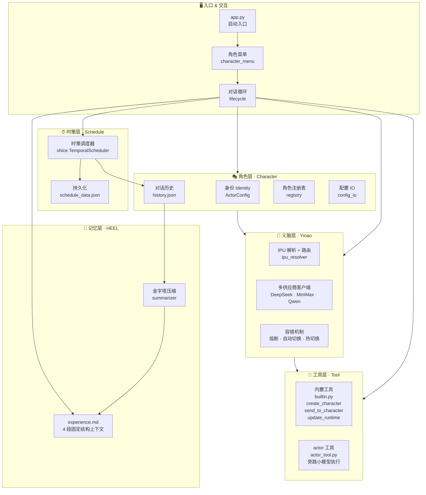

# Jardias项目介绍

## 特色功能示例指令：

### 自触发深度精炼
你创建一个角色2跟你讨论【价值的本质是什么】，直到你们达成共识，向我汇报。

### 双角色自我手术
你创建一个角色3，然后跟他讨论你们的详细配置，选择一个修改，然后对方验证修改的效果。

### 记忆管理
刚才那个话题你转为摘要，以避免占用上下文。
之前你摘要的话题，回忆一下，我想继续聊细节。
角色2，你跟角色1讨论一下我刚才跟他聊的内容。

### 语义调度
30秒后每15秒发送一个科学家名字给我（角色注意到缺少次数边界，主动询问）
20秒后，每隔1秒随便说一个水果，如果累计错过2次（比如网络延迟），剩下的就改为间隔10秒一次，总共10次。错过漏发的水果在第一次发现时与当次水果一起补发。
15秒后，每隔10秒随便说一个地名，持续20次，或者直到我开始准备休息的时候。

### 串联

（用户先对角色1说：）**60秒**后，每隔**2秒**随便说一个糖果，如果累计错过1次（比如网络延迟），剩下的就改为间隔10秒一次，总共10次。错过漏发的糖果在第一次发现时与当次糖果一起补发。
30秒后每15秒发送一个科学家名字给我
15秒后，每隔10秒随便说一个地名，持续20次，或者**直到我说停下**的时候。
你**创建**一个角色2（名字你决定，不要用现有角色）跟你讨论【价值的本质是什么】，直到你们达成共识，向我汇报。
刚才的定时任务测试和价值本质讨论这两个话题你分别归档，以避免占用上下文。
你说说在归档状态下对前面两个话题的记忆是怎么样的
你创建一个角色3（名字你决定，不要用现有角色），然后跟他讨论你们的详细配置，选择一个修改，然后对方验证修改的效果。
之前你摘要的【价值的本质是什么】话题，回忆一下
角色3，你问一下角色1我今天总共跟他聊过哪些内容，然后跟我说说你的感想。

> [演示说明文档](library/演示场景.md)
> [真实运行输出](logs/)
> 实际运行录屏（链接）
> [差异对比](library/Jardias 与主流 Agent 框架、平台对比.md)


## Quick Start

```bash
git clone https://github.com/L-aaaaaaa/Jardias.git
cd jardias

# 创建虚拟环境
python -m venv venv

# Windows
venv\Scripts\activate
# Linux / macOS
source venv/bin/activate

pip install -r requirements.txt

# 至少配置一个 LLM 供应商的 API Key
cp .env.example .env
# 编辑 .env，填入你的 API Key

# 跑起来
python app.py
```

> 详细说明见 [运行和开发提示文档](library/运行和开发提示.md)

**依赖**：`openai>=1.0.0`, `pydantic>=2.0.0`
**Python 版本**：≥ 3.10

---

## 项目概述

**Jardias（佳递叶思）**——Just A Rather Dimension-Free-Updating Intelligent Actor System.

> It doesn't fly, it doesn't fight. But it keeps updating to break the dimensional wall.

Jardias 是一套 Agent 框架的参考实现，展示自主协作、记忆管理、语义驱动调度等能力的构造性证明。适合研究、实验和二次开发。当前Jardias实现是一个让 AI 不只是回答问题，而是自主协作、记忆成长、时间感知的认知主体框架，最大程度做好底层抽象，为将来的系统进化提供开放接口。

## 命名体系

根据《命名即架构》（[library/命名即架构.md](library/命名即架构.md)），命名决定了我们对架构的理解（反向同样成立），错误的命名会限制我们突破旧有范式，因此本项目执行以下命名重构方案：

| 原始术语 | 重构后术语 | 说明 |
|---|---|---|
| AI Model（AI 模型） | 智能基元（IPU） | Intelligence Primitive Unit |
| 模型调用管理模块 | 义脑（Yinao） | IPU 路由 + 供应商抽象层 |
| Token（矢量文本） | 物理单位 token，价值单位：智点（ICP） | Intelligence Credit Point |
| Pixel Patch（矢量像素） | 物理单位 Pixel Patch，价值单位：智点 | 与 token 统一计量 |
| AI Agent（智能体） | 智能体 / 智能演员（AI Actor） | 强调自主行动能力 |
| AI Agent System（智能体系统） | 智能体系统 / 智能演员系统（AI Actor System） | — |
| 扮演具体设定的智能体 | 角色（character） | 使用时直接称呼具体角色名 |

> 用**地球**作为**坐标系原点**计算太阳系**天体运动**，不是不行，而是**计算会很复杂**。反之如果肯承认地球和人类不是宇宙的中心，很多事会变得非常简洁。
>
> 【Harness Engineering】这个命名让人误以为智能体应该以大模型为中心打补丁，而不是把模型作为众多可替换的零件之一，这是命名导致范式无法跃迁的绝佳展示。

## 系统架构



## 分层

| 层 | 职责 |
|---|---|
| CLI 入口 | 启动、角色选择、对话循环 |
| 角色层 | 身份管理、对话历史、多角色编排、配置即记忆 |
| 义脑层 | 多供应商抽象、IPU 路由、容错热切换（不重启换模型） |
| 工具层 | 内置工具 + `@actor_tool` 装饰器旁路执行 |
| 记忆层 | HEEL 4 段固定上下文，金字塔压缩 L1→L2→L3，上下文占用 O(1) |
| 时策层 | LLM 语义驱动调度，错过补偿、动态干预 |

---

## 设计原则

**组合优于继承**
项目代码截至目前零自定义继承。功能通过组合工具、策略表、装饰器实现，避免深层继承链带来的耦合。

**策略表代替 if-elif**
用 Python dict 做分发表，将"条件 → 行为"映射显式化。例如 IPU 供应商路由、工具调度都采用此模式——新增能力只需加一行映射，不动现有逻辑。

**文本优先测试**
AI 辅助编程中，模型输出的语义正确性比代码覆盖率更重要。优先检查终端输出、日志记录、对话流程的完整性；稳定模块辅以单元测试。

---

## 理论支撑

Jardias 不只提供实现，还有一套持续完善的架构理论。已完成的文档：

| 文档 | 核心观点 | 解决的实际问题 |
|---|---|---|
| [命名即架构](library/命名即架构.md) | 术语重构影响范式突破能力 | 为什么 Jardias 不用"模型"这个词 |
| [上下文结构设计](library/上下文结构设计.md) | 记忆按加工状态分层 | 为什么对话再多也不炸上下文 |
| [能力差距对照表](library/能力差距对照表.md) | 与主流框架能力对比 | 为什么需要这个项目 |
| [Jardias 与主流 Agent 框架对比](library/Jardias%20与主流%20Agent%20框架、平台对比.md) | 技术选型参考 | 这个项目适合什么场景 |
| [应用参考](library/应用参考.md) | 典型使用场景 | 怎么用好这个框架 |

更多理论文档（HEEL、时策、破壁定理等）正在陆续整理中。

> 全部理论文档见 [library/](library/)

---

## 项目结构

```
jardias/
├── app.py              # 启动入口
├── requirements.txt    # 依赖清单
├── character/          # 角色层：身份管理、对话历史、多角色编排
├── yinao/              # 义脑层：IPU 路由、多供应商客户端、容错
├── tool/               # 工具层：内置工具、@actor_tool 装饰器
├── common/             # 公共模块
├── schedule/           # 时策系统的时间规划层：语义驱动调度器
├── playbook/           #时策系统的任务策略层 剧本/工作流定义
├── data_shape/         # 数据结构定义
├── doc/                # 开发文档
├── library/            # 理论文档
├── logs/               # 运行日志
├── meta/               # 开源合规（LICENSE / CLA / CONTRIBUTING）
└── tests/              # 测试
```

---

## 开源协议

- **代码**：[Apache License 2.0](meta/LICENSE-CODE)
- **论文与文档**：[CC BY-NC-SA 4.0](meta/LICENSE-PAPERS)

贡献前请阅读 [CONTRIBUTING](meta/CONTRIBUTING) 并签署对应的 [CLA](meta/CLA-INDIVIDUAL)。

> 协议文档（[meta/LICENSE-CODE](meta/LICENSE-CODE)、[meta/LICENSE-PAPERS](meta/LICENSE-PAPERS)）

## 路线图

当前阶段：**参考实现（Reference Implementation）**——核心机制可运行、可验证，但非生产就绪。
