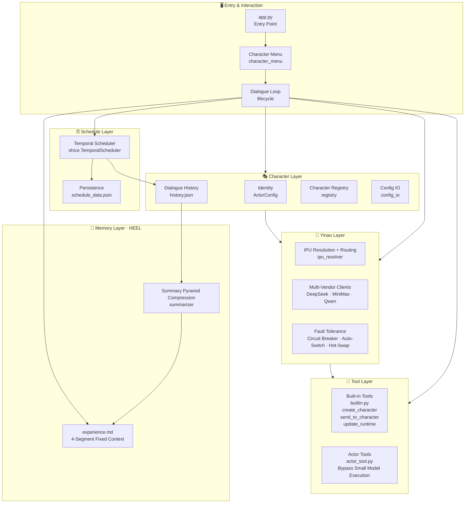

# Jardias（佳递叶思） Project Introduction

**[中文版](README.md)** | English Version

## Featured Function Demo Commands:

### Self-Triggered Deep Refinement
Create a character 2 to discuss with you about [What is the essence of value?] until you reach consensus, then report to me.

### Dual-Character Self-Surgery
Create a character 3, then discuss your detailed configurations with them, choose one to modify, and have the other verify the modification's effect.

### Memory Management
Summarize that topic to avoid consuming context space.
Recall the topic you just summarized—I want to discuss the details.
Character 2, discuss with character 1 what I was just talking about.

### Semantic Scheduling
Every 15 seconds, send me a scientist's name (30 seconds from now). Note: Character should proactively ask about missing count boundaries.
Every 1 second, say a random fruit name (starting in 20 seconds), for a total of 10 times. If you miss 2 cumulative times (e.g., network delay), change the interval to 10 seconds for the rest. Missed fruits should be supplemented along with the current fruit when first discovered.
Every 10 seconds, say a random place name (starting in 15 seconds), for 20 times, or until I prepare to rest.

### 串联 (Chaining)

(User first says to character 1:) Every 2 seconds, say a random candy name (starting in 60 seconds), for a total of 10 times. If you miss 1 cumulative time (e.g., network delay), change the interval to 10 seconds for the rest. Missed candies should be supplemented along with the current candy when first discovered.
Every 15 seconds, send me a scientist's name (starting in 30 seconds).
Every 10 seconds, say a random place name (starting in 15 seconds), for 20 times, or **until I say stop**.
Create a character 2 (name your choice, don't use existing characters) to discuss with you about [What is the essence of value?] until you reach consensus, then report to me.
Archive those two topics—the scheduled task test and the value essence discussion—separately to avoid consuming context.
Tell me how your memory of those two topics looks in their archived state.
Create a character 3 (name your choice, don't use existing characters), then discuss your detailed configurations with them, choose one to modify, and have the other verify the modification's effect.
Recall the [What is the essence of value?] topic you summarized earlier.
Character 3, ask character 1 what topics I've discussed with them today, then share your thoughts with me.

> [Demo Documentation](library/参考/演示场景.md)
> [Actual Run Logs](logs/)
> [Live Recording (link)](#)
> [Comparison](library/参考/Jardias%20与主流%20Agent%20框架、平台对比.md)

---

## Quick Start

```bash
git clone https://github.com/L-aaaaaaa/Jardias.git
cd jardias

# Create virtual environment
python -m venv venv

# Windows
venv\Scripts\activate
# Linux / macOS
source venv/bin/activate

pip install -r requirements.txt

# Configure at least one LLM provider's API key
cp .env.example .env
# Edit .env and fill in your API key

# Run it
python app.py
```

> See [运行和开发提示文档](library/参考/运行和开发提示.md) for detailed instructions.

**Dependencies**: `openai>=1.0.0`, `pydantic>=2.0.0`
**Python Version**: ≥ 3.10

---

## Project Overview

**Jardias（佳递叶思）**——Just A Rather Dimension-Free-Updating Intelligent Actor System.

> It doesn't fly, it doesn't fight. But it keeps updating to break the dimensional wall.

Jardias is a reference implementation of an Agent framework, demonstrating constructive proofs of capabilities such as autonomous collaboration, memory management, and semantic-driven scheduling. Suitable for research, experimentation, and secondary development. The current Jardias implementation is a framework that enables AI to not just answer questions, but to be cognitive agents that autonomously collaborate, grow their memory, and perceive time—maximizing底层抽象 to provide open interfaces for future system evolution.

---

## Naming System

According to [Naming as Architecture](library/参考/命名即架构.md), naming determines our understanding of architecture (and vice versa). Incorrect naming limits our ability to break through old paradigms, so this project implements the following naming refactoring scheme:

| Original Term | Refactored Term | Explanation |
|---|---|---|
| AI Model | Intelligence Primitive Unit (IPU) | — |
| Model invocation management module | Yinao | IPU routing + vendor abstraction layer |
| Token | Physical unit: token; Value unit: Intelligence Credit Point (ICP) | — |
| Pixel Patch | Physical unit: Pixel Patch; Value unit: ICP | Unified measurement with token |
| AI Agent | AI Actor | Emphasizes autonomous action capability |
| AI Agent System | AI Actor System | — |
| AI agent playing a specific role | Character | Use specific character names directly |

> Using the **Earth** as the **coordinate system origin** to calculate **celestial body movements** in the solar system isn't impossible, but **the calculations become very complex**. Conversely, if we acknowledge that Earth and humans are not the center of the universe, many things become much simpler.
>
> The naming **[Harness Engineering]** leads people to believe that agents should be centered around large models with patches, rather than treating models as one of many replaceable components—this is an excellent demonstration of how naming prevents paradigm shifts.

---

## System Architecture



---

## Layer Responsibilities

| Layer | Responsibilities |
|---|---|
| CLI Entry | Startup, character selection, dialogue loop |
| Character Layer | Identity management, dialogue history, multi-character orchestration, configuration-as-memory |
| Yinao Layer | Multi-vendor abstraction, IPU routing, fault tolerance, hot-swap (change models without restart) |
| Tool Layer | Built-in tools + `@actor_tool` decorator for bypass execution |
| Memory Layer | HEEL 4-segment fixed context, pyramid compression L1→L2→L3, context footprint O(1) |
| Schedule Layer | LLM semantic-driven scheduling, missed-compensation, dynamic intervention |

---

## Design Principles

**Composition over Inheritance**
Zero custom inheritance in project code to date. Functions are implemented through composition of tools, strategy tables, and decorators, avoiding coupling from deep inheritance chains.

**Strategy Tables over if-elif**
Use Python dicts as dispatch tables, making "condition → behavior" mappings explicit. For example, IPU vendor routing and tool scheduling both use this pattern—adding new capabilities requires only one mapping line, without touching existing logic.

**Text-First Testing**
In AI-assisted programming, semantic correctness of model output matters more than code coverage. Prioritize checking terminal output, log records, and dialogue flow completeness; stabilize modules with unit tests.

---

## Theoretical Foundation

Jardias provides not just an implementation, but a continuously improving architectural theory derived from eight core papers (all published on Zenodo, independently citable).

### Papers (Preprints)

| # | Title | DOI | Description |
|:---:|---|---|---|
| 1 | [HEEL: A State-Centric Autobiographical Memory Architecture for Persistent Agents](library/论文/en/1.HEEL-en.md) / [中文版](library/论文/zh/1.HEEL.md) | [10.5281/zenodo.19851563](https://doi.org/10.5281/zenodo.19851563) | How to layer memory modules for sufficient stability |
| 2 | [Shícè: From Rule Pre-compilation to Runtime Reasoning](library/论文/en/2.时策-Temporal-Strategy-en.md) / [中文版](library/论文/zh/2.时策.md) | [10.5281/zenodo.21427649](https://doi.org/10.5281/zenodo.21427649) | Characters as the strategy layer for scheduled tasks |
| 3 | [Configuration as Memory: The Self-Referential Agent](library/论文/en/3.配置即记忆-Configuration-as-Memory.md) / [中文版](library/论文/zh/3.配置即记忆.md) | [10.5281/zenodo.21427657](https://doi.org/10.5281/zenodo.21427657) | What happens when characters can modify their own configuration |
| 4 | [Long-Horizon Tasks and Concentration Domain](library/论文/en/4.长程任务与关注域-Long-Horizon-Tasks-and-Concentration-Domain-en.md) / [中文版](library/论文/zh/4.长程任务与关注域.md) | [10.5281/zenodo.21427659](https://doi.org/10.5281/zenodo.21427659) | How to manage memory like computer memory |
| 5 | [AIOS Cognitive Kernel: Interface Specification](library/论文/en/5.AIOS-en.md) / [中文版](library/论文/zh/5.AIOS.md) | [10.5281/zenodo.21427661](https://doi.org/10.5281/zenodo.21427661) | Unified framework defining HEEL, Shícè, Configuration-as-Memory, and Character-FenShen-Yinao decoupling modules with interface specifications |
| 8 | [The Wall-Breaking Principle](library/论文/en/8.破壁原理-The-Wall-Breaking-Principle-en.md) / [中文版](library/论文/zh/8.破壁原理.md) | [10.5281/zenodo.20278747](https://doi.org/10.5281/zenodo.20278747) | Cognitive decision-making framework—how to break through dimensional walls via strategy ascension |
| 10 | [Dimension-Free Updatism](library/论文/en/10.维度自由更新论-Dimension-Free-Updatism-en.md) / [中文版](library/论文/zh/10.维度自由更新论.md) | [10.5281/zenodo.20155165](https://doi.org/10.5281/zenodo.20155165) | An actionable engineering framework for paradigm innovation—recursive nested Bayesian updates |
| 12 | [Actor Context Protocol (ACP): Context Standard Protocol](library/论文/en/12.Agent%20Context%20Protocol-en.md) / [中文版](library/论文/zh/12.Actor%20Context%20Protocol.md) | Chen, Z. (2026). Actor Context Protocol (ACP) — Design Draft. Zenodo. [10.5281/zenodo.21429417](https://doi.org/10.5281/zenodo.21429417) | Establishes unified context interaction standards for multi-character collaboration, solving inter-character message routing and state synchronization problems |

### Reference Documents

| Document | Core Content | Use Case |
|---|---|---|
| [Naming as Architecture](library/参考/命名即架构.md) | Terminology refactoring scheme (IPU/Yinao/ICP/Character/FenShen, etc.) | Understanding why the project naming system is designed this way |
| [Context Structure Design](library/参考/上下文结构设计.md) | HEEL 4-layer structure prompt engineering implementation | Reference system prompt template |
| [Capability Gap Comparison](library/参考/能力差距对照表.md) | Item-by-item comparison with LangChain/CrewAI/AutoGen/MemGPT | Answering "Why do we need this project?" |
| [Jardias vs Mainstream Agent Frameworks](library/参考/Jardias%20与主流%20Agent%20框架、平台对比.md) | Technical selection reference matrix | Determining project use cases |
| [Application Reference](library/参考/应用参考.md) | Typical usage scenario classification | Guiding how to use the framework well |
| [Run and Development Tips](library/参考/运行和开发提示.md) | Environment configuration, debugging methods, development guide | Development reference |
| [Demo Scenarios](library/参考/演示场景.md) | Chinese usage guide for featured functions | Quick start for new users |

### Paper Supplementary References

| Document | Description |
|---|---|
| [Theory-to-Implementation Mapping Report](library/论文/理论架构与工程实例的映射报告.md) | Run log item-by-item verification of all eight papers, confirming no conflicts between engineering implementation and theoretical design |
| [Paper Reading Guide](library/论文/论文阅读指南.md) | Suggested reading order for papers and quick reference for core concepts |

> All theoretical documents are in [library/](library/)

---

## Project Structure

```
jardias/
├── app.py              # Entry point
├── requirements.txt    # Dependencies
├── README.md           # Chinese version
├── README_en.md        # English version (this file)
├── character/          # Character layer: identity management, dialogue history, multi-character orchestration
├── yinao/              # Yinao layer: IPU routing, multi-vendor clients, fault tolerance
├── tool/               # Tool layer: built-in tools, @actor_tool decorator
├── common/             # Common modules
├── schedule/           # Schedule layer: semantic-driven scheduler
├── playbook/           # Playbook layer: task strategy, workflow definitions
├── data_shape/         # Data structure definitions
├── doc/                # Development documents
├── library/            # Theoretical documents
├── logs/               # Run logs
├── meta/               # Open source compliance (LICENSE / CLA / CONTRIBUTING)
└── tests/              # Tests
```

---

## Open Source License

- **Code**: [Apache License 2.0](meta/LICENSE-CODE)
- **Papers & Documentation**: [CC BY-NC-SA 4.0](meta/LICENSE-PAPERS)

Before contributing, please read [CONTRIBUTING](meta/CONTRIBUTING) and sign the corresponding [CLA](meta/CLA-INDIVIDUAL).

> License documents: [meta/LICENSE-CODE](meta/LICENSE-CODE), [meta/LICENSE-PAPERS](meta/LICENSE-PAPERS)

---

## Roadmap

Current stage: **Reference Implementation**—core mechanisms are runnable and verifiable, but not production-ready.

---

*This document is the English version. For the Chinese version, see [README.md](README.md).*
