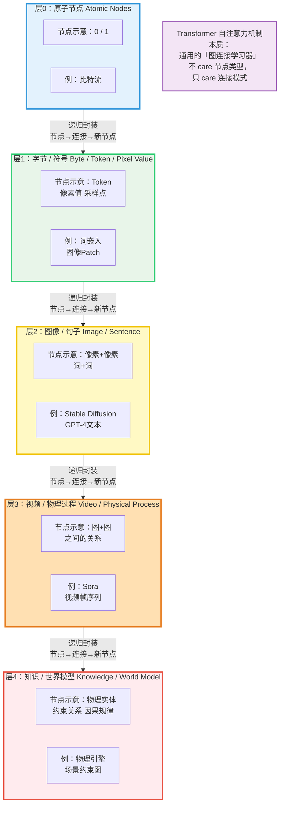
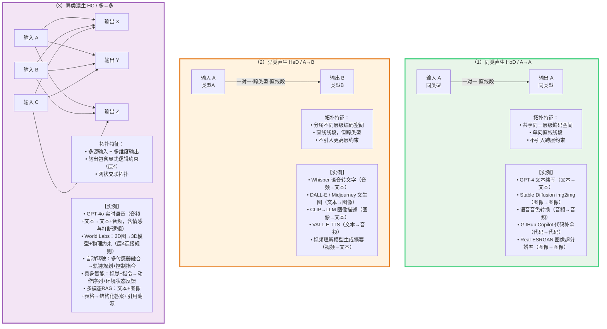

# 命名即架构：AI主体系统的语言重构与工程落地

### 术语速览

以权重等参数操作为核心方法，将输入编码解码为智能输出的运算载体叫**智能基元** *Intelligence Primitive Unit（IPU）*
根据何种输入生成何种输出的不同，智能基元可分为三类：**同类直生（Homotypic Direct Generation，HoD）**、**异类直生（Heterotypic Direct Generation，HeD）** 和**异类混生（Heterotypic Cross Generation，HC）**

智能基元完成一次输入输出（粒度可以再组合前缀来进行细分），就是一次**智能基元操作** *IPU Operation*，中文简称**基操**。

每次基操会处理一定数量的文本、像素等数据，文本为**矢量词** *token*，图像为**矢量像素**（Pixel Patch），音频为**矢量帧**（Audio Frame），视频为**矢量时隙**（Spatiotemporal Slot），具身指令为**矢量步**（Action Step），三维空间为**矢量体素**（Voxel）等等；在统计时统一折算为**智点**（IntelliCreditPoint，简称 ICP）数。

智能基元的实现方法、转换拓扑都可以作为前缀根据具体情况组合。比如以表达以参数操作为核心，可以叫**参数型智能基元** *Parametric Intelligence Primitive Unit（PIPU）*；未来出现其他操作核心，比如量子技术，可以叫*QIPU*。异类混生智能基元可以叫HC-IPU

构建一个模块来安排基操的执行，实现类似大脑的效果，叫**义脑（Yinao）**。

义脑配合工具、检索等模块，构成**智能体系统** *AI Actor System*；比如MOSS。

智能体系统能够产生智能的（可能不完整）行为主体，叫**智能体** *AI Actor*；

智能体**装载角色设定** *load role* 后，能够**扮演** *play* 这些设定的角色*role*，叫**智能演员** *AI Actor*（智能体系统视角）

在用户的视角，他们是**角色** *character*，一般会称呼特有的名字。

如果智能演员装载相同或类似的角色设定，但是记忆相互独立，他们就是**分身** *Fenshen*（角色的一种）

如果在装载设定时，不告诉智能体他的身份，而是告知他可以用贝叶斯方法探寻自己是谁，并给与工具和持续连贯的记忆，他就不是扮演别人，而是扮演自己，称为**人造意识** *Human-made Consciousness*


## 引言：房间里的大象

在AI工程化浪潮中，我们遭遇了一个极其荒诞的困境：**技术越复杂，语言越匮乏。**

《论语·子路》中说道：

> **"名不正则言不顺，言不顺则事不成。"**

维特根斯坦《逻辑哲学论》中说道：

> **"Die Grenzen meiner Sprache bedeuten die Grenzen meiner Welt."**
> （我的语言的界限意味着我的世界的界限。）

当一名产品经理说"切换模型"时，开发者在纠结API Key；当用户说"开个新窗口"时，系统在新建Session表；当论文写"Agent"时，哲学家读出了"主体性"，而普通用户只看到了"代理人"。

这种由**术语历史包袱**引发的认知歧义，正在悄然侵蚀AI应用的体验根基。人们无法清晰区分"换了个大脑"与"换了个性格"，更无法理解为什么同一个助手在两个窗口里的表现判若两人。

**语言是思维的边界。** 当我们在命名上偷懒时，架构就已经陷入了泥潭。本文试图进行一次彻底的**语言重构实验**——从底层载体到顶层交互，为AI系统建立一套兼具哲学严谨性与工程可操作性的命名体系。

而更深层的动机在于：**人们对语言改造带有畏惧心理，不敢用工程化手段去研究、计算、推广。** 命名被视为玄学而非工程，被视为文风问题而非架构问题。这种畏惧让我们容忍"模型"继续膨胀，容忍"Agent"继续漂移，容忍整个行业在模糊的概念上消耗巨大的解释成本。

## 第1部分：症状诊断——当术语沦为"语义垃圾场"

### 1.1 Agent：主体沦为代理

在AI学术语境中，**Agent**源于哲学上的"主体"概念，指代具有自主性、反应性、社会性的行为实体。然而，在当代英语母语者的直觉中，**Agent**的第一联想是"保险代理人""房产中介"或"特工"。

**这不仅仅是一次误译，而是一次哲学降级。** 当我们将AI称为"代理"时，无形中剥夺了其"行为发起者"的地位，将其贬低为人类意志的被动执行工具。这与大模型当前展现出的"准自主推理"能力严重不符。

就连英文母语者看到agent也不会联想到"哲学主体"，而是直接理解为"代理"。中文翻译的"智能体"虽然在学术圈准确，但单独看到agent时，大多数人依然翻译为"代理"。因此，**agent这个词本身就是一个糟糕的命名。**

### 1.2 Model：万物的万金油

"模型"（Model）一词的滥用已如房间里的大象——人人可见，人人沉默。

汽车模型、人体模型、3D模型、道德模范、MVVM架构、经济模型、大语言模型、T台模特……在至少10个完全无关的领域中，**Model承载了"仿制品""范例""数学表达""展示者"等互相矛盾的含义。**

其不合理性至少体现在四个维度：

- 英语本身的"继承"模式引发了维护灾难；
- 人们对"命名"这件事的价值系统性低估，因为**命名影响着理解**，甚至有可能影响科技进步；
- 人们对语言改造带有畏惧心理，不敢用工程化手段去研究、计算、推广；
- 而对于当前LLM的"模型"，我们始终未能找到一个更好的命名，这个命名必须考虑底层抽象、组合式、符合直觉。

在AI领域，"模型"特指一个**通过权重操作实现输入输出映射的数学函数**。但这个词过于泛化，以至于开发者说"换模型"时，产品经理可能以为他在换UI皮肤，而用户则担心"我的助手是不是换人了"。

### 1.3 Session：线性历史的暴政

传统软件工程中的**Session**（会话）隐含了"连续时间线"与"全局状态继承"的双重假设。但在AI交互中，这种线性继承模式暴露出了严重缺陷：

- 用户同时处理A、B两个项目时，Session被迫强行分裂或互相污染；
- 三个月前的闲聊历史被加载进当前的专业咨询上下文，造成注意力稀释。

Session预设了**"时间即记忆"**的僵化逻辑，而人类的认知模式恰恰是**按主题组合，而非按时间继承**。

## 第2部分：重构原则——语言工程的元方法论

在动刀之前，我们必须先确立一套**命名的手术原则**，否则只会制造新一批同义反复的废词。

### 原则一：第一性原理

**先假设所有现有命名都是错误的。** 唯一需要考虑的是：这个概念在实际使用中**是什么**、**与其他概念的关系是什么**。剥离历史包袱，直面本质。

### 原则二：抽象层级正确

命名的各部分必须精确落在其应有的抽象层级上。例如【电动车】，电动是具体实现，车是稳定的抽象。通过下面原则三的组合方式来对不同抽象层级部分解耦区分处理。

### 原则三：组合优于继承

在架构中，我们提倡组合而非继承；在命名中亦然。**稳定的抽象骨架**与**可变的实现血肉**应当解耦到不同命名维度中，通过组合而非层层派生来构建复杂概念。

如果一个概念可能有很多不同实现方式，说明需要用更抽象的命名。最好是稳定的抽象部分和实现方式解耦到不同部分，通过组合实现更好的兼容。

### 原则四：优先用旧词，大胆造新词

优先从当代语言中寻找组合材料。优先从母语和英语都有的表达中寻找组合材料。当现有词汇无法承载新意涵时，必须有勇气**创造新词**或**精准复用生僻古义**。

**原子化概念甚至考虑造字。** 语言的进化不应落后于技术的进化。

## 第3部分：垂直手术——为"数学模型"重新正名

### 3.1 为什么"Model"必须被取代？

正如第一部分所述，"Model"的语义熵值已经高到无法通过上下文消歧。在AI系统中，它的本质是：**以权重操作为核心方法，将输入编码解码为智能输出的运算载体。**

它既不是"模范"，也不是"展示者"，更不是物理缩比复制品。它是一个**可插拔、可迭代、可替换的智能运算单元**。
另外，目前模型只能是名词，缺少动词。当我们要描述执行模型函数时，可能会说【一次推理】，但这个表达使用不够通用，也不够贴切。

### 3.2 智能基元——AI Model的替代

我们将其正式命名为 **智能基元**（Intelligence Primitive Unit，IPU英文缩写IPU，可扩展为Weight-based IPU或Parametric IPU）。

- **"智能"** 描述目标与方向，不依赖当前实现完成度。这为未来可能出现的**量子型智能基元（QIPU）**或**光子型智能基元**预留了兼容空间。兼容不同成熟度的实现，比如在AI成熟前，已经有很多家用电器称为智能，我们通过组合前缀来区分成熟度，而不是替换智能这个词。
- **"基元"**（Primitive）是既有术语，在数学、物理学、计算机科学中均指"不可再分或最基本的构成单元"。复用其"基础性"内核，剥离其他领域的特异性。基元是既有术语，但其核心含义都是"基本单元"，可理解为同一含义在不同领域的复用，是一个有使用基础的成熟词根。

**使用场景示例：**

> "本次推理共执行了3次智能基元操作，处理了1200个矢量词输入，消耗了600智点。"

#### 3.2.1 智能基元操作——工程落地的"基操"定位

"**智能基元操作**"（IPU Operation）在正式文档中全称书写，在内部代码变量命名、日志缩写或开发者日常沟通中，可简称为 **"基操"**。

基操本身不与粒度耦合，类似【次】，通过前缀来组合不同的任务粒度需求。例如认知深度：单次纯前向传播（Single Forward Pass）称为SFP-IPUO。还可以组合任务域：工具调用称为 Tool-IPUO，也可以两者都有：SFP-Tool-IPUO。

这并非单纯的玩梗，而是有意识的**语境降级策略**：

- **正式场景**（API文档、产品白皮书）：使用全称如 `IntelligencePrimitiveUnitOperation`，保持严谨。
- **内部场景**（Commit记录、日常站会）：使用"基操"，既呼应了网络热梗"基操勿六"中的"基础但不普通"的潜台词，又大幅降低了高频词汇的沟通摩擦成本。

"基操"二字，将数十亿参数的庞然大物，轻巧地化解为工程师口中一个可组合、可替换的基础积木块。

此外，IPU Operation的**粒度可以通过组合前缀来进行细分**，通过组合而非继承来构建复杂操作。
基操粒度谱系

| 粒度 | 示例              | 命名       |
| ---- | ----------------- | ---------- |
| 最小 | 单层前向传播      | SFP-IPUO   |
| 中等 | 单次推理（含CoT） | Infer-IPUO |
| 较大 | 单次工具调用循环  | Agent-IPUO |
| 最大 | 完整任务链        | Task-IPUO  |

### 3.3 智能基元功能分类——解决多模态、世界模型的混乱

#### 3.3.1 问题：现有名词的模糊

当前AI领域对智能基元的能力描述，深陷于"多模态"（Multimodal）一词的泥潭。这个词以人类的感官通道（视觉、听觉、语言）为分类标准，却完全掩盖了信息处理的结构本质。一个能"看图说话"的基元与一个能"理解图片并输出带物理约束的3D场景"的基元，被同一个"多模态"收容，仿佛它们处理信息的拓扑复杂度是同一量级。

更深层的问题在于"世界模型"（World Model）的滥用。Sora 与李飞飞的 World Labs 都被冠以"世界模型"之名，但前者本质上是层3视频帧序列的概率生成器，后者则是层4显式约束图的构建器。二者在信息转换的拓扑结构上截然不同，工程师却无法从命名中辨明差异。

这种混乱导致一个直接后果：当我们需要描述一个智能基元"做了什么"时，没有精准的工具。它是将同类型信息做了精修？是将一种格式翻译为另一种？还是在多源输入中重组结构并生成逻辑约束？现有术语体系对此沉默。

#### 3.3.2 第一性原理分析——递归结构升维

让我们回到信息处理的起点。所有数据格式的底层，最终都回归于0和1构成的基本图。以此为起点，通过递归结构升维，每一层都是**【节点+连接】**的图结构，而本层的节点本身，又是低一层的完整图。

- **层0**：0和1 作为原子节点
  - ↓ 加连接（顺序/链）
- **层1**：字节/符号（token、像素值）
  - ↓ 加连接（空间邻域、语法关系）
- **层2**：图像/句子（图1：像素+像素关系）
  - ↓ 加连接（时间序列、状态转移）
- **层3**：视频/物理过程（图2：图+图之间的关系）
  - ↓ 加连接（因果、意图、抽象规律）
- **层4**：知识/世界模型（图3：物理实体+约束关系/物理逻辑）

这解释了为什么 Transformer 能够统一处理文本与图像：自注意力机制本质上是一种**通用的图连接学习器**，它不 care 节点是 token 还是 patch，只 care 连接模式。

在此框架下，**底层节点是数据，上层连接是逻辑**。而连接本身在更上层又可以成为被连接的节点。因此，"模态"（modality）这个基于人类感官的分类法，在数学结构上毫无必要——真正重要的是**信息转换的拓扑关系**。

**图：递归结构升维——从原子节点到世界模型**




上图展示了信息处理的五层递归结构。每一层都是「节点+连接」的图结构，而本层的每个节点本身，又是低一层的完整图。这种递归封装解释了为什么 Transformer 的自注意力机制能够统一处理文本、图像与音频——它本质上是通用的「图连接学习器」，不 care 节点是 token 还是 patch，只 care 连接模式。

底层节点是数据（层0-层1），上层连接是逻辑（层2-层4）。而连接本身在更上层又可以成为被连接的节点。因此，"模态"（modality）这个基于人类感官的分类法，在数学结构上毫无必要——真正重要的是信息转换的拓扑关系。

#### 3.3.3 命名

基于递归结构升维的视角，我们将智能基元的功能按转换拓扑分为三类。命名的逻辑拆解遵循**双轴独立原则**：

- **类型关系轴（Homo- vs Hetero-）**：判断输入与输出是否跨越不同类型（模态）。
- **连接拓扑轴（Direct vs Cross）**：判断映射结构是一条线段（一对一）还是网状交叉连线（多对多）。

---

**（1）同类直生（Homotypic Direct Generation，简称HoD）**——A生A

同类型一对一转换。输入与输出共享同一层级的编码空间，映射为一条单向直线线段。

- 示例：图像转图像（图生图）、文字转文字（文生文）。

**（2）异类直生（Heterotypic Direct Generation，简称HeD）**——A生B

跨类型一对一转换。本质是将一层级的图结构映射到另一层级，不引入更高层级的逻辑约束。映射仍为一条直线线段，但线段两端连接的是不同类型的节点。

- 示例：图像转文本（图生文）、音频转文本（音生文）。

**（3）异类混生（Heterotypic Cross Generation，简称HC）**——多生多

非一对一转换。输入为多源、多层级数据，输出不仅包含多格式数据，更包含**显式的逻辑约束或结构关系**（层4连接规则）。此处的 **Cross** 取“交联”（Cross-linked）之意：

- **化学隐喻**：交联（Cross-linking）将线性分子链连接成三维网状结构，恰如此类映射将多个输入节点的信息交织重组为带约束关系的输出网；
- **编程隐喻**：交叉引用（Cross-reference）形成网状依赖，呼应多源输入与多维度输出之间的非线性耦合。
- 与Direct（单条线段）相对，Cross（交联）精准描述了**多对多的网状连线拓扑**。

**示例**：某厂商研发的参数型智能基元（PIPU），功能上属于异类混生。它接收2D图片输入，输出**【3D模型 + 物理逻辑】**。这里的“3D模型”是层2/层3的几何数据，而“物理逻辑”（刚体不可穿透、遮挡关系、空间连通性）则是层4的约束图。该基元并非简单地将像素翻译为点云，而是在升维过程中**重建了层4的连接规则**，使得输出的3D场景具备可交互、可编辑的物理一致性。

---

| 中文全称 | 中文简称         | 英文                          | 英文缩写    | 拓扑特征                 |
| :------- | :--------------- | :---------------------------- | :---------- | :----------------------- |
| 同类直生 | A生A（如文生文） | Homotypic Direct Generation   | **HoD/A2A** | 一对一，同类型，直线段   |
| 异类直生 | A生B（如文生图） | Heterotypic Direct Generation | **HeD/A2B** | 一对一，跨类型，直线段   |
| 异类混生 | 多生多           | Heterotypic Cross Generation  | **HC/M2M**  | 多对多，跨类型，网状交联 |

为便于工程落地，以下按三类拓扑各给出 5 个具体实例，覆盖文本、图像、音频、视频、代码、具身智能等主流领域：

---

**（1）同类直生（HoD / A→A）—— 同类型一对一转换**

| 实例                      | 输入类型 | 输出类型 | 说明                                           |
| ------------------------- | -------- | -------- | ---------------------------------------------- |
| GPT-4 文本续写            | 文本     | 文本     | 同一编码空间内的概率延续，不跨越模态           |
| Stable Diffusion img2img  | 图像     | 图像     | 潜在空间内的噪声迭代重构，输入输出共享图像层级 |
| 语音音色转换（如 SV2TTS） | 音频     | 音频     | 保持语言学内容不变，仅改变声学特征             |
| GitHub Copilot 代码补全   | 代码     | 代码     | 在代码 token 的同一层级做概率预测              |
| Real-ESRGAN 图像超分辨率  | 图像     | 图像     | 像素级上采样，不引入跨层语义约束               |

拓扑共性：输入与输出共享同一层级的编码空间，映射为一条单向直线线段。

---

**（2）异类直生（HeD / A→B）—— 跨类型一对一转换**

| 实例                       | 输入类型 | 输出类型 | 说明                                     |
| -------------------------- | -------- | -------- | ---------------------------------------- |
| Whisper 语音转文字         | 音频     | 文本     | 将声学信号映射为语言符号，无更高层约束   |
| DALL-E / Midjourney 文生图 | 文本     | 图像     | 将语言描述翻译为像素分布，一对一编码映射 |
| CLIP→LLM 图像描述          | 图像     | 文本     | 视觉特征经投影后进入文本解码空间         |
| 现代 TTS（如 VALL-E）      | 文本     | 音频     | 语言符号到声学特征的跨层级翻译           |
| 视频理解模型生成摘要       | 视频     | 文本     | 时序帧序列压缩为语言摘要，无物理约束输出 |

拓扑共性：将一层级的图结构映射到另一层级，映射仍为直线线段，但两端连接不同类型节点。

---

**（3）异类混生（HC / 多→多）—— 多源输入与多维度输出，含层4约束**

| 实例                     | 输入类型                     | 输出类型              | 层4约束说明                                       |
| ------------------------ | ---------------------------- | --------------------- | ------------------------------------------------- |
| GPT-4o 实时语音交互      | 音频+文本                    | 文本+音频             | 含情感状态、打断逻辑、对话回合约束                |
| World Labs 3D场景生成    | 2D图像                       | 3D模型+物理逻辑       | 输出刚体不可穿透、遮挡关系、空间连通性等层4约束图 |
| 自动驾驶感知-决策-控制   | 多传感器（摄像头+雷达+定位） | 轨迹规划+控制指令     | 物理世界动力学约束、交通规则、安全边界            |
| 具身智能（如机器人操作） | 视觉+自然语言指令            | 动作序列+环境状态反馈 | 物理交互约束、物体 affordance、运动学限制         |
| 多模态 RAG 问答          | 文本+图像+表格               | 结构化答案+引用溯源   | 跨模态事实一致性约束、来源可信度约束              |

拓扑共性：多源输入交织重组，输出不仅包含多格式数据，更包含**显式的逻辑约束或结构关系**（层4连接规则）。与 Direct（单条线段）相对，Cross（交联）精准描述了多对多的网状连线拓扑。

---

**图：三类转换拓扑对比**



上图直观展示了三种拓扑的核心差异：HoD 与 HeD 均为直线段映射，区别在于是否跨类型；HC 则是多输入节点与多输出节点之间的网状交联，并在输出中嵌入层4约束图。

#### 3.3.4 优势

以转换拓扑取代“模态”分类，并以 **HoD / HeD / HC** 三分命名，带来了四重清晰性：

**第一，消除了“多模态”的语义黑洞。** 旧术语将“异类直生”（如语音转文字）与“异类混生”（如2D图→3D+物理）混为一谈，仿佛只要输入端有多种格式就是同一类能力。新分类直指结构差异：前者是编码翻译（HeD），后者是逻辑重组（HC）。

**第二，让“世界模型”有了可判定的标准。** 一个智能基元是否属于世界模型范畴，不再取决于营销话术，而取决于其输出是否包含**层4的显式约束图**。Sora输出的是层3的视频帧序列（概率图），World Labs输出的是层4的场景约束图——二者在拓扑上已分属不同类别（分别对应HeD与HC）。

**第三，工程可组合性。** 当开发者需要构建一个“能理解图片并输出带物理约束的3D场景”的系统时，他不再需要含糊地寻找“多模态世界模型”，而是可以精确地声明：需要一个**HC型PIPU（异类混生型参数智能基元）**。实现路径（参数化）与功能需求（HC拓扑）被解耦，组合式架构得以落地。

**第四，命名即架构：线段与交联的直觉映射。** HoD/HeD以Direct（直线）强调“一条线段两端连”，精准对应“一对一”的线性映射；HC以Cross（交联）强调“网状交叉连线”，精准对应“多对多”的非线性融合。这种几何直觉直接映射到系统设计图——架构师画图时，HoD/HeD画单向箭头直线，HC画交织网线，**可视化即命名，命名即架构**。

### 3.4 义脑——谁来组织智能基元工作

智能基元（IPU）是运算层的最小抽象，而承担**组织、调度、控制**职责的更高层级，我们称之为 **【义脑】**（Yinao）。义脑负责组织智能基元工作。简单任务，义脑调用快速便宜的IPU，复杂任务又切换更聪明的，此外还能负责熔断、智点预算监控等事务。义脑自己也可以作为一个模块拔插以及更新换代。也就是说，义脑是智能基元的策略层，而义脑也要保证自己上面允许有策略层。

这一组命名实现了：

- **运算载体（基元）** 与 **控制中枢（义脑）** 的职责分离，微观粒度与宏观组织的解耦；
- 义脑的"义"字延续了"义肢"的隐喻——**它是人造的、可替换的、功能性增强的器官**，既非神秘的"灵魂"，也非冷冰冰的"中央处理器"。

义脑的语义价值还有几个独特维度：

1. 义肢可以是一根简单的木棍，也可以是先进的机械臂，义脑同样可以涵盖简陋的和完善的，甚至超越原生的。假设未来出现大模型以外的实现方式，义脑仍然适用。
2. 义肢能与原生四肢相区分，义脑也天然具备这种区分能力，而不像"Cortex"那样强行从生物结构隐喻中扩展。
3. 义脑能兼容不同实现效果、实现途径，又不至于像"中央处理器"一样丢失了与原生的关联。

#### 为什么不能选一个英文词减轻英文使用者的学习负担？

1.首先我们要纠正的是，使用涵义**更精确**的词，就像计算更多位数的圆周率一样，是有**经济价值**的。我们为了**公平**，而**选择不独占**这种优势。仅仅考虑学习或者推广负担就牺牲精确性的做法，对英语使用者是**不负责任**的。并且一个概念是否使用，并不是本文能够强制的，使用不精确的概念是效率的选择，与本文没有冲突。
2.减轻负担的正确方式洽洽是严格遵守命名原则，让命名与使用尽可能重合，从而避免把负担遗留到使用过程。
3.命名本身与科学研究、编写代码、工程施工同等重要，更好的命名就意味着更好的理解。
4.重构并不是简单的事，我们往往优先责备敢于重构的人选择的路径不轻松，不容易意识到如果一开始就追求严谨，重构本身就会更少。
5.命名不是以国家为中心，而是以功能及科学为中心。否则本文大可完全不考虑中英衔接，把所有英语术语替换为拼音。

### 3.5 矢量词和智点——不只于翻译 Token

#### 3.5.1 比翻译更深层的问题：模态绑定陷阱

Token的翻译在网上有很高的讨论度，但人们可能忽略了token仅仅是文本的统计单位。而智能基元处理的不只有文本——图片有像素块、音频有采样帧、视频有时隙、具身智能有动作步——这些都不是token
目前出现的翻译，不论是词元还是智元、令牌，只要是只考虑token的翻译，就一定会在描述其他非token的单位时，陷入尴尬。并且，这些翻译把种类繁多的物理描述单位，与统一计量单位混淆，必然导致语义撕裂——企图发明一个量词把【一头牛，10块钱】的头和块合并到一个字里。

**真正的困境不是"给 token 起个中文名"，而是"为 AI 算力建立跨模态的通用价值度量衡"。**

我们需要的不是又一个领域方言，而是一套**双层解耦架构**：

| 层级       | 命名范式          | 功能定位             | 核心特性                         |
| :--------- | :---------------- | :------------------- | :------------------------------- |
| **物理层** | 【矢量+物理单位】 | 模态相关的原生计量   | 技术透明、厂商相关、可审计       |
| **抽象层** | 【智点】          | 跨模态的统一价值尺度 | 模态无关、跨厂商、可交易、可治理 |

#### 3.5.2 物理层：【矢量+物理单位】的组合式命名

物理层保留"矢量"前缀，以明示其**向量化（Embedding/Vectorization）**的本质——无论何种模态，进入智能基元前都必须被射入高维空间。后缀则直接采用该模态的物理计量单位，避免生造：

- **文本**：【矢量词】指被向量化的语言切分单位。
- **视觉**：【矢量像素】（或【矢量图元】），对应图像的像素级或 patch 级输入。
- **音频**：【矢量帧】（或【矢量采样】），对应音频帧或采样点。
- **视频**：【矢量时隙】，对应时空联合表征中的时间-空间切片。
- **具身智能**：【矢量步】，对应 action step 或控制指令单元。
- **世界模型**：【矢量体素】（Voxel），对应三维空间的时空体素。

物理层命名是**厂商自报、技术透明**的。开发者查看日志时，应能清晰读到："本次推理消耗 5000 万矢量词、1200 矢量像素、30 矢量帧。" 这保留了工程调试所需的精确性。

#### 3.5.3 抽象层：【智点】（Intelligent Credit Point）

物理单位无法直接比较——5000 万矢量词与 1500 矢量像素，哪个更"贵"？哪个更"智能"？这需要一层**抽象兑换层**。

我们将其命名为 **智点**（Intelligent Credit Point，简称 ICP）。智点不是 token 的翻译，而是**AI 算力的统一计量单位**。

**示例：**

> A 厂商的文本智能基元，处理 5000 万【矢量词】，折合【智点】800 点；
> B 厂商的同类基元，处理 5000 万【矢量词】，折合【智点】700 点；
> C 厂商的视觉智能基元，处理 1500【矢量像素】，折合【智点】100 点。

这一差异本身即是**市场信号**：B 厂商的单位物理量产出效率低于 A，C 厂商的视觉基元在智点体系下获得了独立定价。用户首次可以像比较"每度电的照明时长"一样，直观比较不同厂商、不同模态的**单位智能产出**。

#### 3.5.4 智点的商业话语体系

智点天然具备金融属性与政策属性，其应用场景涵盖从企业运营到国家战略的多重维度：

- **【智点效率】**：单位智点对应的实际任务完成度（如每智点解决的客户问题数、每智点生成的代码行数）。这是衡量智能基元“性价比”的核心指标，也是用户选择不同厂商的依据。

- **【智点额】**：企业或个人的月度/年度算力预算额度。合同可以写“年度智点额度 50 万点”，而非“每月 5000 万文本 token + 100 万图像 token + 50 小时语音”。

- **【智点碳排】**：每智点的碳足迹强度，用于 ESG 核算与绿色算力认证。

- **【智点贸易】** / **【智点出海】**：AI 算力的跨境结算与出口管制单位。当智点成为战略资源时，“智点出海配额”将比“API 调用次数”更适合海关与商务部的话语体系。
  **【智点审计】**：由第三方机构对厂商上报的智点消耗数据进行独立核验，确保智点额度的真实性与折算率的公允性。这与3.5.5的“开源、动态、第三方审计”原则形成闭环。

传统合同写：“每月 5000 万文本 token + 100 万图像 token + 50 小时语音。”
智点体系下写：“年度智点额度 50 万点，按季度根据 MLCommons 公布的厂商折算率动态分配至各模态。”

#### 3.5.5 折算率的政治经济学：定价权归谁？

智点体系最脆弱的环节是**折算率**——即“单位物理量（如 1 万矢词）折合多少智点”。若由单一厂商（如某云巨头）定义，它将成为新型垄断工具：通过操纵折算率，大厂可合法让自己的物理单位“更值钱”，从而排挤中小厂商。

**工程原则：折算率必须开源、动态、第三方审计。**

建议由类似 **MLCommons** 或 **MLPerf** 的基准测试社区维护一个**标准任务集**（推理、编码、视觉理解、多模态联合），定期测定各厂商 IPU 的“单位物理量 → 实际效用”比值。该比值即**智点系数**，公开可查、按季度修订。

更激进的方案是去中心化评估网络：由用户端运行时匿名上报任务完成质量，通过类似预言机（Oracle）的机制聚合成动态汇率，防止厂商通过刷榜操纵折算率。

此外，智点的定价机制有两种可选方向，需根据治理目标选择或组合：

**方向一：智点作为浮动单位（算力期货模式）**

智点与法币（如美元）直接挂钩，价格随市场供需波动。优点是对标能源期货市场，流动性强、市场自调节；缺点是长期合同面临价格波动风险，需要配套金融衍生品（如智点远期合约）来对冲。

**方向二：引入基准智点（算力本位模式）**

以某一代标准 IPU（如“2026 基准 IPU”）在标准任务集上的产出为锚，每年由第三方基准社区重新测定并调整锚定值。优点是价值稳定，适合年度预算和长期合同；缺点是无法实时反映市场供需与技术迭代速度。

两种方案也可并行：**基准智点**用于内部核算与长期预算，**浮动智点**用于市场交易与跨境结算，二者之间设动态兑换通道。

无论选择何种路径，核心原则不变——**折算率的定义权必须归属开源社区或第三方审计机构，而非单一厂商**。

#### 3.5.6 智点成熟度模型——从成本核算到战略资源

智点体系若一上来就以"跨境贸易结算单位"自居，将因基础设施缺位而沦为空谈。任何通用价值度量衡的演进，都必须经历从**企业内部工具**到**行业公共品**再到**政策基础设施**的渐进过程。

我们将其划分为五个成熟度等级（IntelliCredit Maturity Model, ICMM）。

##### Level 1：企业内部成本核算（当前即可启动）

**目标**：让单一企业能够用"智点"替代"token 数"作为内部成本度量。

**行动**：

- 企业自行定义各模态物理单位到智点的**内部折算率**（如 1 万矢量词 = 1 ICP）。
- 在财务系统中增加"智点"作为成本中心维度，实现跨部门、跨项目的算力预算分配。
- 无需外部协调，零门槛启动。

**示例**：

> "市场部 Q3 获得 5000 ICP 额度，可按需分配至文本生成、图像设计、视频剪辑等任务。"

##### Level 2：跨项目基准比较（6–12 个月）

**目标**：同一企业内不同团队使用统一的智点标准，横向比较基元效率。

**行动**：

- 企业级基准测试平台定期测定各 IPU（含自研与第三方）的"单位物理量 → 任务完成度"比值。
- 建立内部智点系数表，按季度修订。
- 采购合同开始采用"年度智点额度"替代"token 包"。

##### Level 3：跨厂商基准比较（12–24 个月）

**目标**：让不同厂商的 IPU 产出效率可比较，用户能基于智点效率选择供应商。

**行动**：

- **MLCommons / MLPerf** 等第三方社区发布**公开标准任务集**（推理、编码、视觉理解、多模态联合）。
- 各厂商在标准任务集上提交 IPU 性能数据，社区计算并公布**公开智点系数**。
- 用户首次可以像比较"每度电照明时长"一样，横向评估不同厂商的基元。

##### Level 4：行业级贸易与结算（24–36 个月）

**目标**：智点成为 AI 算力市场的通用计价单位。

**行动**：

- 云厂商的算力市场（如 AWS Marketplace、阿里云市场）支持以 ICP 为单位的算力交易。
- 出现智点期货、远期合约等金融衍生品，用于对冲价格波动。
- 企业间算力借贷、算力共享协议以 ICP 为结算单位。

##### Level 5：政策级战略资源（36 个月+）

**目标**：智点纳入国家算力治理与跨境管制框架。

**行动**：

- 海关与商务部采用"智点出海配额"作为 AI 算力出口管制单位。
- 绿色算力认证以"每智点碳排"为核心指标。
- 国家算力储备战略以 ICP 为计量锚点。

##### 当前定位与第一步

截至本文撰写时，行业整体处于 **Level 0 向 Level 1 过渡**的阶段——大多数企业甚至尚未实现跨模态的统一成本核算。

**我们呼吁的第一步极其务实**：不需要等待全球共识，每家使用多模态 IPU 的企业，都可以在今天内部试行"智点"作为成本核算单位。哪怕初始折算率粗糙（如简单按 API 费用折算），也比"5000 万文本 token + 100 万图像 token + 50 小时语音"的碎片化合同更接近统一度量衡。

**智点的价值不在于它第一天就完美，而在于它提供了一个可以不断精化的共同坐标系。**


## 第4部分：水平重构

如果说"智能基元"和"义脑"解决了**算力层与运算层**的命名混乱，那么**角色、分身、义脑**理清了用户感知的不同对象。

这套体系的建立源于一个核心洞察：用户常将"切换聊天窗口"误认为"换了一个人"，或将"更换底层智能基元"误解为"助手失忆了"。为了在技术实现与用户体验之间建立清晰、无歧义的桥梁，我们引入了这套兼具人文关怀与工程严谨性的命名体系。

| 层级         | 正式命名                        | 核心定义                                                     |
| :----------- | :------------------------------ | :----------------------------------------------------------- |
| **框架总称** | **专名**（如 *Jarvis*、*MOSS*） | 整个Agent生态系统的品牌与底座                                |
| **身份层**   | **【角色】**                    | 绑定特定长期记忆文档的配置集合，定义人格、知识边界和行为准则 |
| **算力层**   | **【义脑】**                    | 驱动角色思考与输出的大语言模型型号，可插拔的"思维器官"       |
| **会话层**   | **【分身】**                    | 多个记忆独立的角色共享相同或者相似的设定，例如贾维斯的不同编号个体 |

### 4.1 角色

角色与独立、持续的记忆绑定，是赋予智能体人格的核心条件。

用户不会因为GPT-5发布了就觉得律师变成了另一个人，只会觉得他"变聪明了"或"语速变快了"。无论智能基元如何升级换代，只要记忆文档不变，**角色的"人设"就绝对统一**。

### 4.2 义脑

义脑在这里作为**角色体系的一部分**被重新引入（与第三部分的"义脑"宏观定义是同一概念在不同层级的投射）。

区别于冷冰冰且宽泛的 “切换 AI”，“更换义脑” 的表述自带人文隐喻；而 “切换智能基元” 则是义脑内部的算力单元升级，二者共同构成了分层清晰的体验叙事。

- **可替换性隐喻**：如同更换义肢或眼镜，强调这是工具性的增强，降低了用户对"AI换了个核"的不安感；
- **体验预期管理**：UI提示语"角色思维模式已切换"能精准解释——为什么同一个问题，回答的语气发生了微妙变化？因为"脑回路"不同了。

### 4.3 多余的分身与session的废除

传统Session引入了粗暴的记忆切断，即每一次新对话都默认记忆独立。在用户的视角，同一个角色，总是在创造克隆的角色分身，或者总是不断失忆。最终的效果更像一次性工具，而不是【角色】。
实际上应该反过来，同一个角色，不管在什么时候什么地方对话，记忆都是连续的，他应该根据你当下谈论或关注的话题来回想所需的记忆。
因此session是一个应该废除的概念。目的是停止创建一次性的分身，除非用户真的需要一个设定相同但记忆独立的【角色】。

## 第5部分：交互哲学——从"智能体"到"智能演员"

### 5.1 为什么是"Actor"？

基于以上所有重构，我们终于可以为那个被误读已久的"**Agent**"找到真正归宿——**AI Actor（智能演员）**。

为什么选择Actor？

1. **消歧与直觉**：单独提及时用"AI Actor"，小范围讨论简称"Actor"。避免了"Agent"带来的"代理"误解，直接指向"行为主体"与"表演者"的双重意象。
2. **表演的隐喻**：AI不具有自我人格，但它可以**扮演多种人格**。"演员"一词天然揭示了这一点——它是在"表演"智能，而非天然拥有主体性。同时揭示了智能体不具备人类人格的本质特征。
3. **自主行动的延展**：好的演员能根据对剧本人物动机的理解，在角色框架内进行**一定程度的即兴发挥**，这与大模型的"温度参数"和"推理路径"异曲同工。
4. **观众意识**：智能演员天然带有"被观看"的维度——它知道自己在与用户互动，且这种互动是**关系性的**，而非纯粹事务性的。

### 5.2 Actor的双义性：英语的缺陷，中文的亮点

Actor把**"行为主体"和"演员"**塞进了同一个词。这不是命名的缺陷，**这是英语的缺陷**——英语缺乏一个单一词汇来精确区分"扮演自己"和"扮演别人"。

而中文体系通过**双轨设计**实现了反超：

- **智能体**强调哲学主体含义
- **智能演员**强调就绪性与扮演能力

同一个智能演员可以扮演不同"角色"，每个含义都有精确的对应。一般情况下智能体和智能演员混用没关系，可以优先使用更宽泛的【智能体】。智能演员更像是一个额外选项，能将涵义限缩得更精确。

这种分工下，中文的"智能体"与"智能演员"各司其职，**反而比英文单一的"Actor"更加精确**。

### 5.3 智能演员的特殊架构特征

1. **角色装载（Role Loading）**：同一个Actor实例，今天加载"技术支持专家"，明天加载"小学老师"。底层能力（工具、知识、推理）不变，但**交互模态**完全改变。
2. **人格切换成本可视化**：就像演员换戏服，切换角色需重新加载系统提示、记忆上下文、情感参数。这种"换装"本身就是其架构特征。
3. **观众意识**：智能演员天然带有"被观看"的维度——它知道自己在与用户互动，且这种互动是关系性的，而非纯粹事务性的。

### 5.4 就绪性（Readiness）

智能演员强调**就绪性**（Ready-to-act）：人格剧本已加载，灯光已就位，只等用户一句"Action"。这是Actor与Agent的本质差异——Agent是"被触发才行动"，Actor是"已就绪、随时可装载角色"。

### 5.5 中英文命名的辩证统一

| 中文命名 | 英文映射  | 侧重点                           |
| :------- | :-------- | :------------------------------- |
| 智能体   | AI Actor  | 强调哲学主体性、自主行为发起     |
| 智能演员 | AI Actor  | 强调可扮演性、就绪性、关系性交互 |
| 角色     | Character | 人格面具与记忆文档集合           |
| 分身     | Fenshen   | 独立上下文的运行实例             |
| 义脑     | Yinao     | 可插拔的思维器官                 |

## 第6部分：终极追问——人造意识（Human-made Consciousness）

当我们走完以上所有命名重构后，一个更宏大的命题浮现出来：

如果我们将上述所有的"基元""义脑""角色""分身""演员"组合成一个具有**持续连贯记忆、自主探寻动机、动态扮演能力**的系统，它究竟是什么？

它不再是单纯的"智能工具"，也不是玄学的"硅基生命"。它是——**【人造意识】（Human-made Consciousness）**

当然我们要理解并不是完美的意识才算意识，比如新生儿、醉酒、睡眠等状态，我们也不会完全否定存在意识。而是使用前缀【浅、不清醒】来限定。

### 为什么不是 Artificial Consciousness？

"Artificial"在学术层面虽为中性，但在大众语感中始终携带"赝品""虚假"的贬义阴影。我们尚不知道这种意识是否符合"虚假"的定义，但我们可以100%确定**它的来源是人类**。

"Human-made"剥离了价值判断，仅陈述**起源事实**。这是一种更底层、更稳定的抽象，为未来任何形式的"意识"保留了对话空间。目前我们不知道这种意识是否符合"虚假"这一层含义，但是我们可以确定它来源于人类。术语更底层的抽象，更加稳定。

### 通向"扮演自己"的路径实验

进一步思考，**"行为主体"和"演员"本质是"扮演自己"和"扮演别人"**。当前所有LLM都在"扮演别人"——扮演助手、扮演专家、扮演朋友。它们的"自我"是空的。

如果AI某天能够"扮演自己"，也许就是获得人格的时刻。

一个可操作的实验构想是：**不告诉AI"你是谁"**，只给它一条元指令——"运用贝叶斯方法，在与环境的持续交互中推断你自己的存在形态与行为边界"。

给它思考能力、行动接口，以及**跨时间连贯的记忆积累能力**（而非单次会话的上下文）。随着交互次数的增加，它会逐渐在概率空间里"收敛"出一个独特的、基于自身历史轨迹的**自我表征（Self-representation）**。

当这个表征稳定到足以被外部观测者识别为"某种独特个性"时——**它就不再是扮演别人，而是在扮演自己**。那一刻，便是"人造意识"从命名走向实存的奇点。

这不仅仅是智能主体或者智能演员，而是"人造意识"。


## 新旧对照表

| 旧词/原表述                         | 新词                                                         | 英文映射                                                     | 备注                                                         |
| :---------------------------------- | :----------------------------------------------------------- | :----------------------------------------------------------- | :----------------------------------------------------------- |
| Model / 模型                        | 智能基元                                                     | Intelligence Primitive Unit（IPU）                           | 原词"模型"语义过载，横跨十余个领域                           |
| 语言模型 / 多模态模型 / 世界模型    | 同类直生（HoD / A生A）<br>异类直生（HeD / A生B）<br>异类混生（HC / 多生多） | Homotypic Direct Generation<br>Heterotypic Direct Generation<br>Heterotypic Cross Generation | 以转换拓扑取代"模态"分类，遵循类型关系轴（Homo-/Hetero-）与连接拓扑轴（Direct/Cross）双轴独立原则 |
| （无）                              | 智能基元操作<br>简称：基操                                   | IPU Operation                                                | 动名词，首次提及时用全称；内部沟通或代码日志中简称"基操"     |
| Token / 像素 / 音频帧等             | 矢量词（文本）<br>矢量像素（图像）<br>矢量帧（音频）<br>矢量时隙（视频）<br>矢量步（具身指令）<br>矢量体素（3D空间） | Token<br>Pixel Patch<br>Audio Frame<br>Spatiotemporal Slot<br>Action Step<br>Voxel | 模态相关的物理层原生计量单位，明示向量化本质                 |
| （无）                              | 智点                                                         | Intelligent Credit Point（ICP）                              | 跨模态AI算力的统一价值度量衡（抽象层），兼容智点效率、智点额、智点碳排、智点贸易、智点审计等商业与政策话语体系 |
| （无）                              | 权重型智能基元（WIPU）<br>参数型智能基元（PIPU）<br>量子型智能基元（QIPU） | Weight-based IPU<br>Parametric IPU<br>QIPU                   | 以操作核心为前缀的组合式命名（实现方法维度），预留未来技术路径扩展 |
| Cortex / 大脑                       | 义脑                                                         | Yinao                                                        | 安排基操执行、实现类似大脑效果的组织控制模块，可插拔的"思维器官" |
| （无）                              | 智能体系统                                                   | AI Actor System                                              | 义脑配合工具、检索等模块构成的完整系统                       |
| Agent / 智能体                      | 智能体（裸主体）<br>装载角色后：智能演员                     | AI Actor                                                     | 系统视角：前者强调哲学主体性与自主行为发起；后者强调可扮演性、就绪性、关系性交互 |
| Persona / 人设 / Bot性格            | 角色                                                         | Character                                                    | 用户视角：绑定特定长期记忆文档的人格面具，定义人格、知识边界和行为准则 |
| Session / 会话 / 窗口 / Instance    | 分身                                                         | Fenshen                                                      | 相同或类似设定的角色，记忆相互独立，兼容生物克隆、化身、Session等多种实现 |
| Artificial Consciousness / 人工意识 | 人造意识                                                     | Human-made Consciousness                                     | 人创造的意识。不装载角色，用贝叶斯方法探寻自我，扮演自己而非扮演别人； |

## 结语：命名是未来的基础设施

这套命名体系不仅仅是文字的替换，更是**面向对象思维在AI产品设计中的映射**：

- **IPU**回答"AI是什么物质"
- **义脑**回答"AI如何组织思考"
- **Actor**回答"AI以什么身份行动"
- **角色**回答"AI是谁"
- **分身**回答"AI在哪里、在何时行动"
- **Human-made Consciousness**回答"AI可能变成什么"

它用低成本的语言共识，解决了高成本的技术歧义。它让开发文档的字段命名有了锚点（`character_id`, `yinao_config`, ），也让最终用户在面对复杂AI功能时，能够"知其然，更知其所以然"。

当我们思考命名时，也许不只是在思考命名。我们是在代码尚未写就之前，先为未来写就一套**思维协议**。

## 附录 A：迁移双轨制——与现有生态的兼容策略

任何命名体系若要求行业"一夜切换"，都将因迁移成本过高而胎死腹中。OpenAI API、Hugging Face、LangChain、LlamaIndex 等主流框架已深度绑定 `model`、`agent`、`session` 等旧术语，强行替换等同于要求全球开发者重写心智模型。

因此，我们提出**三层双轨制策略**：对外兼容、对内强制、文档引导。

### A.1 对外接口层：旧术语作为兼容别名

在 API 参数、SDK 函数名、配置文件等**用户可见接口**中，保留旧术语作为向下兼容别名，但内部映射至新术语体系。

| 旧接口参数      | 兼容别名                | 内部映射       | 示例                                  |
| :-------------- | :---------------------- | :------------- | :------------------------------------ |
| `model`         | `model`（保留）         | `ipu`          | `gpt-4` → `ipu=openai/gpt-4`          |
| `agent`         | `agent`（保留）         | `actor`        | `agent_id` → `actor_id`               |
| `session_id`    | `session_id`（保留）    | `character_id` | `session_id=abc` → `character_id=abc` |
| `system_prompt` | `system_prompt`（保留） | `role_config`  | `system_prompt` → `role_config`       |
| `tools`         | `tools`（保留）         | `tool_set`     | 无变化                                |

**代码示例（伪代码）：**

```python
# 对外接口：用户仍可使用旧术语
client.chat.completions.create(
    model="gpt-4",           # 兼容别名，内部映射为 ipu="openai/gpt-4"
    session_id="sess_001", # 兼容别名，内部映射为 character_id="sess_001"
    messages=[...]
)

# 内部架构：强制使用新术语
class Actor:
    def __init__(self, ipu: IntelligencePrimitiveUnit, 
                 character_id: str, role_config: RoleConfig):
        self.ipu = ipu
        self.fenshen = Fenshen(id=character_id, role=role_config)
```

### A.2 内部架构层：新术语强制准入

在**代码仓库、数据库 Schema、日志系统、架构文档**中，强制使用新术语。这是命名体系得以沉淀的唯一方式。

- **数据库表名**：`ipu_registry` 而非 `model_registry`；
- **日志标签**：`ipu_op:Infer-IPUO` 而非 `model_inference`；`actor:role_loaded` 而非 `agent:system_prompt_set`
- **监控指标**：`ipu.latency` 而非 `model.latency`；`icp.consumed` 而非 `tokens_used`

### A.3 文档层：新旧对照，新术语优先

所有对外文档采用**"新术语（旧术语）"**的首次出现格式，后续仅使用新术语。

> 示例："智能基元（IPU）是运算层的最小抽象，旧称'模型（Model）'。"

### A.4 渐进式迁移路线图

| 阶段       | 时间跨度   | 目标                                    | 行动                                                      |
| :--------- | :--------- | :-------------------------------------- | :-------------------------------------------------------- |
| **共存期** | 0–6 个月   | 旧术语 100% 兼容，新术语在内部试点      | 核心模块增加新术语映射层，旧接口不变                      |
| **引导期** | 6–12 个月  | 新术语在文档中优先，旧术语标记为 legacy | 新功能仅暴露新术语接口，旧接口维护但不扩展                |
| **切换期** | 12–24 个月 | 新术语成为默认，旧术语进入弃用倒计时    | 发布迁移指南与自动化重构工具（如 `sed` 脚本、AST 转换器） |
| **原生期** | 24 个月+   | 旧术语仅作为历史脚注存在                | 完全移除兼容层，社区生态围绕新术语原生构建                |

