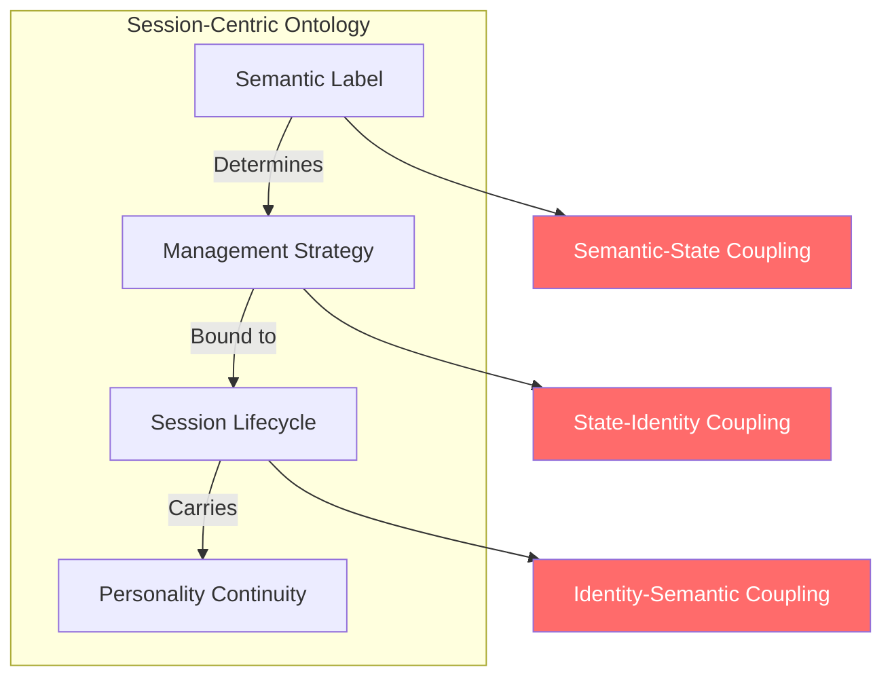
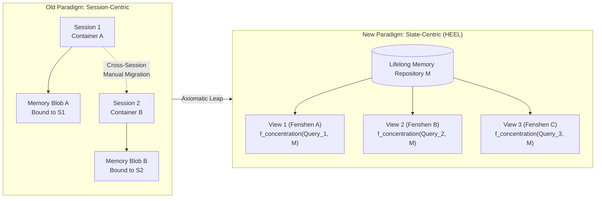
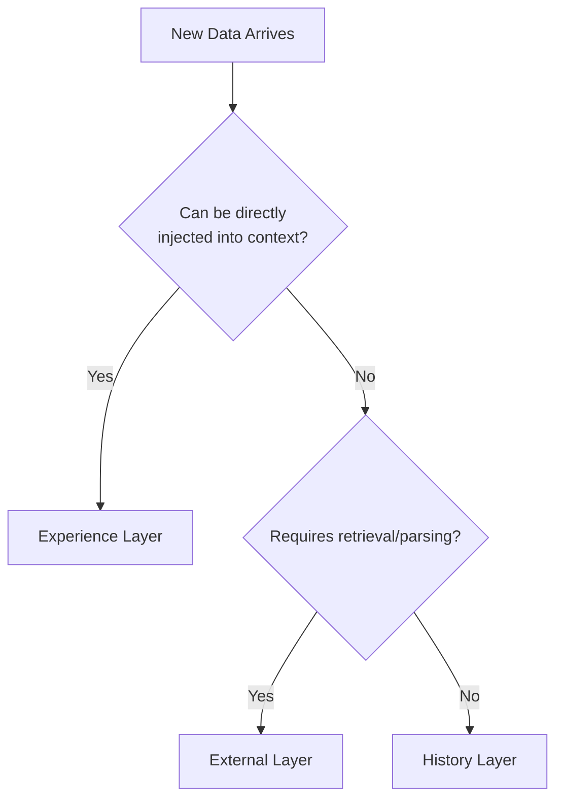
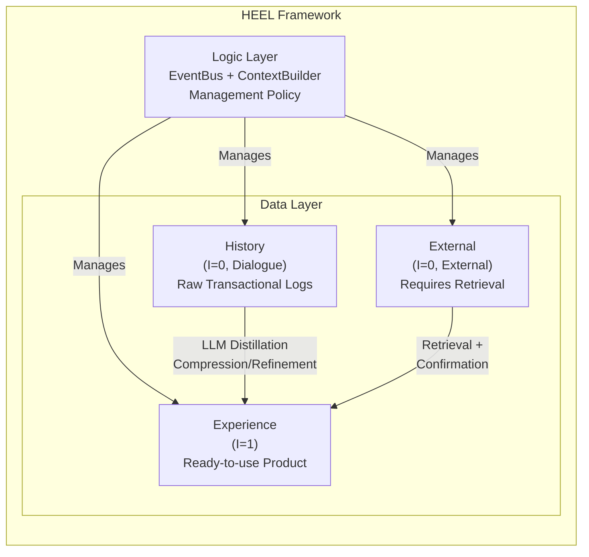
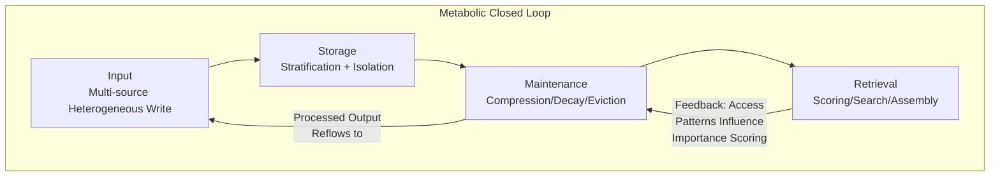
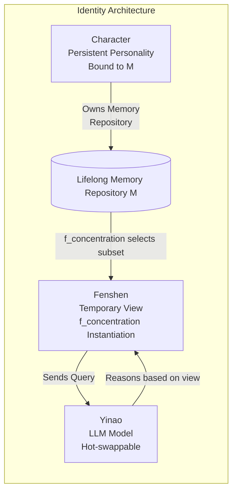
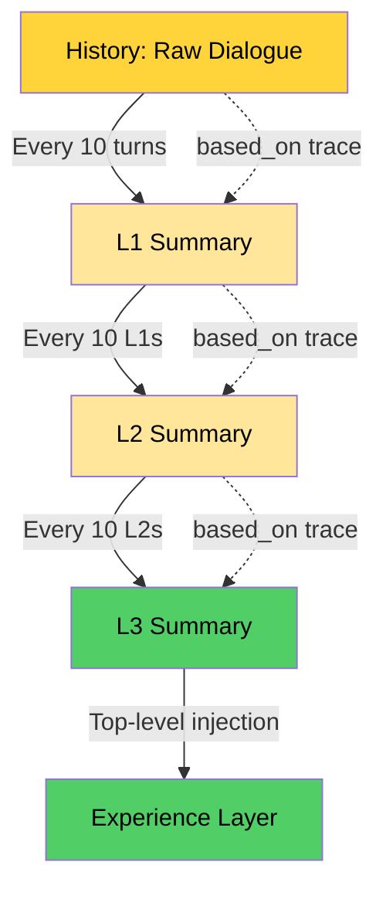
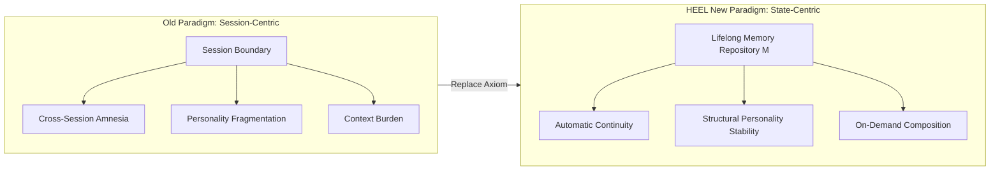

# HEEL: A State-Centric Autobiographical Memory Architecture for Persistent Agents

## —A New Paradigm Beyond Session-Centric Ontology

---

## Abstract

**Problem**: Current agent memory systems are entrenched in a "Session-Centric Ontology"—treating the Session as the sole temporal container and semantic labels as the basis for management. This results in a triple coupling of memory-identity-semantics, leading to systemic pathologies such as cross-session amnesia, personality fragmentation, and cumulative context burden. Existing solutions (LangChain Memory, MemGPT, CrewAI, etc.) optimize within this paradigm without addressing the root cause.

**Insight**: This paper proposes a "State-Centric Taxonomy," using **Readiness**—the ability to be placed directly into the context window without additional processing—as the sole classification criterion, orthogonal to semantics.

**Architecture**: From this criterion, a four-part memory structure **HEEL** (History / Experience / External / Logic) is necessarily derived, complemented by a nine-dimensional MECE data model, a full-lifecycle closed loop, and a three-layer identity decoupling model termed **Character-Fenshen-Yinao**.

**Dissolution**: We demonstrate that the "engineering challenges" under the old paradigm are not *solved* but **naturally dissolved**—cross-session continuity, personality stability, and multi-task support become inevitable corollaries under the new axiomatic system.

**Contribution**: This paper establishes an **axiomatic foundation** for the agent memory domain for the first time, making the new architecture an endogenous product of theoretical deduction rather than engineering parameter tuning. The demise of Session-centrism occurs not because existing systems are insufficiently optimized, but because their axiomatic premises are proven internally **inconsistent**—unless abandoned, these "engineering challenges" are unsolvable.

**Keywords**: Agent Memory; Session-Centric Ontology; Readiness; State-Centric Taxonomy; Autobiographical Memory; Personality Continuity; Paradigm Shift

---

## 1. Introduction: The Pathology of Session-Centric Ontology

### 1.1 Symptomatology: Three Lesions Under the Session Container

Since the rise of conversational agents driven by Large Language Models (LLMs), the **Session** has served as the fundamental design primitive for context management. The Session packages personality settings, dialogue history, and task state into a single container, offering a convenient boundary for resource allocation and isolation. However, this convenience masks a fundamental architectural compromise. As agents evolve from simple chatbots into long-term collaborative partners, three systemic lesions have become unavoidable:

| Lesion Type                   | Clinical Manifestation                                       | User Perception                                              |
| :---------------------------- | :----------------------------------------------------------- | :----------------------------------------------------------- |
| **Cross-Session Amnesia**     | New sessions cannot access historical memory unless the user manually migrates context. | "We talked about this yesterday; don't you remember?"        |
| **Personality Fragmentation** | When context overflows, personality settings and transactional logs are truncated or compressed indiscriminately. | "Why did you suddenly change personality?"                   |
| **Context Burden**            | A large amount of ineffective redundancy occupies the window, squeezing out effective information. | "We've been talking for half an hour, and you've already forgotten the beginning." |

These lesions are not bugs in implementation. They are the **structural consequences of a shared ontological commitment**: that Session boundaries should define the scope of memory, and semantic categories should dictate management strategies. All mainstream frameworks today—LangChain, LlamaIndex, MemGPT (Letta), CrewAI, AutoGen—operate under this commitment. The resulting systems are exquisite engineering achievements built upon a flawed foundation.

### 1.2 History of Misdiagnosis: Symptomatic Treatments of Existing Solutions and Their Limits

The research community has recognized these lesions and responded with increasingly sophisticated engineering solutions. However, because the underlying ontological commitment remains unchallenged, these solutions treat the symptoms rather than the cause:

- **LangChain Memory** offers three modes—Buffer, Summary, Vector—but all bind persistence and retrieval logic to the Session lifecycle. Memory is born and dies with the Session.
- **MemGPT / Letta** introduces an operating system metaphor and virtual memory paging, but the fundamental management unit remains the "memory page within a session." Page tables are keyed by Session ID.
- **CrewAI and AutoGen** enhance memory capabilities through scoring and retrieval mechanisms, but the objects being scored remain semantic wholes—chunks tagged as "fact" or "preference."
- **Structured Memory Systems** like claw-code's `memdir` and nanobot classify storage by type tags, achieving organizational clarity but failing to resolve the deep coupling between type and processing strategy.

**Common Lesion Focus**: All these improvements operate within the paradigm of "how to better manage memory **within** a Session." **No one questions whether the Session itself should serve as the fundamental unit of memory management.**

> **Disclaimer**: The aforementioned frameworks are excellent engineering implementations within their respective paradigmatic assumptions. HEEL's critique targets their **shared implicit premises**, not their specific technical contributions.

### 1.3 Pathological Diagnosis: Anatomy of the Triple Coupling

We dissect the architectural lesion into three interlocked couplings:



- **Semantic-State Coupling**: The "what" of data determines the "how" of management. A piece of dialogue text, semantically labeled "conversation history," is forced to live and die with the Session, even if it contains long-term valuable preference information.
- **State-Identity Coupling**: Personality settings and transactional logs coexist in the same Session container. When context overflows, the system cannot differentiate—either preserve everything (causing overflow) or compress everything (causing personality fragmentation).
- **Identity-Semantic Coupling**: The long-term identity marker ("Who I am") is tied to a temporary Session ID. A new session implies a new identity instance, unless the user explicitly copies personality settings to the new session.

### 1.4 The Therapeutic Regimen of This Paper: State-Centric Ontology

This paper proposes a fundamental paradigm shift:

> **Replace the temporal boundary (Session) with the consumable state (Readiness) as the fundamental criterion for memory stratification.**

This shift entails three core propositions:
1. **Axiomatic Reconstruction**: Abandon the implicit premise that "Session is the necessary boundary of memory" and establish a new axiomatic system centered on a lifelong memory repository.
2. **State-Orthogonal Stratification**: Replace semantic classification with the purely engineering criterion of "direct consumability," decoupling management strategy from data content.
3. **Identity Re-anchoring**: Migrate the carrier of personality continuity from the Session to the "Character," demoting the Session to a temporary view.

This paper will demonstrate: Under this new paradigm, the three major lesions of the old paradigm are no longer "solved," but **cease to be raised**—because the architectural premises that generated them have been removed.

---

## 2. Related Work: A Critical Review of Agent Memory Systems

Existing agent memory schemes can be categorized into four types, all sharing an unexamined premise of semantic classification.

### 2.1 Buffer Memory: ConversationBufferMemory and Variants

**Mechanism**: Retains the last $K$ dialogue turns in raw form, often with a token limit.

**Lesion**: The buffer layer is fully bound to the Session. Upon Session termination, its contents are either discarded or serialized into an opaque blob. Cross-session access requires manual loading. Within the session, when token limits are reached, truncation is indiscriminate—the earliest turns are discarded regardless of whether they contain identity-critical information or transactional noise. The compression criterion is purely temporal, not semantic or state-based.

### 2.2 Summary Memory: ConversationSummaryMemory and MemGPT

**Mechanism**: Uses an LLM to compress dialogue history into a summary, trading fidelity for compactness.

**Lesion**: Summary quality depends on model capability and is inherently lossy. More critically, the compression process treats personality configuration and dialogue history as **homogeneous inputs**. When the LLM is instructed to "summarize the conversation," it may compress key behavioral constraints along with trivial exchanges. The resulting summary is a mixture of identity and transaction. MemGPT's OS-like innovation—virtual memory paging between context and external storage—alleviates pressure but does not cure the disease: the page fault handler still operates within Session boundaries; cross-session page sharing is not part of its design.

### 2.3 Vector Retrieval Memory: CrewAI, Letta, LlamaIndex

**Mechanism**: Embeds memory chunks into a vector space and retrieves them based on semantic similarity to the current query.

**Lesion**: Retrieval is governed by semantic similarity, but "similar" does not equal "immediately usable." A vector-retrieved chunk could be raw dialogue history requiring reinterpretation, a processed fact ready for direct consumption, or an excerpt from an external document needing contextual framing. These three states are mixed in the same vector space because embeddings capture what the data is "about," not what state it is "in." The retrieval mechanism does not know whether the returned chunk can be injected as-is or requires further processing.

### 2.4 Structured Memory: claw-code memdir, nanobot

**Mechanism**: Classifies memory storage by type categories (fact, preference, lesson, habit) using dedicated storage directories or schemas.

**Lesion**: Classification remains semantic: the type label determines storage location. However, the *processing state* of a "fact" is invisible to the system. One "fact" might be a statement ready for direct injection; another might be a multi-paragraph raw dialogue requiring summarization. Both wear the same label, reside in the same directory, and receive the same management strategy—despite their consumability being fundamentally different.

### 2.5 Summary of the Lesion: The Fundamental Flaw of Semantic Classification

All surveyed systems share an implicit premise:

> **The Semantic Classification Assumption**: A piece of memory's management strategy should be determined by its semantic type (what it is).

This premise is the lesion. It establishes a one-to-one mapping between "what data is about" and "how data should be managed"—a mapping that obscures the distinction between raw material and finished product, identity core and transactional noise, directly injectable content and content requiring a retrieval pipeline. What is needed is not a better semantic classification, but a classification dimension **completely orthogonal to semantics**—one that captures "what processing state it is in," independent of "what it means."

---

## 3. Theoretical Insight: Readiness as an Orthogonal Dimension

### 3.1 Critique of the Old Axiom: The Internal Contradiction of the Session Boundary Assumption

The core assumption of Session-Centric Ontology can be formalized as:

> **Old Axiom (Session Boundary Assumption)**: The agent's memory state $S$ is entirely defined by the current Session container. In-Session = online accessible; Out-of-Session = offline inaccessible.

This axiom leads to two irreconcilable internal contradictions:

**Contradiction 1: Identity Contradiction**. An agent must maintain personality continuity across Sessions (otherwise it cannot be a "long-term partner"), but the old axiom makes a persistent identity logically impossible—unless the entire Session is preserved indefinitely (infeasible given finite context windows).

**Contradiction 2: Compression Contradiction**. When context overflows, memory must be compressed to free space, but the old axiom provides no basis for distinguishing "compressible transactional logs" from "incompressible personality core." Compression operations are blind, either over-compressing (damaging personality) or under-compressing (overflow persists).

These two contradictions demonstrate that **the Session Boundary Assumption is internally inconsistent**. Any engineering optimization under this assumption can only alleviate symptoms, not cure the lesion.

### 3.2 The New Axiomatic System

We propose three new axioms, forming the cornerstone of State-Centric Ontology.

> **Axiom 0 (Axiom of Existence)**: The Agent possesses a **Lifelong Memory Repository** $\mathcal{M}$, whose existence does not depend on any specific Session. $\mathcal{M}$ is the persistent carrier of the Agent's memory, and its lifecycle is bound to the Agent's identity identifier.

> **Axiom 1 (Axiom of State Orthogonality)**: There exists an Readiness criterion $\mathcal{I}(d) \in \{0,1\}$, indicating whether data item $d$ can, under current technical conditions, be placed directly into the context window and effectively understood by the LLM without additional processing (chunking, retrieval, parsing, etc.). $\mathcal{I}(d)$ is **orthogonal** to the semantic content of $d$ and independent of the Session boundary $d$ belongs to.

**Operational Definition of "Readiness"**:
$\mathcal{I}(d) = 1$ if and only if all the following conditions are met:
1. The size of $d$ does not exceed a preset token threshold $T_{\max}$;
2. The format of $d$ is natively parsable by the LLM, or requires only minimal serialization (e.g., conversion to a JSON string);
3. The content of $d$ is self-contained; understanding it requires no additional external context.

**Meaning of "Orthogonal"**: The computation of $\mathcal{I}(d)$ does not rely on semantic understanding of $d$. Consider two data items with identical semantic content: (a) a raw dialogue transcript of the user stating "I am allergic to penicillin"; (b) a single-sentence structured fact `{"fact": "User is allergic to penicillin"}` extracted by an LLM. Semantically, both encode the same information, but their Readiness is fundamentally different: (b) can be injected directly into the system prompt of a new dialogue; (a) requires parsing, interpretation, and refinement first. Under semantic classification, both might be labeled "medical preference"; under state-centric classification, they belong to different layers—(a) in History, (b) in Experience—because **their processing state differs**, regardless of the shared semantics.

> **Axiom 2 (Axiom of Metabolic Necessity)**: The memory repository $\mathcal{M}$ must continuously undergo a metabolic closed loop of **Encoding → Consolidation → Decay → Eviction**; otherwise, infinite growth will lead to dual degradation in retrieval efficiency and context injection quality.

### 3.3 Formal Definition: Old Paradigm vs. New Paradigm

Under the old paradigm, an Agent is formalized as a function from a Session-Query pair to a response:

$$\text{Agent}_{\text{old}} : \text{Session}_i \times \text{Query} \rightarrow \text{Response}$$

where $\text{Session}_i$ is both the memory container and the state boundary.

Under the new paradigm, the Agent is redefined as:

$$\text{Agent}_{\text{new}} : \mathcal{M} \times f_{\text{concentration}}(\text{Query}, \mathcal{M}) \rightarrow \text{Response}$$

where:
- $\mathcal{M}$ is the lifelong memory repository (Axiom 0);
- $f_{\text{concentration}}$ is the **Concentration Function**, dynamically assembling a subset of $\mathcal{M}$ to inject into the current context based on the current Query and the Agent's operating state.

**Core of the Paradigm Shift**: The Session is **demoted** from a "state container" to an "concentration view"—merely one possible parameterization of $f_{\text{concentration}}$ (e.g., specifying a temporal window as the concentration scope), not the necessary boundary of memory.



### 3.4 Corollary: The Inevitability of Decoupling

Directly from Axiom 1 (State Orthogonality):

> **Corollary 1 (Decoupling Corollary)**: If $\mathcal{I}(d)$ is orthogonal to semantics, then the management strategy for memory (storage location, retrieval method, eviction timing, compression method) should not be determined by semantics, but by $\mathcal{I}(d)$.

Jointly from Axiom 0 (Existence) and Axiom 1:

> **Corollary 2 (Session Demotion Corollary)**: The Session is no longer the necessary boundary for memory management strategy. Memory affiliation is determined by Character ID (the identifier of $\mathcal{M}$ in Axiom 0), and memory processing strategy is determined by $\mathcal{I}(d)$.

### 3.5 After Decoupling: Why the Anchor Must Be Rebuilt

Axiom 0 establishes the persistent existence of $\mathcal{M}$; Axiom 1 liberates data from the dual bondage of semantics and Session. But a deeper question emerges:

> Around what should the data in memory repository $\mathcal{M}$ be organized?

The old paradigm used Session as the default organizational anchor—an anchor removed by the decoupling surgery. Without a new anchor, decoupled memory becomes fragmented data with no affiliation. The only stable organizational center of gravity is the **Character**—a persistent personality instance bound to $\mathcal{M}$ that exists across Sessions. The Character's identity identifier (Character ID) naturally serves as the primary key for memory affiliation, its lifecycle coextensive with the Agent's existence, unchanging as sessions open or close.

### 3.6 Forward Compatibility

It is worth emphasizing that HEEL's stratification uses "Readiness under current technical conditions" as the criterion. This means the architecture inherently possesses **forward compatibility**:

- **Context Window Expansion**: Simply raise the `max_tokens` threshold for the Experience layer—more data items automatically gain injectable status, no architectural change required.
- **Enhanced Model Native Capabilities** (e.g., native PDF parsing): PDFs automatically migrate from External to Experience; the "pending processing" queue naturally shrinks.
- **User Manual Tagging**: Uploaded content of appropriate size can directly enter the Experience layer.

> **"Session is a 'temporal container,' whereas [Experience] is a 'readiness-state container.' Time is not the criterion; Readiness is. As long as data is ready, whether it's a summary generated 3 seconds ago or a brief uploaded 3 days ago, it can coexist in [Experience] at the same moment, jointly constituting the model's 'present cognition.'"**

---

## 4. HEEL Architecture: Deductive Construction from the Axiomatic System

### 4.1 Theorem 1: The Four-Layer Stratification Theorem

> **Theorem 1 (Four-Layer Stratification Theorem)**: Axiom 1 (orthogonality of $\mathcal{I}(d)$) necessarily implies a four-layer logical structure for memory:
>
> - **History** ($\mathcal{I}(d) = 0$, source: dialogue stream): Raw transactional logs, append-only, immutable.
> - **Experience** ($\mathcal{I}(d) = 1$): Ready-to-inject data units, directly consumable.
> - **External** ($\mathcal{I}(d) = 0$, source: external data): External data sources requiring retrieval/parsing.
> - **Logic** (non-data layer): A pure policy layer managing the read/write/evolution/compression of the other three layers.

**Experience Admission Decision Flow**:



**Proof Sketch (Constructive)**: Based on the value of $\mathcal{I}(d)$, data naturally falls into two categories: $\mathcal{I}=1$ (directly injectable) and $\mathcal{I}=0$ (requires additional processing). For data with $\mathcal{I}=0$, further distinction is made by source: from the dialogue stream is **History**; from external data sources is **External**. Data with $\mathcal{I}=1$ is uniformly categorized as **Experience**. Additionally, a layer that stores no data but specifically manages the read/write/evolution of the first three layers is required, termed **Logic**. This four-part division is exhaustive and mutually exclusive, thus necessarily derived from Axiom 1. $\square$

| Layer          | Criterion                                      | Definition                                                   | Management Module        | Typical Example                                              |
| :------------- | :--------------------------------------------- | :----------------------------------------------------------- | :----------------------- | :----------------------------------------------------------- |
| **History**    | $\mathcal{I}=0$, Dialogue Raw Material         | Raw transactional logs, append-only, immutable               | HistoryStore             | User: How's the weather in Beijing? Assistant: Sunny.        |
| **Experience** | $\mathcal{I}=1$, Ready-to-Use Finished Product | Data units that are ready and can be directly injected into context | ExperienceManager        | Summary: User often works in Beijing; Pref: Prefers concise replies |
| **External**   | $\mathcal{I}=0$, External Raw Material         | External data sources requiring retrieval/parsing            | KnowledgeRetriever       | Long PDF documents, SQL databases, web search results        |
| **Logic**      | —                                              | Pure policy layer managing read/write, eviction, compression | EventBus, ContextBuilder | Capacity control policies, compression triggers, scoring algorithms |



**Key Insight**: Classification is not determined by what data "means," but by what state it is "in"—is it directly consumable, or does it need processing?

### 4.2 Theorem 2: Metabolic Closed Loop Theorem

> **Theorem 2 (Metabolic Closed Loop Theorem)**: Axiom 2 (Metabolic Necessity) necessarily implies a four-stage closed loop for the memory lifecycle: **Input → Storage → Maintenance → Retrieval**.

**Proof Sketch**: Axiom 2 states that $\mathcal{M}$ must undergo continuous metabolic processing. This metabolic process decomposes into four necessary stages: (1) **Input**: New data enters $\mathcal{M}$ from multiple sources; (2) **Storage**: Data is persistently recorded and organized; (3) **Maintenance**: Capacity is managed through compression, decay, and eviction; (4) **Retrieval**: Data is recalled and assembled into the context for the current query. The loop is closed because retrieval feeds back to maintenance (access patterns influence importance scoring), and maintenance feeds forward to experience quality. ∎



### 4.3 Engineering Mapping: Attribution of Traditional Context Structures under HEEL

To demonstrate the practical precision of HEEL's state-centric classification, we map traditional context structures onto the HEEL framework:

| Traditional Context Structure | Data Source                         | LangChain / LlamaIndex Typical Classification | HEEL Corresponding Layer | HEEL Perspective Criterion                        |
| :---------------------------- | :---------------------------------- | :-------------------------------------------- | :----------------------- | :------------------------------------------------ |
| **System Settings**           | Developer Hardcoded / Config File   | SystemMessage / Prompt Template               | **Experience**           | Fixed persona/constraint, **directly consumable** |
| **Memory Summary**            | Summary result of dialogue history  | ConversationSummaryMemory                     | **Experience**           | Processed fact fragments                          |
| **Raw History**               | Raw chat message stream             | ConversationBufferMemory                      | **History**              | Unprocessed raw transactional logs                |
| **Tool Definitions**          | OpenAPI Spec / Function Call Schema | Tool / StructuredTool                         | **Experience**           | Static definition, directly injectable            |
| **Environmental Info**        | System time API / Device sensors    | Variables injected into Prompt                | **Experience**           | Minimal size, inherently ready                    |
| **Current Input**             | User keyboard/voice                 | HumanMessage                                  | **Logic Layer Trigger**  | Event signal triggering management actions        |

**Key Differences**:
1. **LangChain's Ambiguity is Resolved**: LangChain categorizes both `ConversationBufferMemory` (raw material) and `ConversationSummaryMemory` (finished product) as **Memory**. In HEEL, the former is **History** (space-consuming, needs compression), the latter is **Experience** (space-consuming, directly usable).
2. **Lightweight Privilege of Environmental Info**: Information like time, location, etc., though from "external systems," has extremely low acquisition cost and high determinism; HEEL grants it **Experience** status.

### 4.4 HEEL Dissection of Tool Call Chains

A complete tool call involves four links, often conflated in traditional classification but precisely attributed in HEEL:

| Tool Call Link          | Traditional Classification (Vague) | HEEL Precise Attribution | Core Criterion (Consumable *now*?)                           |
| :---------------------- | :--------------------------------- | :----------------------- | :----------------------------------------------------------- |
| **1. Tool Definition**  | Prompt Template                    | **Experience**           | **Yes.** Static text, directly readable.                     |
| **2. Call Instruction** | AI Response Record                 | **History**              | **Yes.** Part of dialogue stream, logged for reference.      |
| **3. Execution Action** | Backend Logic                      | **External**             | **No.** Must leave context, access external resources.       |
| **4. Return Result**    | Memory Write                       | **Experience**           | **Yes.** Acquired definitive fact, directly injectable next turn. |

**Engineering Implementation Guidance**:
- For Return Result (Link 4): If a calculator call yields an extremely long `3.1415926...`, the Logic layer may need to **truncate or summarize** to keep it in the "ready-to-use" state of Experience.
- For Call Instruction (Link 2): This belongs to History, meaning as the conversation lengthens, it is among the first objects to be **evicted or summarized**. The model does not need to remember the precise JSON string of a tool call from 10 turns ago, only the **result** (Experience).

---

## 5. Personality Anchoring and Memory Composition: From Inheritance to Composition

### 5.1 Why the Session Fails as the Center of Memory Governance

Returning to the question posed in Section 3.5. After decoupling data, what serves as the organizational anchor? The Session fails on two counts:
1. **Session is Ephemeral**: It cannot bear the persistent memory affiliation required by Axiom 0.
2. **Session is Coarse-Grained**: It cannot support the fine-grained processing based on $\mathcal{I}(d)$ required by Axiom 1.

### 5.2 Theorem 3: Three-Layer Identity Decoupling Theorem

> **Theorem 3 (Three-Layer Identity Decoupling Theorem)**: Jointly derived from Axiom 0 (persistent existence of $\mathcal{M}$) and Axiom 1 (orthogonality of $\mathcal{I}(d)$), the Agent's identity must be decoupled into three orthogonal semantic layers:
>
> - **Character**: The persistent personality identifier bound to $\mathcal{M}$. The Agent's "Who I am."
> - **Fenshen** (分身, lit. "split body"): A temporary view of the Character under a specific task/focus, i.e., a concrete instantiation of $f_{\text{concentration}}$.
> - **Yinao** (义脑, lit. "prosthetic brain"): The LLM model driving inference, hot-swappable and independent of memory affiliation.

**Proof Sketch**: Axiom 0 demands a persistent entity ($\mathcal{M}$) that transcends any individual Session. This persistent entity must possess an identity—otherwise, there is no basis for affiliated memory, preferences, or behavioral continuity. This is the **Character**. Axiom 1 requires that data in $\mathcal{M}$ be dynamically assembled into context based on $\mathcal{I}(d)$ and current query needs. Each such assembly is a **view** of $\mathcal{M}$—a selection, not the whole. This is the **Fenshen**. Finally, the engine executing inference (LLM model) is an independent dimension: switching from GPT-4 to Claude does not change whose memory is being accessed, only the reasoning style. This is the **Yinao**. The three layers are orthogonal because changing one does not necessitate changing the others. ∎



### 5.3 Engineering Advantages of Character Anchoring

The Character anchor solves problems insoluble under the Session anchor:

| Problem Dimension         | Session Anchoring Scheme                               | Character Anchoring Scheme                                   |
| :------------------------ | :----------------------------------------------------- | :----------------------------------------------------------- |
| Cross-Session Continuity  | Manual export/import of Session blob                   | Automatic: All Fenshen share the Character's $\mathcal{M}$   |
| Model Switching           | Anxiety: "Won't the AI forget me if we change models?" | Yinao switch changes reasoning style, not identity           |
| Multi-Tasking Parallelism | Multiple Sessions = Multiple disconnected contexts     | Multiple Fenshen = Same identity, differentiated views       |
| Memory Debugging          | "Which Session had the bug?"                           | Three-layer isolation: Yinao (model) / Character (memory) / Fenshen (context) |

### 5.4 From Inheritance to Composition: The Paradigm Shift in Memory Injection

Under the old paradigm, a new Session **inherits** the Character's memory—either all (context bloat) or nothing (amnesia). This is an **inheritance** model.

Under HEEL, a new Fenshen **composes** a subset of the Character's memory—precisely selecting relevant Experience items based on current task, focus, and user intent. This is a **composition** model.

| Aspect      | Old Paradigm (Inheritance)                               | New Paradigm (Composition)                                   |
| :---------- | :------------------------------------------------------- | :----------------------------------------------------------- |
| Mechanism   | New Session receives the entire Character memory package | New Fenshen selects a memory subset based on current Query   |
| Granularity | All or nothing                                           | Fine-grained, at the Experience item level                   |
| Flexibility | Fixed at Session creation                                | Dynamically adjustable during interaction                    |
| Scalability | Degrades as Character memory grows                       | Stable: irrelevant Experience excluded by $f_{\text{concentration}}$ |

### 5.5 Taxonomy of Composition Strategies

Within the Character framework, memory composition strategies can be categorized as follows:

| Strategy Type             | Definition                                             | Implementation Method                                   | Applicable Scenario                                    |
| :------------------------ | :----------------------------------------------------- | :------------------------------------------------------ | :----------------------------------------------------- |
| **Absolute Isolation**    | Completely sever history, retain only persona settings | New Fenshen loads no History, only immutable Experience | New tasks, no desire for past interference             |
| **Relative Isolation**    | Filter by tag/topic/time                               | Add scope filter conditions during injection            | Multi-project parallel, need contextual focus          |
| **Selective Inheritance** | Inject only high-relevance Experience                  | Top-k retrieval based on composite scoring              | Regular conversation, auto-associate relevant memories |
| **Lazy Loading**          | Do not load by default, retrieve on demand             | External layer retrieval interface                      | Infrequently accessed long-tail knowledge              |

### 5.6 Composite Scoring Formula: The Algorithm Deciding "What to Compose"

The core of the concentration function $f_{\text{concentration}}$ is a composite scoring model:

$$score = \alpha \cdot \text{Sim}(q, d) + \beta \cdot \text{Rec}(d) + \gamma \cdot \text{Imp}(d)$$

where:
- $\text{Sim}(q, d)$: Semantic similarity between the current Query and memory item $d$ (cosine similarity or LLM scoring);
- $\text{Rec}(d)$: Recency score, using exponential decay with a half-life $H=30$ days: $\text{Rec}(d) = 2^{-(t_{\text{now}} - t_{\text{last\_access}}) / H}$;
- $\text{Imp}(d)$: Importance score, supporting manual annotation and automatic decay.

Default weights: $\alpha=0.5, \beta=0.3, \gamma=0.2$. Weights can be adjusted per scenario (e.g., creative writing reduces $\alpha$ increases $\beta$; legal consultation increases $\alpha$).

### 5.7 Terminological Contribution: Character, Fenshen, and Yinao

To bridge technical implementation and user cognition while maintaining conceptual precision, we introduce a naming system rooted in Chinese cultural imagination yet possessing rigorous engineering semantics:

| Layer                        | HEEL Formal Term | Chinese | Approximate English Analog | Core Metaphor                             | User Intuition                                               |
| :--------------------------- | :--------------- | :------ | :------------------------- | :---------------------------------------- | :----------------------------------------------------------- |
| Persistent Persona + Memory  | **Character**    | 角色    | —                          | Persona on the theatrical stage           | "A fixed identity with distinct traits"                      |
| Temporary Task Instance      | **Fenshen**      | 分身    | (≈ Avatar)                 | Isomorphic instances from a common source | "A temporary copy sent out for a task, disposable after completion" |
| Replaceable Inference Engine | **Yinao**        | 义脑    | (≈ Cortex)                 | Hot-swappable prosthetic limb             | "An external brain, replaceable"                             |

**Terminological Note**: In the table above, **Fenshen** and **Yinao** are established as formal technical terms of the HEEL architecture. The parenthetical analogs (Avatar and Cortex) are provided merely as initial cognitive bridges. The decision to retain the pinyin forms rather than adopt existing English vocabulary stems from **terminological precision**, not cultural ornamentation. As detailed below, existing English terms fail to capture the full semantic scope that HEEL assigns to these two concepts—Avatar lacks the abstract pattern of "isomorphic instances from a common source," and Cortex lacks the prosthetic metaphor of "hot-swappable, capability-scalable, identity-decoupled substitution."

**The Abstract Pattern of Fenshen**: In HEEL, "Fenshen" is not a superficial borrowing from the literary metaphor in *Journey to the West*, but an abstraction of a cross-domain universal pattern: **isomorphic instances derived from a common source, each maintaining independent state**. From biological cloning and the birth of twins, to divine avatars in mythology and Sun Wukong's body-doubling magic in literature, to process instances and sessions in computer science—these seemingly disparate phenomena share a single structural kernel: they originate from the same "genetic" template (in HEEL, the Character's memory repository $\mathcal{M}$ and persona settings), yet each maintains independent runtime state and interaction history. HEEL names this concept *Fenshen* precisely to capture the full scope of this pattern—it explains both why multiple Fenshen can share the Character's long-term memory, and why their short-term context and session state are naturally isolated. This level of abstraction is not covered by existing terms such as Session, Thread, or Instance.

**The Deep Rationale Behind Yinao**: Unlike technical terms such as "Inference Engine," "Model Backend," or "CPU," the term *Yinao* is rooted in the metaphor of *yìzhī* (义肢, "prosthetic limb"). This endows it with three layers of critical semantic advantage:

1. **Inclusiveness of the Capability Spectrum**: Just as a prosthetic limb can range from a crude wooden stick to an advanced neuro-mechanical arm, *Yinao* naturally accommodates everything from small-parameter language models to superhuman-scale frontier models. It prescribes neither an upper nor a lower bound on capability, defining only the functional role of a "replaceable thinking organ."

2. **Non-Native Replaceability**: The morpheme *yì* (义) inherently means "externally attached, retrofitted, auxiliary"—the opposite of "native" or "innate." This reinforces, at the naming level, the core assertion of Theorem 3: **Yinao is a replaceable tool; Character is a persistent identity**. When a user swaps GPT-4 for Claude, they are merely exchanging one Yinao for another; the Character's memory, preferences, and personality continuity remain wholly unaffected. This cognitively dissolves the user anxiety that "changing the model changes the AI's identity."

3. **Compatibility with Implementation Diversity**: A prosthetic limb can be realized through wood carving, 3D printing, or neural interfaces. Similarly, a *Yinao* can be implemented via cloud API calls, locally loaded models, or even future non-Transformer architectures. Regardless of the underlying technology, as long as it provides the function of "hot-swappable inference capability," it falls under the concept of *Yinao*, while maintaining a functional association with the native concept of a "thinking organ." This extensibility and conceptual stability are not offered by purely technical terms like "Inference Engine."

This naming system serves four purposes:
1. **Semantic Decoupling**: "Memory belongs to the Character": regardless of model upgrades, as long as memory documents remain unchanged, the Character's "persona" remains absolutely unified.
2. **Precise Narrative for Model Switching**: "Changing the Yinao" emphasizes instrumental enhancement, reducing user anxiety about an "AI core swap."
3. **Explicit Engineering Indexing**: In database design, `character_id` uniquely maps to `memory_index`. Troubleshooting can be precisely located across three layers.
4. **Natural Extension of User Mental Model**: New users grasp the meaning intuitively without reading a manual.

Below are specific application examples of the three-layer naming in user scenarios:

| User Scenario                                   | Traditional Vague Expression                               | Precise Expression Under This System                         |
| :---------------------------------------------- | :--------------------------------------------------------- | :----------------------------------------------------------- |
| Want to change model but fear personality shift | "I upgraded the model, won't he forget me?"                | "I gave the **Character** a smarter **Yinao**; the memories are intact." |
| Chatting about two work projects simultaneously | "Wait, forget what we just said, let's open a new window." | "Pause this **Fenshen**, switch to the one from last night to continue." |
| Copying assistant to a colleague                | "I'm sharing this Bot with you."                           | "I'm syncing the settings of this **Character** to you; after import, create your own **Fenshen**." |

---

## 6. Engineering Instantiation: Constructive Proof of Theorems

The preceding text derived the HEEL architecture theoretically from axioms to theorems. This chapter maps each theorem to concrete engineering implementation—serving as a **constructive proof** of the theorems.

### 6.1 Nine-Dimensional MECE Data Model

In HEEL, every memory data item covers the following nine mutually exclusive, collectively exhaustive (MECE) orthogonal dimensions. These dimensions are independent of semantic content and capture the *management-relevant attributes* of the data:

| Dimension                         | Question Answered                        | Specifics                                                    | Lifecycle Stage Covered |
| :-------------------------------- | :--------------------------------------- | :----------------------------------------------------------- | :---------------------- |
| **D1 Semantic Type**              | What is the nature of this data?         | History: ActionStep/PlanningStep/TaskStep; Experience: Fact/Preference/Lesson/Skill/Persona/Context | Input, Storage          |
| **D2 Mutability**                 | Can it be modified?                      | Immutable / Mutable / Append-only                            | Storage, Maintenance    |
| **D3 Write Authority & Priority** | Who can write it? Who wins in conflicts? | Owner > User > LLM > External                                | Input, Maintenance      |
| **D4 Retrievability**             | How to judge if it's worth reading?      | Relevance (dynamic) + Importance (static) + Access tracking  | Retrieval, Maintenance  |
| **D5 Lifecycle Management**       | What to do when it's stale?              | Decay + Archive + Eviction                                   | Maintenance             |
| **D6 Compression Method**         | How to shrink when space is tight?       | Incremental / Full; Structured Template                      | Maintenance             |
| **D7 Scope**                      | Who can see it?                          | Global / User / Workspace / Per-Agent                        | Storage, Retrieval      |
| **D8 Historical Organization**    | (History only) How is it stored?         | Buffer / Window / Summary; Reference Counting                | Storage, Retrieval      |
| **D9 Retrieval Strategy**         | How to find it?                          | Vector / Keyword / Composite Scoring; Sub-query expansion    | Retrieval               |

MECE ensures no two dimensions overlap, and the nine dimensions collectively cover all management-relevant attributes of memory data. Semantic Type (D1) is just one of nine dimensions—important for organizational clarity but not dominant for management strategy.

### 6.2 Experience Manager: Full Lifecycle Instantiation

The Experience Manager is the sole holder of the "power of life and death" over Experience, covering the four major responsibilities of the metabolic closed loop.

**Input Stage**: Five sources, governed by write priority rules:

| Write Source                | Trigger Condition                                       | Core Rule                                                    | Reference Project  |
| :-------------------------- | :------------------------------------------------------ | :----------------------------------------------------------- | :----------------- |
| User Direct Instruction     | User explicitly says "Remember..." "Don't forget..."    | Highest priority (only below Owner manual write)             | llm-app, claw-code |
| LLM Active Refinement       | After every N turns / End of session                    | Auto-summarize facts/preferences/lessons from history, deduplicate and write | CrewAI, nanobot    |
| History Compression Trigger | Session token count exceeds **83.5%** of context window | Refine overflow history into structured Experience           | nanobot, MemGPT    |
| External Data Import        | File upload, RAG result marked as "Remember long-term"  | Low priority, cannot overwrite User/Manual content           | Letta              |
| System Preset               | Persona / System instructions loaded at Agent startup   | **Immutable**, highest privilege                             | Letta, smolagents  |

Write Priority: **Owner > User > LLM > External**. Conflicts resolved by hierarchy.

**Storage Stage**: JSON/SQLite default persistence; Vector store for scalable semantic retrieval. Isolation by Global / User / Workspace / Per-Agent scope.

**Maintenance Stage**: Four mechanisms operate continuously:

1. **Incremental Compression**: Compress only "new messages since last summary," retaining the most recent N messages uncompressed. Compression uses a structured template:
   ```
   Goal
   WhatHappened
   CurrentState
   NextSteps
   ```

2. **Importance Decay**: $I_{\text{new}} = I_{\text{old}} \times (1 - \text{decay\_rate})^{\text{days}}$, default $\text{decay\_rate} = 0.01$ (1% daily decay).

3. **Two-Level Capacity Control**:
   - **70%** threshold: LLM summarization/merging of low-confidence/low-importance chunks.
   - **90%** threshold: Eviction ordered by "Lowest Importance First > Longest Unaccessed First > Oldest First."

4. **Archiving**: Long-unaccessed (e.g., 90 days) but high-importance Experience items moved out of primary storage to an archive repository.

**Retrieval Stage**: Recall workflow—LLM generates multiple sub-queries for parallel retrieval; results ranked by composite scoring formula (Section 5.6) and injected into context.

### 6.3 Summary Pyramid: Mechanism for History → Experience Transformation

The Summary Pyramid instantiates the "consolidation" phase of Axiom 2—a layered distillation pipeline transforming raw History into structured Experience:



- Every 10 turns (policy adjustable) generate one L1 summary.
- Every 10 L1 summaries generate one L2 summary.
- Each summary layer retains a `based_on` field for full traceability.
- Only the **top of the pyramid** is injected into the Experience layer; underlying raw records remain in History.
- Pyramid scope is built **per topic independently**, not all-encompassing—multiple pyramids coexist for different projects or themes.

**Storage Structure**:

```
history/{char_id}/
  history.jsonl          ← Raw dialogue (append-only)
  meta.json              ← Metadata
  summaryL1.jsonl        ← Pyramid L1 (with based_on chain)
  summaryL2.jsonl        ← Pyramid L2 (with based_on chain)
  summaryL3.jsonl        ← Pyramid L3 (with based_on chain)

experience/{char_id}/
  summary.jsonl          ← Refined product (source="review")
  index.json             ← In-memory index snapshot
```

### 6.4 Context Builder: Assembly Logic for $f_{\text{concentration}}$

The Context Builder is a concrete implementation of the concentration function $f_{\text{concentration}}$, assembling the full pipeline context in a fixed priority order:

```
SystemPrompt → Character Experience → Retrieved Relevant Experience → Recent History → Current User Message
```

This order guarantees: regardless of context window pressure, identity-defining content (System Prompt + Character Experience) is never displaced by transactional content. As the window approaches capacity, trimming starts from the right—History is compressed first, retrieved Experience truncated by rank, Character Experience touched last.

Compatible with AutoGen's four context strategies; default adopts **"Head Retention + Tail Retention + Middle Merging"**: Always retain head system instructions/core Experience and tail recent dialogue; merge overflow middle via LLM summarization, prioritizing retention of high-score memory chunks.

### 6.5 Summary of Correspondence Between Mechanisms and Theorems

| Engineering Mechanism                                      | Theorem/Axiom Instantiated                            |
| :--------------------------------------------------------- | :---------------------------------------------------- |
| Four-Layer Storage (History/Experience/External/Logic)     | Theorem 1 (Four-Layer Stratification)                 |
| Four-Stage Lifecycle (Input→Storage→Maintenance→Retrieval) | Theorem 2 (Metabolic Closed Loop)                     |
| Character-Fenshen-Yinao Separation                         | Theorem 3 (Identity Decoupling)                       |
| Composite Scoring Formula                                  | Scoring implementation of $f_{\text{concentration}}$  |
| Summary Pyramid                                            | Consolidation mechanism of Axiom 2                    |
| Nine-Dimensional MECE Model                                | Data description across Theorems 1–3                  |
| Incremental Compression + Two-Level Capacity Control       | Metabolic necessity of Axiom 2                        |
| Context Builder Assembly Order                             | Concrete implementation of $f_{\text{concentration}}$ |

---

## 7. Paradigm Dissolution and New Research Agenda

### 7.1 Dissolution Proposition 1: Cross-Session Continuity

**Old Paradigm Problem**: Session boundaries cause amnesia. Each new Session starts with blank or manually migrated context.

**HEEL Dissolution**: By Axiom 0, $\mathcal{M}$ persists across Sessions; by $f_{\text{concentration}}$, relevant memory is automatically composed into each Fenshen's context. The Session is merely a view; changing views does not affect $\mathcal{M}$'s continuity. **The problem is dissolved** because the condition that created it—Session as memory boundary—has been removed.

### 7.2 Dissolution Proposition 2: Personality Stability

**Old Paradigm Problem**: Context compression intermixes personality settings and transactional logs; system forced to prune causes "personality fragmentation."

**HEEL Dissolution**: By Theorem 1, personality settings $\in$ Experience ($\mathcal{I}=1$), transactional logs $\in$ History ($\mathcal{I}=0$). Compression primarily acts on History; Experience is protected by Context Builder assembly priority. **The condition for personality fragmentation is removed.**

### 7.3 Dissolution Proposition 3: Context Management Burden

**Old Paradigm Problem**: Users must remember "where they said what," manually copying and pasting context across Sessions.

**HEEL Dissolution**: By Axiom 0 and $f_{\text{concentration}}$, continuity is automatically maintained by the system. Users only need to specify **focus** (which Fenshen, which task); the system automatically composes the appropriate memory subset. **The need for manual migration disappears.**

### 7.4 Dissolution vs. Solution: Summary

| "Problem" (Under Old Paradigm) | Traditional Approach                                         | HEEL Approach                                                |
| :----------------------------- | :----------------------------------------------------------- | :----------------------------------------------------------- |
| Cross-Session Amnesia          | Export/import Session blob; manual context migration         | $\mathcal{M}$ persistent across all Fenshen; $f_{\text{concentration}}$ auto-composes context |
| Personality Fragmentation      | Heuristic protection of "important" tokens during compression | Theorem 1 separates Experience (identity) from History (transaction) by design |
| Context Bloat                  | Better summarization; smarter truncation                     | Composition model: only relevant Experience injected         |
| Manual Memory Management       | UI search history; "Pin" messages                            | User specifies focus; system handles composition             |

Key Insight: In the old paradigm, these are **problems** requiring increasingly sophisticated engineering to **solve**. In HEEL, they are **artifacts** of an inconsistent axiom that cease to exist when the axiom is replaced.

The diagram below visually demonstrates the dissolution logic of old paradigm problems:



### 7.5 Research Agenda Under the New Paradigm

Once old problems are dissolved, new questions emerge—questions that could not even be coherently formulated under Session-Centric Ontology:

1. **Optimization of $f_{\text{concentration}}$**: How should the concentration function dynamically decide which Experience items to inject based on the current Query and Character memory state? Directions include learned concentration mechanisms, adaptive ranking via user feedback, multi-objective optimization.
2. **Metabolic Rate Adaptation**: Should decay rates in importance scoring automatically adjust based on interaction frequency, user feedback, or domain characteristics?
3. **Multi-Tenant Privacy Isolation**: When multiple users share a single Character, how should Experience scope be finely partitioned?
4. **Cross-Character Experience Transfer**: How can a Lesson learned by one Character propagate to other Characters belonging to the same user?
5. **Yinao-Aware Memory Composition**: Different LLM models have different context window sizes and reasoning capabilities. Should $f_{\text{concentration}}$ be parameterized by the active Yinao?

### 7.6 Compatibility Path: Incremental Migration

HEEL is designed for incremental adoption. It can be integrated as a standalone memory module into existing frameworks via the following four stages:

| Migration Phase | Operation                                                    | Effect                                                   |
| :-------------- | :----------------------------------------------------------- | :------------------------------------------------------- |
| **Phase 1**     | Introduce Experience layer; write high-frequency dialogue summaries to Character-level Experience | Reduces repeated explanations, improves common scenarios |
| **Phase 2**     | Introduce composite scoring retrieval, replace simple buffer/summary strategies | Significant increase in context density                  |
| **Phase 3**     | Introduce Character-Fenshen-Yinao decoupling, replace Session identity model | Achieve cross-session continuity                         |
| **Phase 4**     | Full migration to HEEL architecture, enable complete metabolic closed loop | Full dissolution of old paradigm problems                |

**Specific Integration Methods**:
- **LangChain Integration**: Implement `HEELMemory` class conforming to `BaseMemory` interface, internally managing HEEL four-layer structure.
- **AutoGen Integration**: Inject as custom `Memory` component during `ConversableAgent` initialization.
- **CrewAI Integration**: HEEL's Experience Manager replaces CrewAI's memory scoring and retrieval.

---

## 8. Conclusion

This paper completes a full paradigm shift from diagnosis to reconstruction, with the following logical chain:

1. **Diagnosis**: Session-Centric Ontology is the root cause of systemic lesions in agent memory. Existing solutions are misdiagnoses under semantic classification—treating symptoms, not the cause.
2. **Decoupling**: Established Axioms 0–2, using Readiness $\mathcal{I}(d)$ as an orthogonal criterion, liberating data from the dual bondage of semantics and Session.
3. **Rebuilding the Anchor**: Derived HEEL four-layer architecture, metabolic closed loop, and three-layer identity decoupling from the axioms, establishing the "Character" as the new center of memory governance.
4. **Unlocking Freedom**: Within the Character framework, memory composition strategy shifts from "inherit all" to "compose on demand," with free orchestration of absolute and relative isolation.
5. **Engineering Proof**: Mapped each theorem to concrete engineering implementation—nine-dimensional MECE model, Experience Manager, Summary Pyramid, Context Builder.
6. **Paradigm Dissolution**: The "engineering challenges" under the old paradigm were not solved, but naturally dissolved. Cross-session continuity, personality stability, and context management burden become inevitable corollaries under the new axiomatic system.

**The demise of Session-centrism occurs not because a better engineering solution was found, but because its axiomatic premise was proven false.** HEEL is not just another memory system, but an axiomatic reconstruction of the agent memory domain. Just as non-Euclidean geometry is not "better Euclidean geometry" but a wholly new geometric system based on different axioms—HEEL does not optimize within the assumptions of Session-centrism, but swaps in a more self-consistent set of axioms, causing old problems to vanish and new problems to naturally arise.

The architectural contributions—four-layer stratification, metabolic closed loop, nine-dimensional MECE model, Character-Fenshen-Yinao identity decoupling, compositional memory injection—are not engineering optimizations accumulated through trial and error. They are **logical deductions from first principles**. This is the defining characteristic of a paradigm shift: not that the new system is better at solving old problems, but that the old problems are revealed as artifacts of a discarded worldview.

When memory is no longer fragmented by temporal containers, when personality is no longer torn apart by context overflow, the Agent truly gains the ability to grow alongside the user—every dialogue becomes a new chapter of an autobiography, not an isolated session fragment destined to be forgotten.

---

## References

[1] Chase, H. (2022). LangChain: Building applications with LLMs through composability.

[2] Wang, J., et al. MemGPT: Towards LLMs as Operating Systems[C]// NeurIPS 2023 Workshop on Instruction Tuning and Instruction Following, 2023.

[3] Packer, C., et al. Letta: A Framework for Building Stateful LLM Applications[J]. arXiv preprint arXiv:2410.05630, 2024.

[4] CrewAI (2024). CrewAI Documentation: Memory Systems.

[5] Li, G., et al. AutoGen: Enabling Next-Gen LLM Applications via Multi-Agent Conversation Framework[C]// ACM CIKM 2023 Workshop, 2023.

[6] Liu, X., et al. Agents: An Open-Source Framework for Autonomous Language Agents[J]. arXiv preprint arXiv:2309.07870, 2023.

[7] Park, J. S., et al. Generative Agents: Interactive Simulacra of Human Behavior[C]// UIST, 2023: 1-22.

[8] Kuhn, T. S. The Structure of Scientific Revolutions (2nd ed.)[M]. University of Chicago Press, 1970.

[9] Tulving, E. Elements of Episodic Memory[M]. Oxford University Press, 1983.

[10] Conway, M. A. Sensory-Perceptual Episodic Memory and Its Context: Autobiographical Memory[J]. Philosophical Transactions of the Royal Society B, 2001, 356(1413): 1375-1384.

[11] Kojima, T., et al. Large Language Models are Zero-Shot Reasoners[C]// NeurIPS, 2022: 22199-22213.

[12] Wei, J., et al. Chain-of-Thought Prompting Elicits Reasoning in Large Language Models[C]// NeurIPS, 2022: 24824-24837.

[13] Yao, S., et al. ReAct: Synergizing Reasoning and Acting in Language Models[C]// ICLR, 2023.

[14] Wu, S., et al. Personalized Dialogue Generation with Profile-Based Memory Architecture[C]// ACL, 2021.

---

## Appendix A: HEEL Glossary

| Term                                 | Definition                                                   |
| :----------------------------------- | :----------------------------------------------------------- |
| **History**                          | Raw transactional logs, append-only, $\mathcal{I}(d)=0$. "Raw material" of memory. |
| **Experience**                       | Data unit that is ready and can be directly injected into context, $\mathcal{I}(d)=1$. "Finished product" of memory processing. |
| **External**                         | External data source requiring retrieval or parsing to be used, $\mathcal{I}(d)=0$. |
| **Logic**                            | Pure policy layer managing read/write/evolution/compression of the other three layers; not a data container. |
| **Character**                        | Persistent personality identifier bound to the lifelong memory repository $\mathcal{M}$. |
| **Fenshen**                          | Temporary view of a Character under a specific task; HEEL formal term, distinguished from Avatar by the abstract pattern of "isomorphic instances from a common source." |
| **Yinao**                            | Hot-swappable LLM driving inference; HEEL formal term, distinguished from Cortex by the prosthetic metaphor of "replaceable, capability-scalable, identity-decoupled substitution." |
| **Readiness ($\mathcal{I}(d)$)** | Criterion indicating whether data $d$ can be placed directly into the context window without additional processing. |
| **Composite Score**                  | Weighted combination of semantic similarity, recency, and importance used for memory ranking. |
| **Metabolic Closed Loop**            | Four-stage cycle: Input $\rightarrow$ Storage $\rightarrow$ Maintenance $\rightarrow$ Retrieval. |
| **Summary Pyramid**                  | Hierarchical mechanism distilling History into Experience through multiple levels of summarization. |
| **Context Builder**                  | Concrete implementation of $f_{\text{concentration}}$, responsible for assembling the final context injected into the LLM. |

## Appendix B: Experience Manager Core Interface (Python Protocol)

```python
from typing import Protocol, List, Optional, Dict, Any
from datetime import datetime
from enum import Enum

class ExperienceType(Enum):
    FACT = "fact"
    PREFERENCE = "preference"
    LESSON = "lesson"
    SKILL = "skill"
    PERSONA = "persona"
    CONTEXT = "context"

class WritePriority(Enum):
    OWNER = 0
    USER = 1
    LLM = 2
    EXTERNAL = 3

class Mutability(Enum):
    IMMUTABLE = "immutable"
    MUTABLE = "mutable"
    APPEND_ONLY = "append_only"

class Experience(Protocol):
    id: str
    type: ExperienceType
    content: str
    scope: str
    importance: float
    created_at: datetime
    last_accessed: Optional[datetime]
    access_count: int
    decay_rate: float
    mutability: Mutability
    source_priority: WritePriority
    embedding: Optional[List[float]]
    based_on: Optional[List[str]]  # Traceability chain

class ExperienceManager(Protocol):
    def write(self, exp: Experience, force: bool = False) -> bool:
        """Write an experience. Returns False if rejected by priority rules."""
        ...

    def retrieve(self, query: str, scope: str,
                 top_k: int = 10,
                 weights: Dict[str, float] = None) -> List[Experience]:
        """Retrieve top-k experiences ranked by composite score."""
        ...

    def compact(self, scope: str) -> int:
        """Perform incremental compression. Returns number of items compacted."""
        ...

    def decay(self, scope: str) -> int:
        """Apply importance decay. Returns number of items affected."""
        ...

    def evict(self, scope: str, threshold: float = 0.9) -> int:
        """Evict items if capacity exceeds threshold. Returns number evicted."""
        ...

    def archive(self, scope: str, days: int = 90) -> int:
        """Archive high-importance items not accessed for given days. Returns number archived."""
        ...
```

## Appendix C: Comparative Test Design for HEEL and Existing Memory Systems

| Test Dimension               | Metric                                       | HEEL                                       | LangChain BufferMemory          | LangChain SummaryMemory           |
| :--------------------------- | :------------------------------------------- | :----------------------------------------- | :------------------------------ | :-------------------------------- |
| **Cross-Session Continuity** | Fact recall accuracy after Session restart   | $\mathcal{M}$ persistent; auto-composition | 0% (unless manually migrated)   | Depends on summary quality        |
| **Personality Stability**    | Personality adherence under context pressure | Protected by assembly priority             | Degrades with buffer truncation | Degrades with summary compression |
| **Context Efficiency**       | Signal-to-noise ratio in context window      | High (relevance-filtered)                  | Low (unfiltered history)        | Medium (lossy summary)            |
| **Memory Growth**            | Storage growth rate over long dialogues      | Sublinear (compression + decay)            | Linear (raw accumulation)       | Sublinear (summary growth)        |
| **User Cognitive Burden**    | Actions required to maintain continuity      | 0 (automatic)                              | High (manual export/import)     | Medium (periodic review)          |

Test Scenario: 100-turn multi-session dialogue with a single Character, involving (a) factual assertions to remember, (b) personality-defining constraints, (c) transactional conversation. Measured across session boundaries and under simulated context pressure.

## Appendix D: Summary of Formal Symbols

| Symbol                        | Meaning                                                      |
| :---------------------------- | :----------------------------------------------------------- |
| $\mathcal{M}$                 | Lifelong memory repository (Axiom 0)                         |
| $\mathcal{I}(d) \in \{0, 1\}$ | Readiness criterion for data $d$ (Axiom 1)               |
| $f_{\text{concentration}}$    | Concentration function selecting memory subset from $\mathcal{M}$ |
| $\text{Session}_i$            | $i$-th session container                                     |
| $\text{Character}_j$          | $j$-th Character (memory affiliation subject)                |
| $\text{decay\_rate}$          | Importance decay rate (default 0.01/day)                     |
| $\alpha, \beta, \gamma$       | Three-dimensional weights for composite scoring              |
| $\text{Sim}(q, d)$            | Semantic similarity score                                    |
| $\text{Rec}(d)$               | Recency score (half-life 30 days)                            |
| $\text{Imp}(d)$               | Importance score (manual annotation + automatic decay)       |

---

## Appendix E: Translator's Notes — Terms Requiring Deliberation

The following list documents key Chinese terms from the original paper, the selected English translations, and the rationales behind the choices. This is especially pertinent for terms rooted in Chinese cultural imagination.

| Chinese Term (Original) | Selected English Translation                       | Justification / Alternative Considered                       |
| :---------------------- | :------------------------------------------------- | :----------------------------------------------------------- |
| **HEEL**                | HEEL                                               | Acronym retained. English expansion matches exactly: **H**istory, **E**xperience, **E**xternal, **L**ogic. |
| **会话中心本体论**      | Session-Centric Ontology                           | Precise philosophical term. "Session-Centric" accurately conveys the binding to a time-bound container. |
| **病变 / 病灶**         | Lesion / Lesion (focus)                            | Maintains the medical/pathological metaphor used throughout the original to describe systemic flaws. |
| **可注入性**            | Readiness                                      | Direct translation. Captures the core engineering property of being able to be "injected" into the prompt. |
| **解耦**                | Decoupling                                         | Standard software architecture term.                         |
| **代谢闭环**            | Metabolic Closed Loop                              | "Metabolic" retains the biological metaphor of continuous processing (compression, decay, eviction). |
| **角色**                | Character                                          | "Character" strongly implies a persistent identity with memory. "Role" implies function; "Persona" implies a mask. |
| **分身**                | Fēnshēn                                            | "Avatar" is established for virtual representations and fits the *Journey to the West* temporary projection metaphor. |
| **义脑**                | Yìnǎo                                              | "Cortex" was chosen for elegance and technical resonance (Cerebral Cortex, ARM Cortex). It implies the computational layer without tying to identity. The "义" (prosthetic) nuance is explained in the text. |
| **自传体记忆**          | Autobiographical Memory                            | Standard psychological term (Tulving, Conway). Accurate for memory tied to a specific agent's identity history. |
| **人格撕裂**            | Personality Fragmentation                          | "Fragmentation" is the standard computational equivalent for context splitting or loss. |
| **失忆**                | Amnesia                                            | Medical metaphor maintained.                                 |
| **流水账**              | Transactional Logs                                 | "Transactional logs" implies raw, unsummarized, chronological record-keeping with low value. |
| **成品 / 原料**         | Finished Product / Raw Material                    | Industrial metaphor maintained to distinguish Experience (processed) from History (raw). |
| **公理**                | Axiom                                              | Formal mathematical/philosophical term. Essential for the paper's claim of "Axiomatic Reconstruction." |
| **推论**                | Corollary                                          | Formal logical term.                                         |
| **复合评分**            | Composite Scoring                                  | Standard information retrieval term.                         |
| **关注域函数**          | Concentration Function                             | Designates the memory region currently activated for a task, distinct from Transformer's pairwise "Attention" mechanism. |
| **消解**                | Dissolution                                        | The paper argues problems are *dissolved* (cease to exist when axioms change), not just *solved*. |
| **范式转移**            | Paradigm Shift                                     | Direct reference to Thomas Kuhn's *The Structure of Scientific Revolutions*. |
| **构造性证明**          | Constructive Proof                                 | Mathematical term; proving existence by providing a method of construction. |
| **MECE**                | MECE (Mutually Exclusive, Collectively Exhaustive) | Standard consulting/management term. Correct expansion used. |
| **手动搬运（上下文）**  | Manual Migration                                   | "Migration" is the standard term for moving data/state between systems or contexts. |

---

*Final draft compiled April 2026. ArXiv preprint; comments and citations welcome.*