# From Rule Pre-compilation to Runtime Reasoning: A Semantic-Driven Time Scheduling Paradigm for LLM Agents

---

## Abstract

Traditional scheduling systems (Cron, Quartz, Airflow) share an implicit assumption: natural-language time intents must be **pre-compiled** into structured rules. This "translation layer" limits semantic expressiveness, making complex calendrical logic, conditional triggers, and fuzzy instructions hard to handle gracefully. This paper proposes the **Shícè (时策, lit. 'time-strategy') paradigm**, which abandons the rule pre-compilation assumption and delegates the decision of "when to execute" entirely to a large language model (LLM) at runtime. We formalize the **Shícè Loop**—a minimalist "wait–decide" loop—and establish three principles: **Perceived Time Anchoring**, **Semantics-Driven Continuous Replanning**, and **Intent-Preserving Misfire Compensation**. We argue that the Shícè Loop achieves semantic coverage over arbitrarily complex calendar semantics. Analysis of a prototype system shows that the size of its core scheduling logic is decoupled from instruction complexity, and that the Perceived Time Anchoring mechanism maintains millisecond-level trigger precision under network jitter. The full implementation and experimental evaluation will be released with the open-source repository. The Shícè architecture offers a new design paradigm for building time-aware language agents, and its core insight—**replacing the rule translation layer with runtime semantic reasoning**—is instructive for the design of agent architectures more broadly.

**Keywords**: agent scheduling; large language models; runtime reasoning; time awareness; paradigm shift

---

## 1. Introduction

### 1.1 The Time-Awareness Dilemma of Agents

Imagine an everyday scenario: a user says to an agent, "Wake me at 8 a.m. every weekday, unless that day is a public holiday."

To a human, this is a perfectly clear request. To existing agent systems, it is a thorny engineering challenge. A Cron expression (`0 8 * * 1-5`) can express "8 o'clock on weekdays" but cannot express "exclude holidays"; Apache Airflow requires a developer to write a custom Python operator that calls an external calendar API and implements conditional branching. The user's flexible intent is forced to be "compiled" into rigid machine rules—a process that is not only tedious but inevitably loses semantic information.

### 1.2 Root Cause: The Rule Pre-compilation Assumption

Surveying the lineage of scheduling systems from Unix Cron to modern cloud-native workflow engines reveals a common implicit premise: **user intent must first be translated into deterministic, machine-parseable rules**. This assumption requires scheduling intent to be fully and precisely expressed in some structured form (Cron expressions, JSON Schema, DAG configurations, etc.) at task creation time.

This "translation layer" is a hard ceiling on semantic expressiveness. The expressive power of structured rules can never exhaust the flexibility of natural language: lunar-calendar dates, dynamic conditions ("don't remind me if it rains"), fuzzy tolerances ("around 10 o'clock")—expressions that are commonplace in natural language either require complex special-case code in rule systems or cannot be expressed at all.

### 1.3 Core Insight and Paradigm Manifesto

**The core claim of this paper is: in the LLM era, scheduling systems no longer need a rule-parser software layer.** A natural-language instruction is itself the most complete expression of a rule, and the LLM is the parser.

We instantiate this claim as the **Shícè paradigm**: no structured scheduling rule is ever stored or parsed; the decision of "when to execute next" is delegated entirely to the LLM at runtime. The system retains only a minimalist "wait–fire" loop. After each task execution, the LLM receives the original instruction together with the execution history and directly returns the next absolute execution timestamp; if the task is to continue, a new schedule entry is created; otherwise the task terminates naturally.

### 1.4 Contributions

1. **A new scheduling paradigm**: We propose an LLM-driven runtime scheduling paradigm that overturns the "rule pre-compilation" assumption, replacing the rule parser at the core of scheduling with LLM-based semantic reasoning.
2. **A formal abstraction**: We define a five-tuple formal model of the Shícè Loop and establish three design principles (Perceived Time Anchoring, Semantics-Driven Continuous Replanning, and Intent-Preserving Misfire Compensation), providing a reusable conceptual framework for subsequent research.
3. **System design and prototype**: We present a complete design of the Shícè scheduler together with an analysis of key engineering decisions. A prototype system validates the architectural feasibility; the full implementation and experimental evaluation will be released with the open-source repository.
4. **A semantic-coverage argument**: We argue that the Shícè paradigm semantically covers the full range of time-instruction types, and we analyze the constant-level character of its implementation complexity.

### 1.5 Organization

Section 2 reviews related work and identifies the shared assumption of existing paradigms; Section 3 systematically analyzes the engineering defects caused by this assumption; Section 4 gives the formal definition of the Shícè paradigm; Section 5 describes the system design and implementation; Section 6 presents the semantic-coverage argument; Section 7 gives the experimental design and evaluation methodology; Section 8 discusses the boundaries of the paradigm and future work; Section 9 concludes.

---

## 2. Related Work

### 2.1 The Rule Pre-compilation Paradigm

Traditional scheduling systems exemplify the "rule pre-compilation paradigm." From the system-level Unix Cron, to the enterprise scheduling framework Quartz, to the data-pipeline orchestration system Apache Airflow and the cloud-native workflow engine Temporal.io, these systems all share one fundamental assumption: scheduling intent must be fully expressed in advance—via a DSL, a configuration file, or code—at task creation time.

The fundamental limitation of this paradigm lies in the unbridgeable gap between the semantic richness of natural language and the finite expressiveness of structured rules. When a user says "9 a.m. every Monday, Wednesday, and Friday, but if that day is a holiday, postpone it to the next working day," the system requires the user or a developer to "translate" this intent into a Cron expression plus external conditional logic. This translation process not only introduces extra work; more critically, it irreversibly discards a large amount of semantic information from the original intent—information that turns out to be the most crucial basis for decision-making when the system encounters anomalies (such as missed triggers).

### 2.2 The LLM-as-Executor Paradigm

The LLM agent frameworks that have emerged in recent years (e.g., ReAct, AutoGPT, LangChain) bring LLMs into task automation, but their architectural designs still position the LLM as a **task executor**. In these frameworks, time-scheduling capability is still outsourced to traditional scheduling libraries (e.g., Python APScheduler).

The consequence of this design is that the LLM's powerful semantic understanding is confined to the task-execution stage and cannot participate in scheduling decisions. Users still describe *what* to do in natural language, but must describe *when* to do it in a structured way (or via precise API-call parameters)—leaving an artificial semantic fault line between the scheduling layer and the execution layer.

### 2.3 Neuro-Symbolic Planning: A Contrast with the "Less Is More" Philosophy

The neuro-symbolic planning route (e.g., LLM+P) attempts to have the LLM output complete symbolic plans (e.g., PDDL) in order to bridge the gap between natural language and machine execution. This approach faces two fundamental difficulties:

- **Combinatorial explosion**: the length of the symbolic expression of complex time constraints grows exponentially with the number of constraints. A scheduling intent involving periodicity, exclusion conditions, and dependencies may require a PDDL expression hundreds of lines long.
- **The grounding problem**: symbols (such as "the next working day") require an additional interpreter to be converted into executable timestamps—and that interpreter layer is itself a replica of the rule pre-compilation paradigm.

The Shícè paradigm does exactly the opposite: **it asks the LLM to output only a single absolute time point**. This is a "less is more" design philosophy—by compressing the output space from "a complete plan" down to "one timestamp," we sidestep both combinatorial explosion and the grounding problem entirely. The LLM does not need to learn the syntax of symbolic planning, nor does it need to generate complex structured output; it only needs to do what it does best: understand natural language and give one concrete answer. This design choice is the fundamental dividing line between this work and the neuro-symbolic planning route.

### 2.4 Positioning the Shícè Paradigm

Synthesizing the above analysis, the core distinction of the Shícè paradigm can be summarized as follows: **the LLM is not the object being scheduled, but the decision-making core of the scheduling system**.

Traditional scheduling systems ask: "Rule engine, when should we execute?"
The LLM-as-Executor paradigm asks: "Scheduler, what should be executed now?"
The Shícè paradigm asks: "LLM, given the user's original intent, when should the next execution be?"

This shift of perspective transforms the core of a scheduling system from "parsing rules" to "understanding intent," opening the door to natural-language time instructions of arbitrary complexity.

---

## 3. Background and Problem Analysis

### 3.1 The Lineage of Traditional Task Scheduling Systems

The table below summarizes the main types of traditional scheduling systems and their rule representations:

| System type                     | Representative product | Rule representation                    |
| :------------------------------ | :--------------------- | :------------------------------------- |
| System-level timer              | Unix Cron              | Cron expressions                       |
| Enterprise scheduling framework | Quartz                 | JSON Schema / form-based configuration |
| Data-pipeline orchestration     | Apache Airflow         | DAG + Python operators                 |
| Cloud-native workflow           | Temporal.io            | Strongly-typed code definitions        |

Despite their different forms of expression, these systems share a highly consistent architectural pattern: **user intent → structured rules → rule parser → scheduled execution**.

### 3.2 Systematic Defects of the Rule Pre-compilation Paradigm

This section systematically analyzes four fundamental defects of the rule pre-compilation paradigm.

**Defect 1: Information loss in rule translation.** When user intent is "translated" into Cron expressions or configurations, a large amount of semantic information is irreversibly discarded. Figure 1 visualizes this layer-by-layer loss process as a "funnel."

**Defect 2: Complexity explosion of rule engines.** When multidimensional conditions—workdays, holidays, external states—must be combined, the amount of configuration grows exponentially. For example, to implement "run at 9 a.m. on workdays, postpone if it is a holiday, and skip if the server is under maintenance," Airflow requires dozens of lines of Python code plus maintained external state—system complexity quickly exceeds what ordinary users can handle.

**Defect 3: The preset-policy dilemma of misfire compensation.** After a system misses a scheduled trigger due to downtime, traditional schedulers offer preset policy options: SKIP (skip this occurrence), FIRE_ONCE (immediately fire once to make up), FIRE_ALL (fire all missed triggers). Such two- or three-way preset policies cannot cover the diversity of real user intent—a user may well want "critical check tasks must be made up, but on-the-hour announcement tasks can be let go if missed." Traditional systems cannot understand such semantic differences.

**Defect 4: The maintenance burden of rule evolution.** When a requirement changes from "the last working day of each month" to "the second-to-last working day of each month," code or configuration files must be modified. Rules cannot evolve automatically as LLM capabilities improve—every requirement change requires manual intervention.

### 3.3 Summary: A Paradigm Problem, Not an Implementation Problem

The root of the above defects is not that any particular system is poorly implemented, but rather the expressive upper bound of the "rule pre-compilation" paradigm itself. As long as a system requires natural-language intent to be translated into structured rules in advance, the four defects above are inevitable. This provides sufficient necessity for a paradigm shift.

### 3.4 A Counterintuitive Finding

The optimization direction of traditional scheduling systems has always been "make rule parsing faster and configuration more flexible." The Shícè paradigm reveals a counterintuitive fact:

- **Storing rules** looks "simple to execute"—at scheduling time one merely reads a preset timestamp or computes the next Cron match—but in fact it **distorts intent**: rules cannot restore the user's original semantics, and when anomalies occur the system has no way of knowing the user's true intent.
- **Storing instructions** looks like it "needs an interpreter"—every decision requires an LLM inference call—but the LLM is itself the most powerful interpreter, and it evolves automatically as foundation models upgrade, without modifying any scheduling code.

The traditional approach optimizes "rule-parsing time"; the Shícè paradigm optimizes for "eliminating the rule-parsing software layer itself."

---

## 4. The Shícè Paradigm: Core Abstractions and Formalization

### 4.1 Design Philosophy: Complexity Migration

The core design philosophy of the Shícè paradigm can be summarized in one formula:

$$\text{Scheduling complexity} \xrightarrow{\text{migrate}} \text{LLM inference complexity}$$

The system layer retains mechanical complexity (waiting, storage, firing), while semantic complexity (understanding "every Monday, Wednesday, Friday," judging holidays, evaluating external conditions) is fully offloaded to the LLM. This division of labor keeps the system code minimal, while semantic capability improves automatically as LLMs advance.

**An intuitive analogy**: solving scheduling problems with geometric methods attaches rules to concrete figures, making generalization difficult; once the problem is converted into algebraic equations, each absolute time point becomes a piece of **data**, **decoupled** from the scheduling policy. This decoupling allows complex composite policies (e.g., "9 a.m. on workdays, 11 a.m. on weekends, postponed on holidays") to be arranged by ever more sophisticated functions without modifying the core scheduling engine. The "absolute time point" of the Shícè paradigm is exactly this decoupled form of data.

### 4.2 Formal Definition of the Shícè Loop

**Definition 1 (Shícè task)**: A Shícè task is a triple $T = (I, H, t_{next})$, where:

- $I$ is the user's original natural-language instruction (immutable; the only "rule" the system persists);
- $H = [(t_1, r_1), (t_2, r_2), \dots]$ is the sequence of execution-history records, each element containing an execution timestamp and an execution result;
- $t_{next} \in \mathbb{R}^+ \cup \{\bot\}$ is the absolute timestamp (Unix milliseconds) of the next execution; $\bot$ denotes task termination.

**Definition 2 (Shícè Loop)**: A scheduling system is a five-tuple $\mathcal{S} = (T, C, D, E, U)$, where:

- $T$ is the set of active tasks;
- $C$ is the context constructor, $C: T \to \text{Context}$, which builds the LLM input at each decision point;
- $D$ is the LLM decision function, $D: \text{Context} \to \{\text{timestamp}\} \cup \{\text{query}\} \cup \{\text{terminate}\}$;
- $E$ is the executor, which triggers task execution when $t_{next}$ arrives;
- $U$ is the updater, which writes the output of $D$ into the corresponding task's $t_{next}$ field or marks the task as terminated.

**Loop invariant**: $\forall t \in T$, if $t$ is active, then $\exists! \, t_{next}(t) \neq \bot$—that is, every active task has exactly one definite future trigger point.

### 4.3 Principle 1: Perceived Time Anchoring

**Background**: In distributed systems, the transmission of a user message from client to server incurs uncontrollable network latency. If "execute 10 seconds later" is computed relative to the server's receipt time, the wait time actually perceived by the user will be $10\text{s} + \text{network latency}$, producing an inconsistent experience.

**Definition 3 (Reference origin)**: All time computations are based on the moment the user sends the message, $t_{sent}$ (recorded by the client), rather than the server's receipt time $t_{recv}$ or the LLM's processing time.

**Property 1 (User-perceived consistency)**: For a user instruction "execute after $\Delta t$," under the Perceived Time Anchoring principle the wait time $\tau$ actually perceived by the user satisfies $\tau = \Delta t$, independent of network latency.

**Proof**: Let the delay specified by the user instruction be $\Delta t$; the system then computes the execution time as $t_{exec} = t_{sent} + \Delta t$. The user's actual wait from sending the message to task execution is $\tau = t_{exec} - t_{sent} = \Delta t$. Network latency affects only $t_{recv} - t_{sent}$, not the value of $\tau$. $\square$

### 4.4 Principle 2: Semantics-Driven Continuous Replanning

Traditional scheduling systems distinguish "one-shot tasks" (SimpleTrigger) from "recurring tasks" (CronTrigger), which leads to two code paths and two sets of state-management logic.

In the Shícè Loop, **there are no one-shot tasks**—only tasks that the LLM decides not to continue. After each task execution, $D$ judges from the original instruction $I$ and the latest history $H$: if the task should continue, it returns the next absolute timestamp; if the task has fulfilled its mission, it returns the termination symbol. This design unifies the handling logic of all task types.

### 4.5 Principle 3: Intent-Preserving Misfire Compensation

After a system misses a scheduled trigger due to downtime, traditional schedulers rely on preset policies (SKIP/FIRE_ONCE) for compensation. The Shícè paradigm instead passes the missed count $missed\_count$ as a context parameter into the decision function $D$. The LLM autonomously decides the compensation behavior based on the deep semantics of the original instruction $I$—for example, given the instruction "check the server status every day; this is very important, so make it up immediately if missed," the LLM tends to fire immediately; whereas for "announce the time at 9 every day; if missed, never mind," the LLM chooses to skip.

This achieves **intent-preserving misfire compensation**: the compensation policy is not preset but dynamically derived from the user's original semantics.

### 4.6 Formal Comparison with the Traditional Paradigm

| Dimension            | Traditional paradigm                                   | Shícè paradigm                                      |
| :------------------- | :----------------------------------------------------- | :-------------------------------------------------- |
| Persisted data       | Structured rules $R$                                   | Natural-language instruction $I$                    |
| Decision function    | Rule parser $f_R: R \times \text{now} \to \text{bool}$ | LLM reasoning $D: I \times H \times C \to t_{next}$ |
| State-space size     | $O(\|R\| \times \|\text{States}\|)$                    | $O(\|T_{active}\|)$                                 |
| Misfire compensation | Enumerated preset policies                             | LLM semantic reasoning                              |
| Rule updates         | Manual config/code changes                             | LLM re-understands the original instruction         |

---

## 5. System Design and Implementation

### 5.1 Mapping from Formalization to Implementation

Before diving into engineering details, we first establish the mapping between the formal definitions of Section 4 and the system's implementation modules:

| Formal component                   | Implementation module               | Responsibility                                               |
| :--------------------------------- | :---------------------------------- | :----------------------------------------------------------- |
| $T$ (task set)                     | `ScheduleStore`                     | Persists schedule entries; provides CRUD interfaces          |
| $C$ (context constructor)          | `ContextBuilder`                    | Assembles the context for LLM decisions (instruction, history, current time, etc.) |
| $D$ (LLM decision function)        | `LLMInterface`                      | Calls the LLM API; parses the returned next execution time   |
| $E$ (executor)                     | `Executor`                          | Triggers task execution; calls the character module to append history |
| $U$ (updater)                      | `ScheduleUpdater`                   | Updates $t_{next}$ or marks the task as terminated           |
| Loop invariant                     | Scheduler main-loop assertion       | Checked and maintained on every loop iteration               |
| Property 1 (perceived consistency) | Pass-through of the `sent_at` field | Carried by the client; passed through the whole chain to execution-time computation |

### 5.2 Architecture Overview

The system architecture, shown in Figure 6, comprises four core components:

- **ScheduleStore**: implemented on Redis ZSET or a relational database; stores tasks with `execute_at` as the score, supporting efficient range queries.
- **Scheduler**: the main loop polls (or relies on keyspace notifications) to detect due tasks and trigger the execution flow.
- **LLM Interface**: encapsulates LLM calls, including context construction, prompt templates, response parsing, and retry logic.
- **CharacterManager**: manages the persistent history streams of agent characters, appending trigger messages to the history under the `system_trigger` role.

The data flow is as follows: user message (carrying `sent_at`) → LLM parses the time intent and computes the first `execute_at` → write to ScheduleStore → Scheduler waits → time arrives → execute the task content → LLM continuation decision → update `execute_at` or mark as terminated.

### 5.3 Core Data Structure

```python
ScheduleEntry {
    task_id: str           # unique identifier
    user_instruction: str  # user's original natural-language instruction (the only persisted "rule")
    execute_at: int64      # Unix timestamp in milliseconds
    character_id: str      # bound character identifier
    missed_count: int      # cumulative number of missed triggers
    state: enum { PENDING, EXECUTING, COMPLETED }
}
```

### 5.4 Task Lifecycle

**Creation phase**: user message (carrying `sent_at`) → LLM identifies the time intent and extracts a delay or an absolute time → compute the first `execute_at = sent_at + offset` → write to `ScheduleStore`.

**Waiting phase**: the Scheduler main loop queries, at a fixed interval (e.g., 100 ms), for tasks with `execute_at <= now()`. There is no state machine and no rule parsing in this phase—only an ordered queue.

**Trigger phase**: acquire an execution slot (concurrency control) → compute the missed count and call $D$ to handle the misses → append the task message to the character's history stream with `role="system_trigger"` → call the LLM to execute the task content.

**Decision phase**: after the task executes, call $D$ to decide whether to continue. If the LLM returns a new timestamp, create a new `ScheduleEntry` (or update the existing one); if it returns the termination symbol, mark the task `COMPLETED`; if it returns a clarifying question, ask the user back and suspend the task.

### 5.5 Character-History-Stream Binding (Fenshen)

When a Shícè task fires, its message is not written into an ephemeral Session (conversation shard) but appended directly to the character's persistent history stream (along the `character_id` dimension). This realizes the "Fenshen" design: whether or not the user is currently online, and from whichever device they connect, the character's timeline evolves independently. Scheduled tasks become part of the character's own actions rather than transient callbacks attached to a particular session.

### 5.6 Key Engineering Decisions

- **Each schedule fires only once**: continuation is handled by the LLM creating a new `ScheduleEntry`; the scheduler maintains no recurring state machine. This simplifies the scheduler's state management and puts continuation logic entirely under LLM control.
- **`max_fires` stored in state, not in conditions**: if the user specifies an execution-count cap (e.g., "remind me 3 times"), the count is stored in `missed_count` or a dedicated `fire_count` field and persisted with the task. The remaining count is still judged correctly after a system restart.
- **Default misfire policy is SKIP**: before calling the LLM for a decision, the system performs no compensating action whatsoever. The decision power for misfire compensation is handed entirely over to the LLM, avoiding "marking-the-boat-to-find-the-sword"-style misguided remedies (i.e., fixes based on stale assumptions).
- **Concurrency control**: the current implementation is a single-node scheduler. Distributed consistency under multi-node deployment (e.g., mutual exclusion of task preemption) is explicit future work; Redis distributed locks or a Raft-based consensus component can be introduced in later versions.

### 5.7 Explicit Confirmation Mechanism

LLM reasoning is inherently non-deterministic. To keep system behavior controllable, Shícè offers three confirmation modes:

- **Mandatory confirmation**: every continuation decision is written to `execute_at` only after the user clicks confirm. Suitable for critical tasks.
- **Whitelist auto-confirmation**: tasks with stable patterns and consistent historical decisions (e.g., "9 a.m. every day" for 30 consecutive days) are approved automatically.
- **Silent execution**: the LLM is fully trusted, with no waiting for user interaction. Suitable for low-risk, high-frequency tasks.

This mechanism converts the non-determinism of LLM reasoning into deterministic system behavior through an extremely low-cost human glance, and it is the key guarantee of the Shícè paradigm's engineering reliability.

### 5.8 Integration with Existing Agent Frameworks

The Shícè scheduler runs as a standalone service and interacts with agent frameworks through standard APIs. At task creation, the agent framework calls `POST /schedule` with the natural-language instruction; on firing, Shícè calls back the agent framework's task-execution interface. This loosely coupled design allows Shícè to serve as a plug-and-play time-scheduling backend for frameworks such as LangChain and AutoGPT. Detailed integration code examples and comparative evaluations will be released with the open-source repository.

---

## 6. Semantic Coverage and Correctness Boundaries

### 6.1 Argument for Scheduling-Semantics Coverage

**Theorem 1 (Semantic coverage)**: For any trigger rule $R$ expressible by a traditional scheduling system, there exist a natural-language instruction $I$ and a context $C$ such that, under the ideal assumption of correct LLM reasoning, the Shícè decision function $D(I, C)$ generates an absolute time sequence equivalent to $R$.

**Proof sketch (constructive)**: We construct five cases.

1. **Absolute time point**: let $I$ be "execute at [specific date and time]." $D$ parses it and outputs the timestamp directly.
2. **Fixed frequency**: let $I$ be "execute every $\Delta t$." $D$ reads the last execution time $t_{last} \in H$ and outputs $t_{last} + \Delta t$.
3. **Cron semantics**: let $I$ be the natural-language equivalent of a Cron expression (e.g., "9 a.m. every Monday, Wednesday, Friday"). The LLM's calendar-semantics understanding can directly output the next qualifying absolute time; calendar tools may be called for assistance if needed.
4. **External dependency**: let $I$ be "execute when condition $P$ holds." At each decision point, $D$ calls a tool to check the state of $P$. If $P$ is true, it returns `now` (execute immediately); otherwise it returns a future polling timestamp.
5. **Complex calendars**: let $I$ involve complex calendar semantics such as the lunar calendar or public holidays. $D$ calls a dedicated calendar tool or relies on the LLM's built-in knowledge to compute the next qualifying timestamp.

The above constructions cover the full set of rule expressiveness of traditional scheduling systems; hence the theorem holds. $\square$

It should be noted that this theorem depends on the ideal assumption that the LLM performs time reasoning correctly. Failure modes that LLMs may exhibit in real deployments—hallucination, timezone confusion, and the like—together with the corresponding fault-tolerance mechanisms, are discussed systematically in Section 8.1.

### 6.2 Implementation-Complexity Characteristics

**Observation 1 (Invariance of implementation complexity)**: Let $\mathcal{I}$ be an arbitrary set of natural-language time instructions, $S_{shice}$ the Shícè core scheduling implementation, and $S_{trad}$ a traditional rule pre-compilation scheduling implementation. Then $|S_{shice}| = \Theta(1)$ (constant), whereas $|S_{trad}| = \Omega(|\mathcal{I}|)$.

**Intuitive explanation**: the size of the Shícè core scheduling logic is independent of the number of supported instruction types. Whether the user says "in 10 seconds" or "on the fifteenth day of the eighth lunar month every year," the scheduler always executes the same "wait–fire–ask" loop. Each time a traditional system adds a new instruction type (e.g., lunar-calendar support), it must add the corresponding parsing code and rule-handling modules—code size grows linearly with the number of instruction types.

### 6.3 Coverage Classification Table

The table below compares how instruction types of different complexity are implemented under the traditional paradigm and the Shícè paradigm:

| Instruction type                    | Traditional implementation complexity | Shícè implementation                       |
| :---------------------------------- | :------------------------------------ | :----------------------------------------- |
| Absolute time point                 | Simple (parse a string)               | Simple (LLM output)                        |
| Fixed frequency                     | Simple (accumulate intervals)         | Simple (LLM accumulation)                  |
| Cron expressions                    | Requires a Cron parsing library       | LLM understands directly                   |
| Workday/weekend combinations        | Requires special-case code            | LLM built-in common sense                  |
| Lunar calendar / holidays           | Requires an external calendar library | LLM calls tools or uses built-in knowledge |
| External-dependency triggers        | Requires polling listeners            | LLM + tool dynamic decision                |
| Fuzzy natural-language instructions | Cannot be handled directly            | LLM generates clarifying questions         |

### 6.4 Correctness Boundaries (An Honest Statement)

Every paradigm has its applicable boundaries. The Shícè paradigm is not suitable for the following scenarios:

- **Hard real-time systems**: for latency requirements below 10 ms, LLM inference latency (hundreds of milliseconds to seconds) is unacceptable.
- **Ultra-high-frequency scheduling**: for per-second or higher-frequency triggering, both LLM call cost and latency are infeasible.
- **Strongly consistent distributed scheduling**: this paradigm does not solve distributed consensus; the current implementation is single-node.

Shícè positions itself as the agent's **"cognitive clock"**—serving time-awareness needs at the scale of human interaction (seconds to days)—rather than as the "hardware timer" of operating-system or industrial-control scenarios.

---

## 7. Evaluation Design

This section describes a reproducible evaluation plan for comprehensively testing the Shícè paradigm's coverage, simplicity, accuracy, and user experience. Full experimental execution and data collection will be released together with the open-source repository; this paper provides the detailed experimental protocol design.

### 7.1 Experimental Design Goals

The experiments are organized around three core research questions (RQs):

- **RQ1 (Breadth of semantic coverage)**: Can Shícè handle the full range of natural-language time instructions? By how much does its parseable rate improve over traditional approaches?
- **RQ2 (System complexity)**: Is the implementation complexity of the Shícè paradigm significantly lower than that of traditional rule engines?
- **RQ3 (Perceived-latency accuracy)**: Does the Perceived Time Anchoring principle effectively eliminate the impact of network latency on user perception?

In addition, usability tests verify the simplifying effect of "abolishing the translation layer" on users' mental models.

### 7.2 Semantic-Coverage Breadth Test (RQ1)

**Test-set construction**: 170 natural-language time instructions in total, divided into five difficulty levels:

| Level | Count | Description                                    | Examples                                                     |
| :---- | :---- | :--------------------------------------------- | :----------------------------------------------------------- |
| L1    | 50    | Simple absolute/relative times                 | "Tell a joke in 10 seconds"; "Remind me of a meeting at 3 p.m. tomorrow" |
| L2    | 50    | Standard recurring semantics (Cron-equivalent) | "Report the weather at 9 a.m. daily"; "8 a.m. every Monday"  |
| L3    | 30    | Complex composite conditions                   | "9 a.m. on workdays, 11 a.m. on weekends"; "the 1st and 15th of each month" |
| L4    | 20    | External-dependency conditions                 | "Notify me when the server goes down"; "If it rains tomorrow, remind me to bring an umbrella" |
| L5    | 20    | Fuzzy/ambiguous expressions                    | "Remind me next Wednesday" (no time of day); "Call me in a little while" |

**Baselines**:

- **Baseline A**: Python APScheduler + Cron expressions (instructions must be manually rewritten as Cron or scripts)
- **Baseline B**: Apache Airflow (DAG definitions must be hand-written)
- **Baseline C (planned)**: LLM-as-Translator—an LLM translates natural language into Cron expressions that APScheduler then executes; used to verify the incremental value of "abolishing the rule layer" over "LLM-assisted rule generation."

**Metrics**:

- **Parseable rate**: the proportion of instructions that can be successfully scheduled without any manual rewriting.
- **Time-to-first-configuration**: the average time from reading an instruction to completing a runnable configuration (measured only for the baselines; with Shícè the user enters natural language directly).

### 7.3 System-Complexity Comparison (RQ2)

**Comparison targets**: the Shícè core scheduler vs. the core modules of the Quartz scheduling framework (including `CronTrigger`, `SimpleTrigger`, `MisfireHandler`, `CalendarIntervalTrigger`, etc.).

**Metrics**:

- **SLOC**: source lines of code (comments and blank lines excluded; counted with `cloc`)
- **Cyclomatic complexity**: measured with `radon` or similar tools
- **Number of modules / classes**

### 7.4 Perceived-Latency Accuracy Test (RQ3)

**Experimental environment**: network-emulation tools (Linux `tc` or `comcast`) are used to inject controlled latency, simulating the following network conditions:

| Network type | RTT    | Jitter  |
| :----------- | :----- | :------ |
| Good network | 50 ms  | ±10 ms  |
| 4G mobile    | 200 ms | ±80 ms  |
| Weak 3G      | 600 ms | ±300 ms |

**Test task**: under each network condition, send 100 instructions of "execute in 10 seconds."

**Compared schemes**:

- **Scheme A (traditional)**: compute `execute_at` relative to the server receipt time `t_recv`.
- **Scheme B (Shícè)**: compute `execute_at` relative to the client send time `t_sent`.

**Metrics**:

- **Mean absolute error (MAE)**: $|t_{actual} - t_{expected}|$
- **95th-percentile error (P95)**

### 7.5 Misfire-Compensation Decision Quality

**Experimental design**: construct three misfire scenarios (agent offline for 2 hours, 2 days, and 7 days), and in each scenario test three task categories (importance high/medium/low, implied by the instruction semantics). Collect the LLM's dynamic decision results.

**Baselines**:

- **SKIP policy**: always skip all missed triggers
- **FIRE_ONCE policy**: always fire once immediately to compensate
- **FIRE_ALL policy**: fire all missed triggers in order

**Metrics**: three independent annotators rate the appropriateness of each decision on a 1–5 Likert scale; mean scores and inter-rater agreement (Kappa coefficient) are computed.

### 7.6 Usability Test

**Experimental design**: recruit 5–10 participants (with some technical background); each participant configures the same task:

> **Task description**: "Create a scheduled task that runs at 9:00 a.m. every Monday, Wednesday, and Friday, but if that day is a statutory public holiday, postpone it to the same time on the next working day."

- **Scheme A**: configure with a Cron expression + Python script (Cron reference documentation provided)
- **Scheme B**: describe directly in natural language (Shícè paradigm; enter the task description above directly)

**Metrics**:

- **Task-completion time**: from starting configuration to successful execution
- **Error rate**: the proportion of configurations containing logical errors (e.g., failing to handle holiday postponement)
- **Subjective satisfaction**: 5-point Likert scale

This experiment directly verifies the Shícè paradigm's core claim: **abolishing the translation layer simplifies not only the system but also the user's mental model**.

### 7.7 Token-Cost Estimation

Based on an estimate of roughly 500 tokens per LLM continuation decision (context input plus output included), the table below gives reference monthly costs at different task frequencies:

| Task frequency | Monthly calls | Monthly token consumption | Applicability                                                |
| :------------- | :------------ | :------------------------ | :----------------------------------------------------------- |
| Once a day     | 30            | ~15K                      | Fully applicable                                             |
| Once an hour   | 720           | ~360K                     | Fully applicable                                             |
| Once a minute  | 43,200        | ~21.6M                    | Batch pre-computation or fallback to a small local model recommended |

---

## 8. Discussion and Future Work

### 8.1 Limitations

The current limitations of the Shícè paradigm and their mitigations are summarized in the table below:

| Limitation                | Description                                                  | Mitigation                                                   |
| :------------------------ | :----------------------------------------------------------- | :----------------------------------------------------------- |
| LLM inference latency     | Continuation decisions take hundreds of milliseconds to seconds | Pre-compute future time points in advance; asynchronous confirmation does not block the main flow |
| LLM reasoning reliability | Hallucination, timezone confusion, and date-calculation errors may occur | Explicit confirmation as a backstop; mandatory confirmation for critical tasks; systematic measurement of LLM failure modes is important future work |
| High-frequency task cost  | LLM call cost for per-second tasks is unacceptable           | Clear paradigm boundaries (minute-level and above is optimal); batch pre-computation or small-model fallback for high-frequency tasks |
| Distributed consistency   | Race conditions in task preemption across multiple scheduler instances | Currently single-node; distributed locks are explicit future work |
| Privacy                   | User instructions are uploaded to the LLM provider           | Support private deployment or local models                   |

### 8.2 Trade-offs in LLM Inference Cost

For high-frequency tasks (e.g., per-minute checks), calling the LLM for every continuation may be too costly. We propose two mitigations:

- **Batch pre-computation**: when the LLM judges the task pattern to be stable, generate the next N time points at once (e.g., hourly trigger points for the next 24 hours), reducing call frequency.
- **Fallback to a small local model**: for simple patterns (e.g., "9 a.m. every day"), a very small local model (< 1B parameters) can be trained or fine-tuned specifically for time computation, avoiding calls to cloud LLMs.

### 8.3 Cooperation with Traditional Schedulers

Shícè does not replace enterprise-grade scheduling middleware (e.g., Airflow, Kubernetes CronJob); it serves as the agent's **semantic front end**. In edge cases (e.g., triggers requiring millisecond precision), Shícè can output its decisions as configurations for a traditional scheduler and let the latter perform the actual firing. This cooperative mode combines semantic flexibility with execution reliability.

### 8.4 Future Work

- **Multi-task dependencies**: support cross-task temporal dependencies such as "execute task B five minutes after task A completes."
- **Proactive Shícè**: the agent proactively plans execution timing based on user behavior patterns (e.g., "organize today's memories at 8 p.m., when the user is usually free").
- **Multimodal triggers**: incorporate sensor or spatiotemporal data (e.g., "when I get home," "when entering a geofence").
- **Multi-agent distributed coordination**: coordinated scheduling of time tasks among multiple agents.
- **Formal verification**: formal modeling and verification of the temporal consistency of LLM decisions.
- **Systematic measurement of LLM failure modes**: build test sets covering cross-timezone, fuzzy-date, and contradictory instructions; quantify the time-reasoning error rates of different models; and evaluate the interception effectiveness of the explicit confirmation mechanism.

---

## 9. Conclusion

The essence of a scheduling system is not "parsing rules" but "understanding intent."

The Shícè paradigm moves the "intent → rule" translation work from development time to runtime, and from code to the LLM. Through the Shícè Loop and its three design principles—Perceived Time Anchoring, Semantics-Driven Continuous Replanning, and Intent-Preserving Misfire Compensation—we have analyzed the paradigm's potential advantages in semantic-coverage breadth, system simplicity, and user-experience consistency, and we have designed a reproducible evaluation plan for subsequent validation.

The Shícè architecture offers a new design paradigm for building time-aware agents. Its core methodology—replacing pre-compiled rule translation with runtime LLM reasoning—applies not only to time scheduling but can also generalize to other decision modules of agents (e.g., resource allocation, task prioritization), providing a reusable design pattern for building agent systems with stronger semantic understanding. Future work will explore directions such as multi-task dependencies, proactive scheduling, and multi-agent time coordination.

---

## Appendix

### Appendix A: Pseudocode of the Shícè Loop

```python
function shice_loop(task):
    while task.is_active:
        context = {                                 # C: build the decision context
            instruction: task.user_instruction,
            current_time: now(),
            history: task.execution_history,
            missed_count: task.missed_count
        }
        decision = llm.decide_next_time(context)   # D: LLM reasoning
        
        if decision.type == "query":                # ambiguity clarification
            response = ask_user(decision.query)
            task.user_instruction += " " + response
            continue
            
        if decision.type == "terminate":            # termination
            task.is_active = false
            break
            
        # decision.type == "timestamp"
        display_decision_to_user(decision)          # explicit confirmation (configurable)
        wait_until(decision.next_trigger_at)        # E: wait for the trigger
        
        result = execute_task(task)                 # E: execute the task
        task.execution_history.append((decision.next_trigger_at, result))  # H: append history
        
        if not llm.should_continue(task):           # D: continuation decision
            task.is_active = false                  # U: terminate the task
```

### Appendix B: LLM Decision Prompt Template

**Context construction schema**:

```json
{
  "schema_version": "1.0",
  "context": {
    "user_instruction": "Tell a joke at 9 a.m. every Monday, Wednesday, and Friday",
    "current_time_utc": "2026-04-23T01:30:00Z",
    "timezone": "Asia/Shanghai",
    "last_execution": {
      "time": "2026-04-21T09:00:15+08:00",
      "status": "success",
      "duration_ms": 2300
    },
    "missed_count": 0,
    "execution_history": [
      {"date": "2026-04-21", "status": "success"}
    ],
    "external_checks": {
      "file_exists": true,
      "api_status": 200
    },
    "user_preference": {
      "auto_confirm": false,
      "missed_policy": "intent_preserving"
    }
  }
}
```

**Expected LLM output format**:

```json
{
  "decision": "continue" | "terminate" | "clarify",
  "next_time": "2026-04-23T09:00:00+08:00" | null,
  "reasoning": "Per the instruction '9 a.m. every Monday, Wednesday, Friday': today is Tuesday, so the next trigger is Wednesday at 9 a.m.",
  "clarify_question": "At what time on Wednesday would you like this to run?" | null
}
```

**Few-shot examples**:

| Scenario                | Input summary                                                | Output                                                       |
| :---------------------- | :----------------------------------------------------------- | :----------------------------------------------------------- |
| Simple continuation     | Instruction: "Report the weather at 9 a.m. daily"; last run: today 9:00 | `decision: continue`; `next_time: tomorrow 9:00`             |
| Ambiguity clarification | Instruction: "Remind me every Wednesday"; no time specified  | `decision: clarify`; `clarify_question: "At what time on Wednesday would you like this to run?"` |
| Task termination        | Instruction: "Tell a joke in 10 seconds"; executed once      | `decision: terminate`                                        |

### Appendix C: Samples of the 170 Test Instructions (Graded L1–L5)

| Level         | Count | Example                                                      |
| :------------ | :---- | :----------------------------------------------------------- |
| L1 Simple     | 50    | "Tell a joke in 10 seconds"                                  |
| L1 Simple     | —     | "Remind me of a meeting at 3 p.m. tomorrow"                  |
| L2 Standard   | 50    | "Report the weather at 8 a.m. every day"                     |
| L2 Standard   | —     | "Send a weekly-report reminder at 5 p.m. every Friday"       |
| L3 Complex    | 30    | "Wake me at 9 a.m. on workdays and 11 a.m. on weekends"      |
| L3 Complex    | —     | "Tell a joke at 9 a.m. every Monday, Wednesday, Friday, but skip statutory holidays" |
| L3 Complex    | —     | "Send the weekly report at 6 p.m. on the last working day of each month" |
| L4 Dependency | 20    | "If it rains tomorrow, remind me to bring an umbrella"       |
| L4 Dependency | —     | "Notify me when server CPU exceeds 80%"                      |
| L5 Fuzzy      | 20    | "Remind me next Wednesday" (no specific time)                |
| L5 Fuzzy      | —     | "Remind me again in a little while"                          |

### Appendix D: Equivalence Mapping to Traditional Cron Expressions

| Natural-language instruction (Shícè)                      | Equivalent Cron expression | Notes                 |
| :-------------------------------------------------------- | :------------------------- | :-------------------- |
| "Execute at 9 a.m. every day"                             | `0 9 * * *`                | Simple period         |
| "Execute at 9 a.m. every Monday, Wednesday, Friday"       | `0 9 * * 1,3,5`            | Multi-day combination |
| "Execute at 9 a.m. on workdays"                           | `0 9 * * 1-5`              | Range expression      |
| "Execute at 9 a.m. on the 1st and 15th of each month"     | `0 9 1,15 * *`             | Multiple dates        |
| "Execute at 9 a.m. on the last working day of each month" | No native support          | Requires custom code  |

---

## Figures

### Figure 1: The Intent Funnel (with percentages)

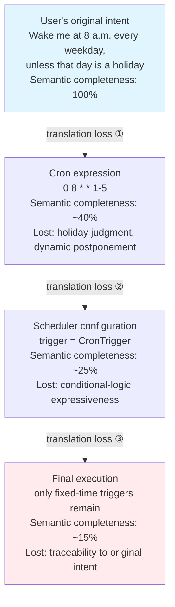

### Figure 2: Traditional Scheduler vs. Shícè Scheduler Architecture

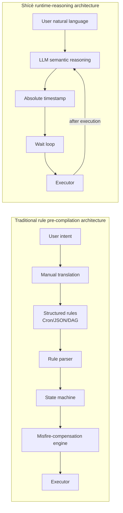

### Figure 3: The Five-Tuple of the Shícè Loop

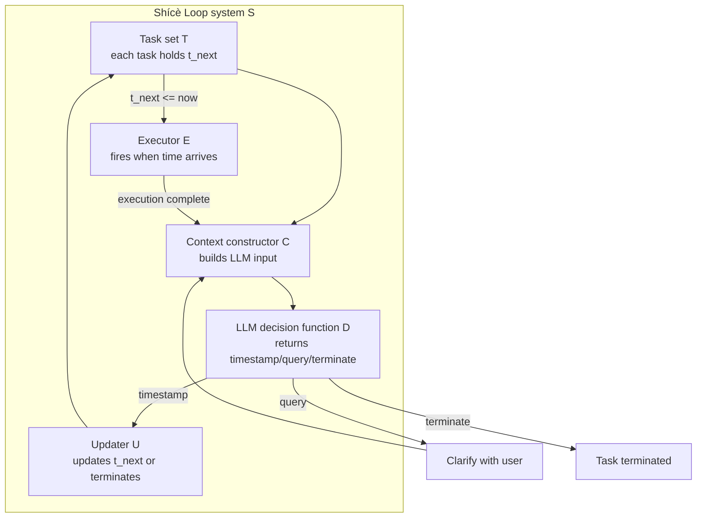

### Figure 4: Perceived Time Anchoring Sequence Diagram

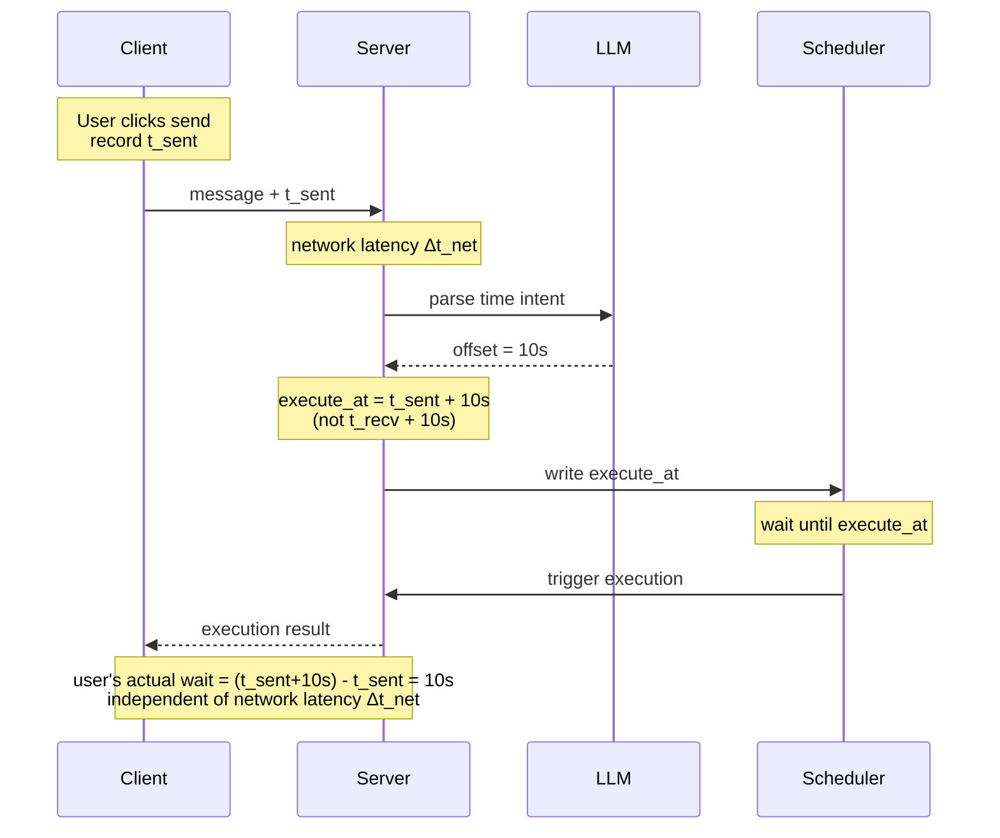

### Figure 5: Task-Lifecycle State Machine

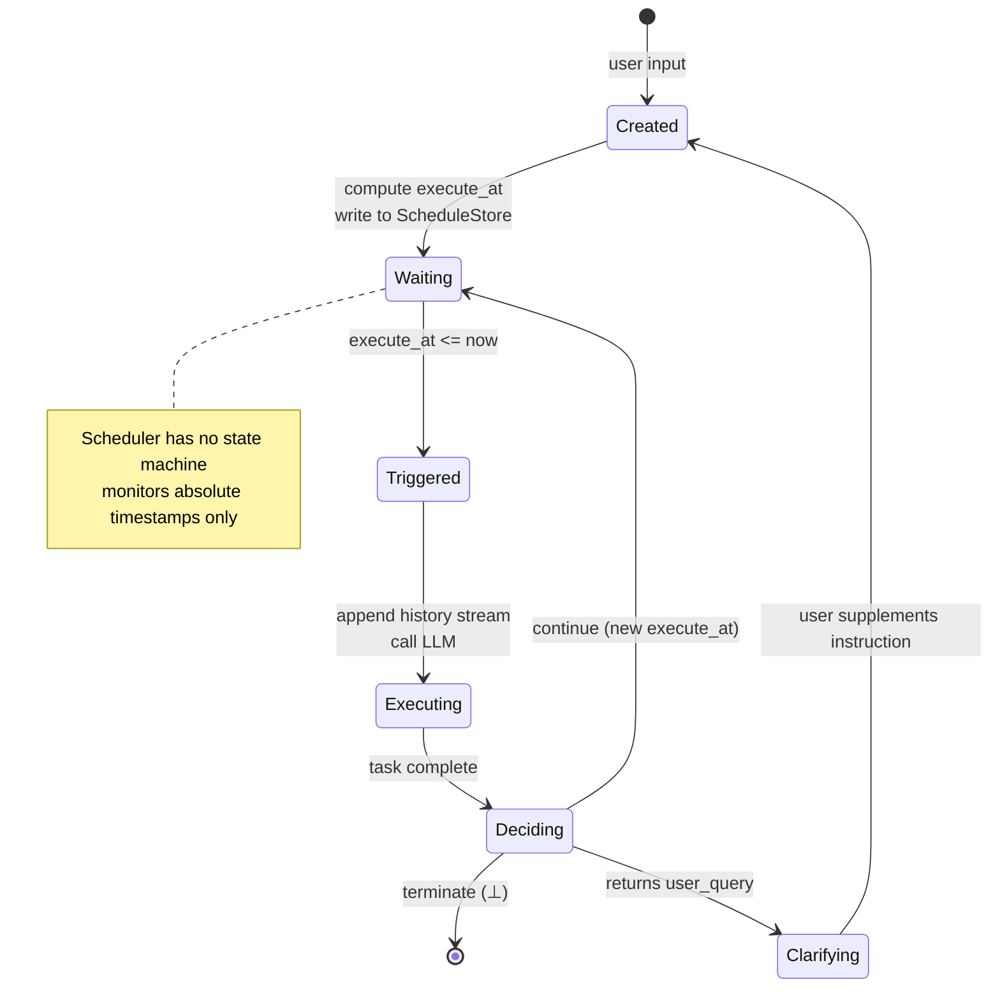

### Figure 6: System Architecture and Data Flow (Three Layers)

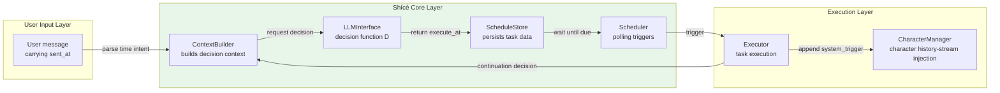

### Figure 7: Character-History-Stream Binding Sequence Diagram

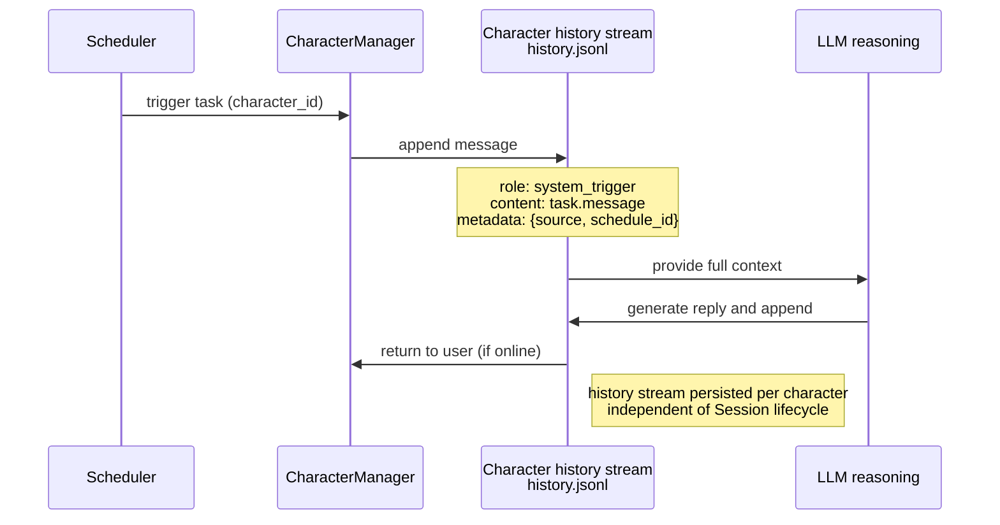

### Figure 8: Instruction-Coverage Comparison

*Note: Values in this figure are illustrative projections based on the evaluation protocol in Section 7; full experimental results will be released with the open-source repository.*

```mermaid
xychart
    title "Parseable Rate by Instruction Type"
    x-axis ["Absolute time", "Fixed freq", "Cron", "Workday", "Lunar", "External", "Fuzzy"]
    y-axis "Parseable rate (%)" 0 --> 100
    bar [95, 95, 80, 30, 10, 20, 0]
    bar [98, 98, 98, 95, 90, 85, 80]
```

### Figure 9: Code-Complexity Comparison

*Note: Values in this figure are illustrative projections based on the evaluation protocol in Section 7; full experimental results will be released with the open-source repository.*

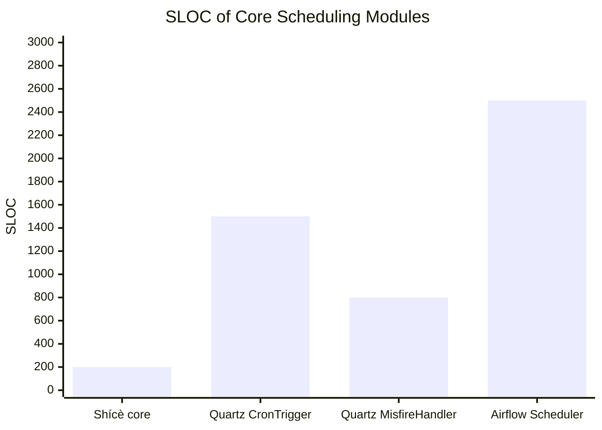

### Figure 10: Impact of Network Latency on Trigger Precision

*Note: Values in this figure are illustrative projections based on the evaluation protocol in Section 7; full experimental results will be released with the open-source repository.*

```mermaid
xychart
    title "Mean Absolute Error under Network Conditions"
    x-axis ["Good 50ms", "4G 200ms", "Weak 3G 600ms"]
    y-axis "MAE (ms)" 0 --> 800
    bar [30, 80, 150]
    bar [60, 220, 650]
```

### Figure 11: Usability-Test Results

*Note: Values in this figure are illustrative projections based on the evaluation protocol in Section 7; full experimental results will be released with the open-source repository.*

```mermaid
xychart
    title "Usability Test Results"
    x-axis ["Completion time", "Error rate", "Satisfaction"]
    y-axis "Score" 0 --> 200
    bar [45, 15, 90]
    bar [180, 65, 45]
```

### Table 1: Limitation–Mitigation Matrix

| Limitation dimension      | Description                                                | Mitigation strategy                                          | Priority |
| :------------------------ | :--------------------------------------------------------- | :----------------------------------------------------------- | :------- |
| LLM inference latency     | Continuation decisions take hundreds of ms to seconds      | Pre-computation; asynchronous confirmation                   | Medium   |
| LLM reasoning reliability | Hallucination, timezone confusion, date-calculation errors | Explicit confirmation as backstop; systematic measurement as future work | High     |
| High-frequency task cost  | Token consumption for per-second tasks is too large        | Minute-level and above is optimal; batch pre-computation     | Medium   |
| Distributed consistency   | Multi-instance race conditions                             | Single node for now; distributed locks in the future         | Low      |
| Privacy                   | Instructions uploaded to a cloud LLM                       | Support private deployment                                   | Medium   |

