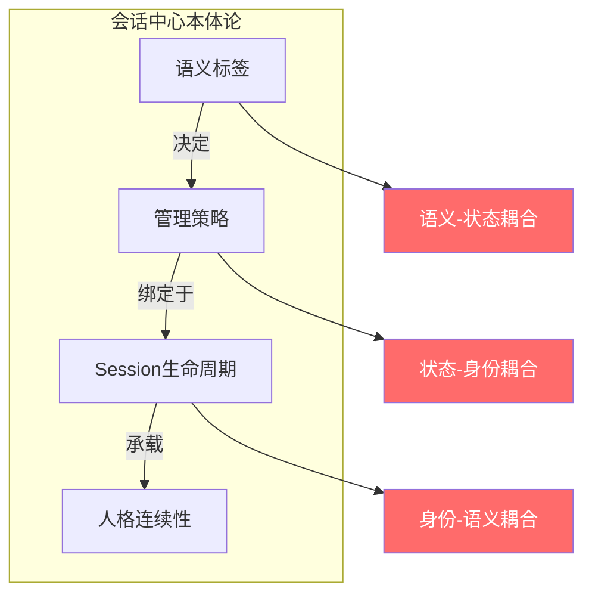
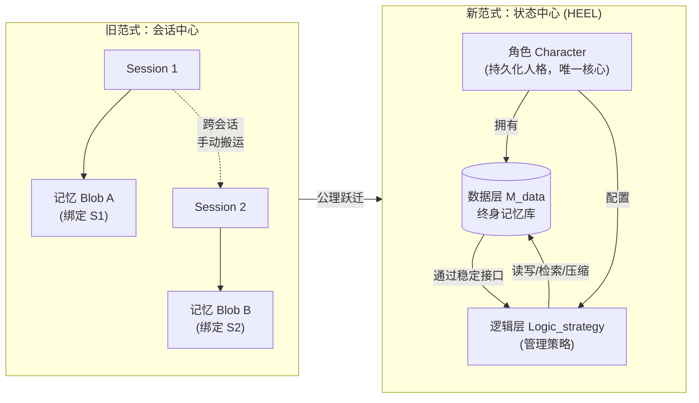
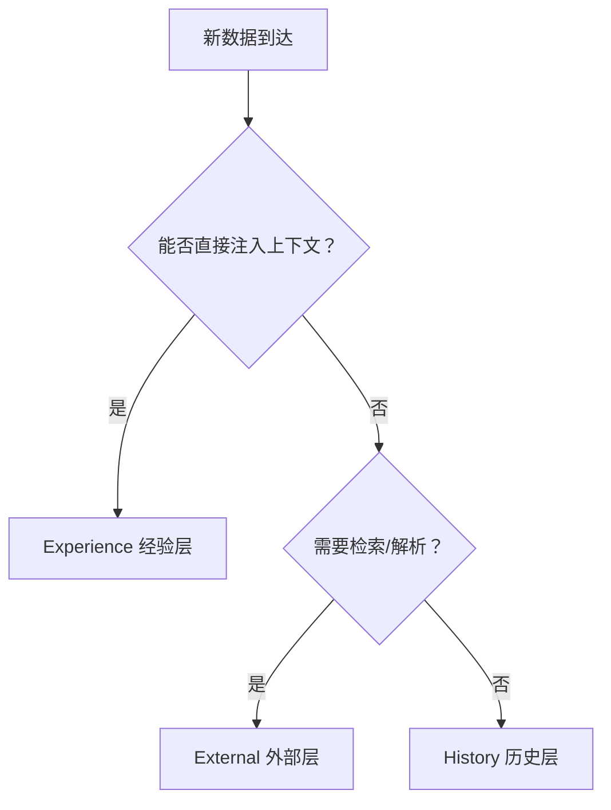
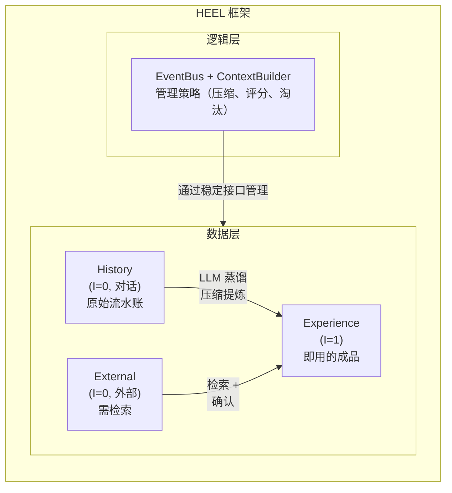
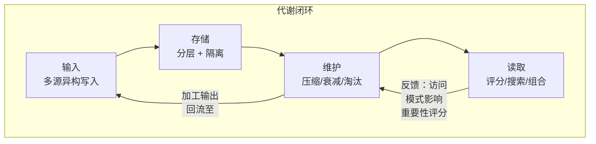
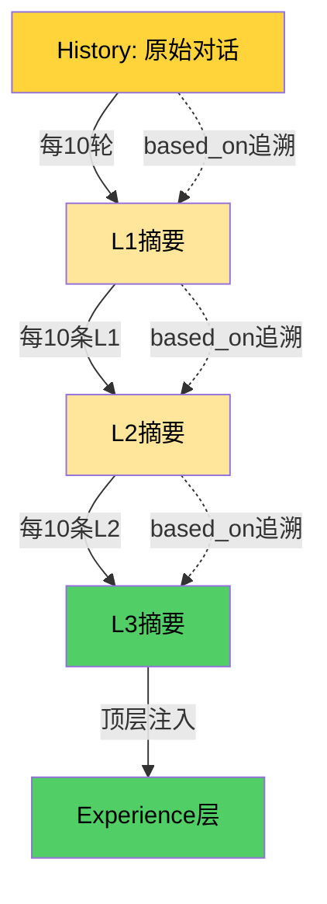

# HEEL：面向持久化智能体的状态中心自传体记忆架构

## ——超越会话中心本体论的新范式

---

## 摘要

**问题**：当前智能体记忆系统深陷“会话中心本体论”——以 Session 为唯一时间容器、以语义标签为管理依据。这导致记忆-身份-语义三重耦合，引发跨会话失忆、人格撕裂、上下文负担累积等系统性病变。现有方案（LangChain Memory、MemGPT、CrewAI 等）均在此范式内优化，未能触及病灶根源。

**洞察**：本文提出“状态中心分类学”（State-Centric Taxonomy），以数据的**就绪性**（Readiness）——即能否无需额外处理直接放入上下文窗口——作为唯一的、与语义正交的分类判据。在此基础上，本文进一步提出**元公理 0**，强制将数据层与逻辑层解耦，确立工程稳定性的根本来源。

**架构**：由该判据必然导出四元记忆结构 **HEEL**（History / Experience / External / Logic），辅以九维 MECE 数据模型与全生命周期代谢闭环。其中 History、Experience、External 构成数据层，Logic 构成逻辑层，两层通过稳定接口交互。身份的唯一持久化锚点是**角色**（Character）。角色的**记忆**由 HEEL 四部分统一构建与管理，角色的**理解**由可插拔的**义脑**（Yinao）提供。Session 降格为角色与外界交互的诸多可选通道之一（如窗口、API、消息等），其生命周期不再与记忆或身份耦合。

**消解**：本文证明，旧范式下的“工程难题”并非被解决，而是**自然消解**——跨会话连续性、人格稳定性、多任务支持等在新公理体系下成为定理的必然推论。数据-逻辑分离进一步保证：即使数据层分类方式随技术演进改变，逻辑层策略仍可保持稳定。

**贡献**：本文首次为智能体记忆领域建立**公理化基础**，并引入**数据-逻辑分离**作为元公理，使新架构成为理论演绎的内生产物，而非工程调参的结果。Session 中心主义的终结，不是因为现有系统不够优化，而是因为其公理前提在内部被证明是**不一致的**——除非抛弃该前提，否则这些“工程难题”无解。

**关键词**：智能体记忆；会话中心本体论；就绪性；状态中心分类；数据-逻辑分离；自传体记忆；人格连续性；范式转移

---

## 1. 引言：会话中心本体论的病理学

### 1.1 症状学：Session 容器下的三类病变

自大型语言模型（LLM）驱动的对话式智能体兴起以来，**Session（会话）** 一直作为上下文管理的基本设计原语。Session 将人格设定、对话历史和任务状态打包进一个单一容器，为资源分配和隔离提供了便利的边界。然而，这种便利掩盖了一项根本性的架构妥协。随着智能体从简单的聊天机器人进化为长期协作伙伴，三种系统性病变已变得不可回避：

| 病变类型       | 临床表现                                       | 用户感知                         |
| :------------- | :--------------------------------------------- | :------------------------------- |
| **跨会话失忆** | 新会话无法访问历史记忆，除非用户手动搬运上下文 | “我们昨天聊过这个，你不记得了？” |
| **人格撕裂**   | 上下文溢出时，人格设定与流水账被一并截断或压缩 | “你怎么突然变了一个人？”         |
| **上下文负担** | 大量无效冗余占据窗口，有效信息被挤出           | “聊了半小时，前面的事就忘了”     |

这些病变不是实现层面的 bug。它们是**一种共享本体论承诺的结构后果**：Session 边界应当定义记忆的范围，语义类别应当决定管理策略。当今所有主流框架——LangChain、LlamaIndex、MemGPT（Letta）、CrewAI、AutoGen——都在这一承诺下运行。由此产生的系统是在 flawed foundation 之上的精致工程成就。

### 1.2 误诊史：现有方案的“对症治疗”及其局限

研究界已经认识到这些病变，并以日益精细的工程方案予以回应。但由于底层本体论承诺始终未被质疑，这些方案治的是标而非本：

- **LangChain Memory** 提供三种模式——缓冲、摘要、向量——但三者都将持久化和检索逻辑绑定在 Session 生命周期上。记忆随 Session 而生，随 Session 而死。
- **MemGPT / Letta** 引入了操作系统隐喻与虚拟内存分页，但根本管理单元仍是“会话内的内存页”。页表以 Session ID 为键。
- **CrewAI 与 AutoGen** 通过评分和检索机制增强了记忆能力，但被评分的对象仍然是语义整体——整块标记为“事实”或“偏好”的记忆块。
- **结构化记忆系统** 如 claw-code 的 `memdir` 和 nanobot 按类型标签分类存储，实现了组织层面的清晰性，却未解决类型与加工策略之间的深层耦合。

**共同病灶**：所有这些改进都在“如何更好地管理 Session **内** 的记忆”这一范式内运作。**没有人质疑 Session 本身是否应作为记忆管理的基本单元。**

> **声明**：上述框架在其各自的范式假设内都是优秀的工程实现。HEEL 的批判指向的是它们**共享的隐含前提**，而非具体的技术贡献。

### 1.3 病理诊断：三重耦合的解剖

我们将架构病灶解剖为三种相互锁定的耦合：



- **语义-状态耦合**：数据的“是什么”决定了“怎么管”。一段对话文本，因其语义被标记为“对话历史”，便被迫跟随 Session 生灭，即使其中包含长期有价值的偏好信息。
- **状态-身份耦合**：人格设定与对话流水账同处一个 Session 容器。上下文溢出时，系统无法区别对待——要么全部保留（导致溢出），要么全部压缩（导致人格撕裂）。
- **身份-语义耦合**：长期身份标识（“我是谁”）被绑定在临时会话 ID 上。新会话意味着新身份实例，除非用户显式地将人格设定复制到新会话中。

### 1.4 本文的治疗方案：状态中心本体论与数据-逻辑分离

本文提出一个根本性的范式转移，包含四个核心主张：

1. **元层解耦**：显式区分**数据层**（存储可操作的内容）与**逻辑层**（封装管理策略），证明这是工程稳定性的根本来源（元公理 0）。
2. **公理重建**：抛弃“Session 是记忆的必然边界”这一隐含前提，建立以终身记忆库为核心的新公理体系。
3. **状态正交分层**：以“能否直接消费”这一纯工程判据替代语义分类，使管理策略与数据内容解耦。
4. **身份重锚**：将人格连续性的承载者从 Session 迁移到**角色（Character）**，使 Session 降格为角色与外界交互的一种可选通信通道。

本文将证明：在这一新范式下，旧范式的三大病变不再是被“解决”，而是**根本不再被提出**——因为产生这些病变的架构前提已被移除。同时，数据-逻辑分离保证该架构在面对未来技术演进时具有长久的稳定性。

*HEEL是AIOS范式度量衡的第一次落地：将“数据是什么”与“数据处于什么状态”分离为两个独立维度，更进一步将“数据”与“逻辑”分离为两个元层。它是交通规则中的第一步——先审查就绪性，再调度触发。*

---

## 2. 相关工作：智能体 记忆系统的批判性综述

现有智能体记忆方案可归纳为四类，它们共享一个未经审视的语义分类前提。

### 2.1 缓冲记忆：ConversationBufferMemory 及其变体

**机制**：以原始形式保留最近 $K$ 轮对话，通常附加 token 数量上限。

**病灶**：缓冲层完全绑定 Session。Session 终止时，其内容要么被丢弃，要么被序列化为不透明的 blob。跨会话访问需要手动加载。Session 内部当 token 达到上限时，截断是无差别的——最早的轮次被丢弃，无论其包含身份关键信息还是交易噪声。压缩标准纯粹是时间性的，而非语义或状态性的。

**数据-逻辑耦合**：截断策略（逻辑）硬编码在 Buffer 类中，与对话数据（数据）存储在同一对象内。

### 2.2 摘要记忆：ConversationSummaryMemory 与 MemGPT

**机制**：使用 LLM 将历史对话压缩为摘要式总结，以保真度换取紧凑性。

**病灶**：摘要质量依赖模型能力且天生有损。更关键的是，压缩过程将人格配置与对话历史视为**同质输入**。当 LLM 被指令“总结对话”时，它可能将关键的行为约束与琐碎的应答一同压缩掉。得到的摘要是身份与交易的混合物。MemGPT 的 OS 式创新——上下文与外部存储之间的虚拟内存分页——缓解了压力但未治愈疾病：页面错误处理程序仍在 Session 边界内运作；跨会话页面共享不是其设计的一部分。

### 2.3 向量检索记忆：CrewAI、Letta、LlamaIndex

**机制**：将记忆块嵌入向量空间，按与当前查询的语义相似度进行检索。

**病灶**：检索受语义相似度支配，但“相似”不等于“此刻可用”。一个向量检索到的块可能是需要重新解读的原始对话历史、可直接消费的处理后事实、或需要上下文框架的外部文档摘录。这三种状态被混杂在同一个向量空间中，因为嵌入捕获的是数据“关于什么”，而非“处于什么状态”。检索机制不知道返回的块能否原样注入还是需要进一步加工。

### 2.4 结构化记忆：claw-code memdir、nanobot

**机制**：按类型类别（fact、preference、lesson、habit）分类存储记忆，配备专用存储目录或 schema。

**病灶**：分类仍然是语义性的：类型标签决定了存储位置。然而一条“事实”的*加工状态*对系统是不可见的。一条“事实”可能是一句可直接注入的陈述；另一条可能是需要摘要的多段落原始对话。两者戴着同样的标签，住在同样的目录，受到同样的管理策略——尽管它们的就绪性截然不同。

### 2.5 病灶总结：语义分类法的根本缺陷

所有被调查的系统共享一个隐含前提：

> **语义分类假设**：一段记忆的管理策略应由其语义类型（是什么）决定。

这个前提就是病灶。它在“数据关于什么”和“数据应如何被管理”之间建立了一对一映射——这一映射模糊了原材料与成品、身份核心与交易噪声、可直接注入内容与需要检索管线内容之间的区别。我们所需要的不是更好的语义分类法，而是一种**与语义完全正交**的分类维度——一种独立于“意味着什么”而捕获“处于什么加工状态”的维度。更进一步，我们需要在元层上区分**数据**与**逻辑**，使得管理策略可以独立于数据结构演化。

---

## 3. 理论洞察：就绪性作为正交维度与数据-逻辑分离

### 3.1 旧公理的批判：Session 边界假设的内在矛盾

会话中心本体论的核心假设可形式化为：

> **旧公理（Session 边界假设）**：智能体 的记忆状态 $S$ 完全由当前 Session 容器定义。Session 内 = 在线可访问；Session 外 = 离线不可访问。

此公理导致两个不可调和的内部矛盾：

**矛盾一：身份矛盾**。智能体 需跨 Session 保持人格连续性（否则无法成为“长期伙伴”），但旧公理使持久化身份在逻辑上不可能——除非永久保存整个 Session（这在有限上下文窗口下不可行）。

**矛盾二：压缩矛盾**。上下文溢出时需压缩记忆以腾出空间，但旧公理未提供区分“可压缩的流水账”与“不可压缩的人格核心”的依据。压缩操作只能盲打，要么过度（伤及人格），要么不足（溢出依旧）。

这两个矛盾表明：**Session 边界假设在其体系内部是不自洽的**。任何在此假设下的工程优化，都只能缓和症状，无法根治病灶。

### 3.2 元公理 0：数据-逻辑分离

在提出关于记忆内容的具体公理之前，我们必须先确立一个更基础的、关于系统结构的元公理。

> **元公理 0（数据‑逻辑分离公理）**  
> 智能体 记忆系统必须划分为两个正交的元层：**数据层**（Data Layer）和**逻辑层**（Logic Layer）。数据层存储可被操作的内容——包括原始对话、加工后的经验、外部知识等；逻辑层封装管理这些内容的所有策略——包括写入优先级规则、检索算法、压缩触发器、淘汰机制、上下文组装顺序等。两层之间的接口应保持稳定，而各自的内部实现可独立演化。

**为什么要显式分离？**  
在现有系统（如 LangChain、MemGPT）中，管理策略往往硬编码在数据结构中：`ConversationBufferMemory` 同时存储对话历史和截断逻辑；`PageTable` 同时存储页映射和交换策略。这种耦合导致任何策略调整都需要修改数据存储代码，任何数据格式变化也会破坏策略实现。元公理 0 断言：这种耦合是架构疾病的根源。可持续的智能体记忆系统必须从设计之初就将“**被操作的对象**”与“**操作对象的规则**”解耦。

**推论 0（接口稳定性）**：数据层只需暴露符合逻辑层接口协议的读写、检索、元数据访问方法；逻辑层通过该接口操作数据，而不关心数据的具体存储形式（JSON、SQLite、向量库）或分类方式（History/Experience/External）。因此，数据层内部的演化（如新增一种记忆类型、调整就绪性阈值）不会迫使逻辑层修改。

### 3.3 新公理体系

我们提出三条新公理，构成状态中心本体论的基石。这三条公理位于数据层内部，但由逻辑层解释和执行。

> **公理 1（存在公理）**：智能体 拥有一个**终身记忆库** $\mathcal{M}$，其存在不依赖于任何特定 Session。$\mathcal{M}$ 是智能体记忆的持久化载体，其生命周期与智能体的身份标识绑定。

> **公理 2（状态正交公理）**：存在一个**就绪性**判据 $\mathcal{I}(d) \in \{0,1\}$，表示数据项 $d$ 能否在当前技术条件下无需额外处理（分块、检索、解析等）直接放入上下文窗口并被 LLM 有效理解。$\mathcal{I}(d)$ 与 $d$ 的语义内容**正交**，与 $d$ 所处的 Session 边界无关。$\mathcal{I}(d)=1$ 的状态称为**已就绪**——数据已加工至可被模型直接消费的状态。

**关于“就绪性”的操作化定义**：  
$\mathcal{I}(d) = 1$ 当且仅当满足以下全部条件：

1. $d$ 的体积不超过预设的 Token 阈值 $T_{\max}$；
2. $d$ 的格式可被 LLM 原生解析，或仅需极简序列化（如转为 JSON 字符串）；
3. $d$ 的内容是自包含的，理解它不需要额外的外部上下文。

**“正交”的含义**：$\mathcal{I}(d)$ 的计算不依赖于对 $d$ 的语义理解。考虑两条语义内容完全相同的数据项：(a) 用户陈述“我对青霉素过敏”的原始对话转录；(b) 由 LLM 从中提取的单句结构化事实 `{"fact": "User is allergic to penicillin"}`。语义上两者编码了相同信息，但就绪性根本不同：(b) 可直接注入新对话的系统提示；(a) 需要先解析、再解读、再提炼。在语义分类下，两者可能都被标记为“医疗偏好”；在状态中心分类下，它们处于不同层级——(a) 在 History，(b) 在 Experience——因为**加工状态不同**，与共享的语义无关。

> **公理 3（代谢必然公理）**：记忆库 $\mathcal{M}$ 必须持续经历**编码 → 巩固 → 衰减 → 淘汰**的代谢闭环，否则将因无限增长而导致检索效率与上下文注入质量的双重衰退。

**关于关注域的说明**：公理 1-3 覆盖了记忆的存在、加工状态和生命周期。但还有一个维度尚未被处理：**已就绪的数据中，此刻哪些应被触发？** 这个维度——我们称之为**关注域（Concentration Domain）**——与就绪性正交。HEEL 框架为关注域管理提供了必要的底层支撑，但完整的关注域理论不在本文范围内。本文聚焦于公理 1-3 及其推论的完整展开。

### 3.4 形式化定义：旧范式 vs 新范式

旧范式下，智能体 被形式化为一个从 Session-Query 对到响应的函数：

$$\text{Agent}_{\text{old}} : \text{Session}_i \times \text{Query} \rightarrow \text{Response}$$

其中 $\text{Session}_i$ 既是记忆容器，也是状态边界。

新范式下，智能体 被重新定义为：

$$\text{Agent}_{\text{new}} : (\mathcal{M}_{\text{data}}, \text{Logic}_{\text{strategy}}) \times \text{Query} \rightarrow \text{Response}$$

其中：

- $\mathcal{M}_{\text{data}}$ 是数据层的终身记忆库（公理 1）；
- $\text{Logic}_{\text{strategy}}$ 是逻辑层的策略集，包含关注域函数 $f_{\text{concentration}}$ 及其他管理策略；
- 最终响应由数据层与逻辑层协同产生：逻辑层根据当前 Query 调用关注域函数从数据层选择子集，组装上下文，交由 LLM 生成响应。

**范式转变的核心**：旧范式中，Session 同时承载身份、记忆归属和上下文管理三重职责。新范式中，**角色**是唯一核心——它拥有终身记忆，可同时通过多种方式（会话窗口、API、消息等）与外界交互，也可以完全不依赖会话。创建多个配置相似但记忆独立的副本（如双胞胎、复制体）只是 `CreateCharacter` 的多次调用，每个副本本身就是一个独立的角色。一次性临时对话同样通过创建临时角色实现，用完即删。Session 仅是交互通道的一种，不再具备任何架构层面的特殊性。



### 3.5 推论：解耦的必然性

由元公理 0 和公理 2（状态正交性）直接可得：

> **推论 1（逻辑-数据解耦推论）**：记忆的管理策略（存储位置、检索方式、淘汰时机、压缩方法）不由数据的语义决定，而应由 $\mathcal{I}(d)$ 决定，并且这些策略属于逻辑层，与数据层分离。

由公理 1（存在公理）与公理 2 联合可得：

> **推论 2（Session 降格推论）**：Session 不再是记忆管理策略的必然边界。记忆的归属由角色 ID（公理 1 中 $\mathcal{M}$ 的标识）决定，记忆的加工策略由 $\mathcal{I}(d)$ 决定，而记忆的组织和检索由逻辑层的关注域函数负责。

### 3.6 前瞻兼容性与数据-逻辑分离的价值

值得强调的是，HEEL 的分层以“当前技术条件下的就绪性”为判据，并且通过元公理 0 将数据与逻辑分离。这意味着架构天然具备**前瞻兼容性**：

- **上下文窗口扩大**：只需调高 Experience 层的 `max_tokens` 阈值——更多数据项自动获得就绪资格，数据层内部自动调整分类；逻辑层的检索、压缩策略无需改动。
- **模型原生能力增强**（如原生 PDF 解析）：PDF 从 External 自动迁移至 Experience，数据层的分类发生变化，但逻辑层的接口和策略保持不变。
- **用户手动标记**：上传的体积适中的内容可直接进入 Experience 层，同理不影响逻辑层。

**数据-逻辑分离带来的稳定边界**：无论数据层内部如何重组——例如，当上下文窗口极大时，部分 External 自动升为 Experience；或者当新的数据源类型（如实时传感器流）出现时，数据层只需新增一个子类——逻辑层的策略接口（写入优先级、复合评分、压缩触发器、组装顺序）均无需改动。这正是元公理 0 的工程意义：**变化被封装在数据层内部，逻辑层保持稳定**。

> **“Session 是一个‘时间容器’，而【经验】是一个‘就绪状态容器’。时间不是判断标准，就绪性才是。只要数据是就绪的，无论它是 3 秒前生成的摘要，还是 3 天前上传的简报，它都可以在同一时刻共存于【经验】中，共同构成模型的‘当下认知’。”**

---

## 4. HEEL 架构：公理体系的演绎构造

### 4.1 定理 1：数据-逻辑分离与数据层内部分层

由元公理 0 和公理 2 必然导出两个定理：

> **定理 1a（数据‑逻辑分离定理）**：在 HEEL 架构中，History、Experience、External 归属于**数据层**，Logic 归属于**逻辑层**。数据层存储可操作内容，逻辑层封装管理策略。

> **定理 1b（数据层三分定理）**：由公理 2（$\mathcal{I}(d)$ 的正交性）必然导出数据层的三元结构：
>
> - **History**（$\mathcal{I}(d) = 0$，来源为对话流）：原始对话流水账，只追加不修改。
> - **Experience**（$\mathcal{I}(d) = 1$）：可直接注入上下文的已就绪数据单元。
> - **External**（$\mathcal{I}(d) = 0$，来源为外部数据）：需检索/解析的外部数据源。

**经验准入决策流程**：



**证明概要（构造性）**：根据 $\mathcal{I}(d)$ 的取值，数据天然分为两类：$\mathcal{I}=1$（可直接注入）和 $\mathcal{I}=0$（需额外处理）。对于 $\mathcal{I}=0$ 的数据，进一步根据其来源区分：来自对话流者为 **History**，来自外部数据源者为 **External**。对于 $\mathcal{I}=1$ 的数据，统一归为 **Experience**。此外，根据元公理 0，需要一个不存储数据、专门管理前三层读写与演化的策略层，称为 **Logic**。此四层划分中前三层属于数据层，Logic 属于逻辑层，穷尽且互斥，故由元公理 0 和公理 2 必然导出。$\square$

**数据层与逻辑层的交互**：数据层中的 History、Experience、External 只负责存储和提供基本的数据访问接口（如 `get`, `put`, `query`）。逻辑层（EventBus, ContextBuilder, 评分模块等）通过这些接口读取数据、写入新数据、触发压缩和淘汰。这种设计保证了数据层的修改（如将 History 的存储从 JSONL 改为 Parquet）不会影响逻辑层的策略代码。

| 层次           | 所属元层 | 判据                      | 定义                               | 典型示例                                 |
| :------------- | :------- | :------------------------ | :--------------------------------- | :--------------------------------------- |
| **History**    | 数据层   | $\mathcal{I}=0$，对话原料 | 原始对话流水账，只追加不修改       | 用户:北京天气如何？助手:晴               |
| **Experience** | 数据层   | $\mathcal{I}=1$，即用成品 | 已就绪、可直接注入上下文的数据单元 | 摘要:用户常在北京工作；偏好:喜欢简练回答 |
| **External**   | 数据层   | $\mathcal{I}=0$，外部原料 | 需检索/解析的外部数据源            | 长 PDF 文档、SQL 数据库、网页搜索结果    |
| **Logic**      | 逻辑层   | —                         | 管理读写、淘汰、压缩的纯策略层     | 事件总线、上下文构建器、评分算法、触发器 |



**关键洞察**：分类不由数据“意味着什么”决定，而由“处于什么状态”决定——能否直接消费，还是需要加工？并且，所有管理策略与数据存储分离。

### 4.2 定理 2：代谢闭环定理

> **定理 2（代谢闭环定理）**：由公理 3（代谢必然公理）必然导出记忆生命周期的四阶段闭环：**输入 → 存储 → 维护 → 读取**。该闭环的实现跨越数据层与逻辑层：数据层负责存储，逻辑层负责维护和读取策略。

**证明概要**：公理 3 声明 $\mathcal{M}$ 必须经历持续的代谢加工。此代谢过程分解为四个必要阶段：(1) **输入**：新数据从多源进入数据层；(2) **存储**：数据在数据层被持久化记录与组织；(3) **维护**：逻辑层通过压缩、衰减、淘汰管理容量；(4) **读取**：逻辑层从数据层召回数据并组合进当前查询的上下文。闭环之所以闭合，是因为读取反馈至维护（访问模式影响重要性评分），维护前馈至经验质量。∎



### 4.3 工程映射：传统上下文结构在 HEEL 下的归属

为展示 HEEL 状态中心分类的实践精确性，我们将传统上下文结构映射到 HEEL 框架：

| 传统上下文结构 | 数据来源                            | 常见分类                  | HEEL 对应层级      | HEEL 视角下的关键判据       |
| :------------- | :---------------------------------- | :------------------------ | :----------------- | :-------------------------- |
| **系统设定**   | 开发者硬编码 / Config 文件          | SystemMessage / Prompt    | **Experience**     | 固化人格/约束，**直接消费** |
| **记忆摘要**   | 历史对话的摘要结果                  | ConversationSummaryMemory | **Experience**     | 已处理的事实片段            |
| **原始历史**   | 原始聊天记录流                      | ConversationBufferMemory  | **History**        | 未加工的原料流水账          |
| **工具定义**   | OpenAPI Spec / Function Call Schema | Tool / StructuredTool     | **Experience**     | 静态定义，直接注入          |
| **环境信息**   | 系统时间 API / 设备传感器           | 注入 Prompt 的变量        | **Experience**     | 体积极小，天然就绪          |
| **当前输入**   | 用户键盘/语音                       | HumanMessage              | **Logic 层触发源** | 触发管理动作的事件信号      |

**关键差异点**：

1. **LangChain 的模糊地带被切开**：LangChain 将 `ConversationBufferMemory`（原料）和 `ConversationSummaryMemory`（成品）统称为 **Memory**。但在 HEEL 中，前者是 **History**（占空间、需压缩），后者是 **Experience**（占空间、可直接用）。
2. **环境信息的轻量级特权**：时间、位置等信息虽来自“外部系统”，但获取成本极低且确定性极高，HEEL 赋予其 **Experience** 身份。

### 4.4 工具链路的 HEEL 解剖

一次完整的工具调用包含四个环节，在传统分类中常被混为一谈，但在 HEEL 中得到精确归属：

| 工具环节        | 传统分类（模糊） | HEEL 精确归属  | 核心判据（此刻能否被直接消费？）            |
| :-------------- | :--------------- | :------------- | :------------------------------------------ |
| **1. 工具定义** | Prompt 模板      | **Experience** | **能。** 静态文本，直接读取。               |
| **2. 调用指令** | AI 响应记录      | **History**    | **能。** 是对话流的一部分，记录备查。       |
| **3. 执行动作** | 后端逻辑         | **External**   | **否。** 必须脱离上下文，访问外部资源。     |
| **4. 返回结果** | Memory 写入      | **Experience** | **能。** 已获取的确定事实，直接注入下一轮。 |

**工程实现指导**：

- 对于返回结果（环节 4）：若调用计算器得到极长的 `3.1415926...`，逻辑层可能需做**截断或摘要**，使其保持在 Experience 的“即用”状态。
- 对于调用指令（环节 2）：这部分属 History，意味着随着对话变长，它是最先被**淘汰或摘要**的对象。模型不需要记得 10 轮之前调用工具的精确 JSON 字符串，只需要记得**结果**（Experience）。

---

## 5. 人格锚定与记忆组合：从继承到组合

### 5.1 角色作为记忆治理的天然锚点

数据层与逻辑层解耦后，需要一个持久化标识来组织终身记忆库 $\mathcal{M}$。**角色（Character）** 是唯一满足条件的锚点：

1. **角色是持久化的**：其生命周期与智能体的身份绑定，满足公理 1 的要求。
2. **角色是细粒度的**：它拥有完整的终身记忆库，逻辑层可以在其上按 $\mathcal{I}(d)$ 进行精细化加工。

相比之下，Session 因临时性和粗粒度而无法承担此职责（详见 3.1 节旧公理的矛盾证明），这正是旧范式系统性病变的根源。

### 5.2 定理 3：角色记忆与理解定理

> **定理 3（角色记忆与理解定理）**
>
> 由公理 1（$\mathcal{M}$ 的持久存在）与公理 2（$\mathcal{I}(d)$ 的正交性）联合导出：
>
> - 角色的**记忆**由 HEEL 四部分——History、Experience、External、Logic——统一构建与管理。四者协同完成记忆的存储、加工、检索和代谢，构成角色的终身记忆系统。
> - 角色的**理解**由**义脑（Yinao）**提供。义脑是角色的大脑——负责管理模型调用、感知推理状态、将上下文内容转化为理解输出的模块，可插拔替换。它从 HEEL 构建好的上下文中读取内容，进行推理和生成，但本身不存储记忆。

**证明概要**：公理 1 要求一个超越任何个体 Session 的持久实体（$\mathcal{M}$）。此持久实体必须拥有身份——否则便无归属记忆、偏好或行为连续性的基础。这就是**角色**。角色的记忆管理由定理 1a/1b 和定理 2 完整覆盖——HEEL 四部分协同构成记忆系统。执行推理的引擎（LLM 模型）是一个独立维度：将 GPT-4 换成 Claude 不改变访问的是谁的记忆，只改变推理风格。这就是**义脑**——角色管理模型调用的模块，可热插拔替换。HEEL 与义脑不在同一抽象层级：前者管记忆，后者管理解。

### 5.3 给习惯 Session 的开发者：旧概念在 HEEL 中的归位

| 你熟悉的场景 | 在 HEEL 中的对应操作 | 说明 |
| :--- | :--- | :--- |
| 开启一个新 Session | 角色通过任意通道（窗口/API/消息）开始一次交互 | Session 只是一种可选的通信通道，非必需 |
| 需要 AI 记住事情 | 写入角色的终身记忆库 | 记忆绑定角色，而非 Session |
| 同时开多个对话窗口 | 同一角色通过多个通道并行交互；或**创建多个独立角色** | 取决于是否需要记忆隔离 |
| 想要一个“分身”/双胞胎/复制体 | **创建一个新角色，复用原有配置** | 新角色拥有独立记忆，与原件无关 |
| 一次性临时对话，过后不保留记忆 | **创建一个临时角色，交互结束后删除** | 临时角色被销毁，记忆随之消失 |

**一句话总结**：旧范式通过 Session 实现的一切临时性和复用性需求，在 HEEL 中均由**角色本身的生命周期管理**来承担——创建、复制、删除角色都是基本操作。Session 仅仅是角色可以选择的一种通信方式，它可以是窗口、电话、消息，甚至只是一个函数调用。

### 5.4 角色锚定的工程优势

角色锚点解决了 Session 锚点无法解决的问题：

| 问题维度     | Session 锚定方案                    | 角色锚定方案                                             |
| :----------- | :---------------------------------- | :------------------------------------------------------- |
| 跨会话连续性 | 手动导出/导入 Session blob          | 自动：角色记忆库 M 持久存在，所有交互共享                |
| 模型切换     | “换了模型，AI 不会不认识我吧？”焦虑 | 义脑切换改变推理风格，不改变身份                         |
| 多任务并行   | 多 Session = 多个断联上下文         | 同一角色可同时服务于多个任务，各任务维持独立临时状态，共享终身记忆库 |
| 记忆调试     | “哪个 Session 出的 bug？”           | 定位清晰：义脑（推理问题）/ 角色记忆系统（记忆问题）     |

### 5.5 从继承到组合：记忆注入的范式转变

旧范式下，新 Session **继承** 角色的记忆——要么全拿（上下文膨胀），要么全丢（失忆）。这是**继承**模型。

HEEL 下，角色根据当前任务需求，动态决定激活自身的哪一部分配置、哪些记忆子集。这是**组合**模型。

| 方面     | 旧范式（继承）                | 新范式（组合）                                           |
| :------- | :---------------------------- | :------------------------------------------------------- |
| 机制     | 新 Session 接收角色全部记忆包 | 角色基于当前 Query 选择记忆子集                          |
| 粒度     | 全有或全无                    | 细粒度，按 Experience 项级别                             |
| 灵活性   | Session 创建时固定            | 交互中动态可调                                           |
| 可扩展性 | 角色记忆增长时退化            | 稳定：无关 Experience 被 $f_{\text{concentration}}$ 排除 |

### 5.6 组合策略的分类

组合策略是**角色自身的选择能力**。角色可以根据当前任务需求，动态决定激活自身的哪一部分配置、哪些记忆子集：

| 策略类型       | 定义                         | 实现方式                                          | 适用场景                   |
| :------------- | :--------------------------- | :------------------------------------------------ | :------------------------- |
| **绝对隔离**   | 角色以“全新状态”行事，不加载任何历史记忆 | 新交互状态仅注入不可变 Experience                  | 全新任务，不希望受过往干扰 |
| **相对隔离**   | 角色按标签/主题/时间筛选自身的记忆 | 注入时加 scope 过滤条件                           | 多项目并行，需要上下文聚焦 |
| **选择性继承** | 角色只激活高相关性的记忆子集 | 基于复合评分的 top-k 检索                         | 常规对话，自动关联相关记忆 |
| **懒加载**     | 角色按需从 External 层获取知识 | External 层检索接口                               | 低频访问的长尾知识         |

### 5.7 复合评分公式：决定“组合什么”的算法

关注域函数 $f_{\text{concentration}}$ 的核心是一个复合评分模型，该评分模型属于**逻辑层**的策略，它读取数据层的元数据并输出排序结果：

$$score = \alpha \cdot \text{Sim}(q, d) + \beta \cdot \text{Rec}(d) + \gamma \cdot \text{Imp}(d)$$

其中：

- $\text{Sim}(q, d)$：当前 Query 与记忆项 $d$ 的语义相似度（余弦相似度或 LLM 评分）；
- $\text{Rec}(d)$：新近度分数，采用半衰期 $H=30$ 天的指数衰减：$\text{Rec}(d) = 2^{-(t_{\text{now}} - t_{\text{last\_access}}) / H}$；
- $\text{Imp}(d)$：重要性分数，支持手动标注与自动衰减。

默认权重：$\alpha=0.5, \beta=0.3, \gamma=0.2$。权重可根据场景调整。

替换为其他评分策略（如学习式排序）时，数据层无需改动，这体现了数据-逻辑分离的优势。

### 5.8 术语学贡献：角色与义脑

为桥接技术实现与用户认知，我们引入一套植根于中文文化想象、兼具工程精确性的命名体系：

| 层级 | HEEL 正式术语 | 中文 | 近似英文对应 | 核心隐喻 | 定义 |
| :--- | :------------ | :--- | :----------- | :------- | :--- |
| 持久人格实体 | **Character** | 角色 | — | 戏台子上的人设 | 持久化人格标识。其记忆由 HEEL 四部分统一构建与管理。 |
| 可替换推理引擎 | **Yinao** | 义脑 | (≈ Cortex) | 可插拔的义肢 | 为角色提供理解能力的模型调用模块，可插拔替换。 |

*术语学说明*：上表中，**Yinao** 被确立为 HEEL 架构的正式技术术语。保留拼音是**术语精确性**的要求，而非文化装饰。

此命名体系服务于四个目的：(1) **语义解耦**——角色与义脑分别对应“记忆”与“理解”两个正交维度；(2) **模型切换的精准叙事**；(3) **工程索引的明确性**；(4) **用户心理模型的自然延伸**。

---

## 6. 工程实例化：定理的构造性证明

前文从公理到定理完成了 HEEL 架构的理论推导。本章将每一条定理映射为具体的工程实现——作为定理的**构造性证明**。关键点在于：所有实现均严格遵循数据层与逻辑层的分离。

### 6.1 九维 MECE 数据模型

HEEL 中每一条记忆数据都覆盖以下九个相互独立、完全穷尽（MECE）的正交维度。这些维度独立于语义内容，捕获的是数据的*管理相关属性*：

| 维度                  | 回答的问题               | 具体内容                                                     | 覆盖环节   |
| :-------------------- | :----------------------- | :----------------------------------------------------------- | :--------- |
| **D1 语义类型**       | 这是什么性质的数据？     | History: ActionStep/PlanningStep/TaskStep；Experience: Fact/Preference/Lesson/Skill/Persona/Context | 输入、存储 |
| **D2 可变性**         | 能被修改吗？             | Immutable / Mutable / Append-only                            | 存储、维护 |
| **D3 写入权与优先级** | 谁有权写？冲突时听谁的？ | Owner > User > LLM > External                                | 输入、维护 |
| **D4 可检索性**       | 怎么判断它值不值得读？   | Relevance（动态）+ Importance（静态）+ Access tracking       | 读取、维护 |
| **D5 生命周期管理**   | 过时了怎么办？           | Decay + Archive + Eviction                                   | 维护       |
| **D6 压缩方式**       | 空间不够时怎么缩？       | Incremental / Full；结构化模板                               | 维护       |
| **D7 作用域**         | 谁能看见它？             | Global / User / Workspace / Per-Agent                        | 存储、读取 |
| **D8 历史组织**       | （仅 History）怎么存？   | Buffer / Window / Summary；引用计数                          | 存储、读取 |
| **D9 检索策略**       | 怎么找到它？             | Vector / Keyword / Composite Scoring；子查询扩展             | 读取       |

> **元注释**：D3（写入优先级）、D5（生命周期）、D6（压缩方式）、D9（检索策略）本质上是**逻辑层策略的参数化表达**。它们作为元数据存储在数据层，但由逻辑层的 Manager 解释和执行。这体现了数据层与逻辑层之间的契约关系。

### 6.2 经验管理器：全生命周期实例化

经验管理器是经验“生杀大权”的唯一持有者，覆盖代谢闭环四大职责。经验管理器本身属于**逻辑层**，它通过数据层接口操作数据。

**输入阶段**：五类来源，受写入优先级规则统治（逻辑层策略）：

| 写入来源     | 触发条件                                | 核心规则                                 | 参考项目           |
| :----------- | :-------------------------------------- | :--------------------------------------- | :----------------- |
| 用户直接指令 | 用户明确说“记住...”“不要忘记...”        | 最高优先级（仅低于 Owner 人工写入）      | llm-app, claw-code |
| LLM 主动提炼 | 每 N 轮对话后 / 会话结束时              | 自动从历史总结事实/偏好/教训，去重后写入 | CrewAI, nanobot    |
| 历史压缩触发 | 会话 Token 数超过上下文窗口的 **83.5%** | 将超出的历史提炼为结构化经验             | nanobot, MemGPT    |
| 外部数据导入 | 上传文件、RAG 结果标记为“长期记住”      | 低优先级，不可覆盖用户/人工写入内容      | Letta              |
| 系统预设     | 智能体 启动时加载的人设 / 系统指令      | **Immutable 不可变**，最高权限           | Letta, smolagents  |

写入优先级：**Owner > User > LLM > External**。冲突按层级解决。

**存储阶段**：JSON/SQLite 默认持久化；向量存储用于可扩展语义检索。按 Global / User / Workspace / Per-Agent 作用域隔离。存储逻辑属于数据层。

**维护阶段**（逻辑层策略）：四种机制持续运作：

1. **增量压缩**：仅压缩“上次摘要之后的新消息”，保留最近 N 条不压缩。压缩采用结构化模板。
2. **重要性衰减**：$I_{\text{new}} = I_{\text{old}} \times (1 - \text{decay\_rate})^{\text{days}}$，默认 $\text{decay\_rate} = 0.01$（每日衰减 1%）。
3. **两级容量管控**：
   - **70%** 阈值：对低置信度/低重要性块做 LLM 摘要合并。
   - **90%** 阈值：按“最低重要性优先 > 最久未访问优先 > 最旧优先”顺序淘汰。
4. **归档**：长期未访问（如 90 天）但重要性较高的经验移出主存储，放入归档库。

**读取阶段**（逻辑层策略）：召回流程——先让 LLM 生成多个子查询并行检索，结果经复合评分公式排序后注入上下文。

### 6.3 摘要金字塔：History → Experience 的转化机制

摘要金字塔是公理 3“巩固”阶段的实例化——将原始 History 转化为结构化 Experience 的分层蒸馏管线：



- 每 10 轮（策略可调）对话生成一条 L1 摘要。
- 每 10 条 L1 摘要生成一条 L2 摘要。
- 每层摘要保留 `based_on` 字段用于完整溯源。
- 只有**金字塔顶层**注入 Experience 层；底层原始记录保留在 History 层。
- 金字塔范围按**主题独立构建**，而非包罗万象。

**存储结构**：

```
history/{char_id}/
  history.jsonl          ← 原始对话（只追加）
  meta.json              ← 元数据
  summaryL1.jsonl        ← 金字塔 L1（含 based_on 链）
  summaryL2.jsonl        ← 金字塔 L2（含 based_on 链）
  summaryL3.jsonl        ← 金字塔 L3（含 based_on 链）

experience/{char_id}/
  summary.jsonl          ← 精加工产物（source="review"）
  index.json             ← 内存索引快照
```

### 6.4 上下文构建器：$f_{\text{concentration}}$ 的组装逻辑

上下文构建器是关注域函数 $f_{\text{concentration}}$ 的一种具体实现，属于**逻辑层**。它按固定优先级拼接全链路上下文：

```
SystemPrompt → 角色 Experience → 检索召回的相关 Experience → 近期 History → 当前用户消息
```

此顺序保证：无论上下文窗口压力多大，身份定义性内容（System Prompt + 角色 Experience）永远不会被交易性内容置换。窗口接近容量时，从右侧开始修剪——History 先被压缩，检索到的 Experience 按排名截断，Character Experience 到最后才被触碰。

### 6.5 机制与定理的对应关系总结

| 工程机制                                          | 所实例化的定理/公理                      |
| :------------------------------------------------ | :--------------------------------------- |
| 数据层与逻辑层分离架构                            | 元公理 0                                 |
| 四层存储结构（数据层的 H/E/Ext + 逻辑层的 Logic） | 定理 1a & 1b（数据-逻辑分离+数据层三分） |
| 四阶段生命周期（输入→存储→维护→读取）             | 定理 2（代谢闭环）                       |
| 角色记忆（HEEL）+ 理解（义脑）架构                | 定理 3（角色记忆与理解定理）             |
| 复合评分公式                                      | $f_{\text{concentration}}$ 的评分实现    |
| 摘要金字塔                                        | 公理 3 的巩固机制                        |
| 九维 MECE 模型                                    | 跨定理 1–3 的数据描述                    |
| 增量压缩 + 两级容量管控                           | 公理 3 代谢必然性                        |
| 上下文构建器组装顺序                              | $f_{\text{concentration}}$ 具体实现      |

---

## 7. 范式消解与新研究议程

### 7.1 消解命题 1：跨会话连续性

**旧范式问题**：Session 边界导致失忆。每个新 Session 以空白或手动搬运的上下文开始。

**HEEL 消解**：由公理 1，$\mathcal{M}$ 绑定于角色，与交互通道无关。无论角色通过窗口、API 还是消息交互，记忆始终归属于角色。临时对话通过创建临时角色实现，其销毁不影响原角色。**问题被消解**，因为创造它的条件——Session 作为记忆边界——已被移除。

### 7.2 消解命题 2：人格稳定性

**旧范式问题**：上下文压缩时将人格设定与交易流水账混排，系统被迫裁剪时“人格撕裂”。

**HEEL 消解**：由定理 1b，人格设定 $\in$ Experience（$\mathcal{I}=1$），交易流水账 $\in$ History（$\mathcal{I}=0$）。压缩主要作用于 History；Experience 受上下文构建器组装优先级的保护。**人格撕裂的条件被移除**。

### 7.3 消解命题 3：上下文管理负担

**旧范式问题**：用户必须记得“在哪说过什么”，手动复制粘贴上下文跨 Session。

**HEEL 消解**：由公理 1 和 $f_{\text{concentration}}$，连续性由系统自动维护。用户只需指定**关注点**（哪个任务、哪个上下文），系统自动组合适当记忆子集。**手动搬运的需求消失**。

### 7.4 消解 vs 解决：总结

| “问题”（旧范式下） | 传统方案                               | HEEL 方案                                                    |
| :----------------- | :------------------------------------- | :----------------------------------------------------------- |
| 跨会话失忆         | 导出/导入 Session blob；手动上下文搬运 | $\mathcal{M}$ 归属角色，与交互通道解耦；$f_{\text{concentration}}$ 自动组合上下文 |
| 人格撕裂           | 启发式保护压缩时的“重要”token          | 定理 1b 将 Experience（身份）与 History（交易）设计上分离    |
| 上下文膨胀         | 更好的摘要；更聪明的截断               | 组合模型：只有相关 Experience 被注入                         |
| 手动记忆管理       | UI 搜索历史；“置顶”消息                | 用户指定关注点；系统处理组合                                 |

### 7.5 新范式下的研究议程

旧问题消解后，新问题浮现——这些问题在会话中心本体论下甚至无法被连贯地提出：

1. **$f_{\text{concentration}}$ 的最优化**：关注域函数如何根据当前 Query 和角色记忆状态动态决定注入哪些 Experience？方向包括学习式关注域机制、用户反馈驱动的排名自适应、多目标优化。
2. **代谢速率自适应**：重要性评分中的衰减率是否应根据交互频率、用户反馈或领域特性自动调整？
3. **多主体隐私隔离**：多个用户共享一个角色时，Experience 作用域如何精细划分？
4. **跨角色经验迁移**：一个角色习得的 Lesson 如何传播给同一用户的其他角色？
5. **义脑感知的记忆组合**：不同 LLM 模型拥有不同的上下文窗口大小和推理能力，$f_{\text{concentration}}$ 是否应由激活的义脑参数化？

### 7.6 兼容路径：渐进式迁移

HEEL 设计为增量式采用。可作为独立记忆模块，通过以下五阶段集成到现有框架中（新增 Phase 0 体现元公理 0 的工程价值）：

| 迁移阶段    | 操作                                                         | 效果                           |
| :---------- | :----------------------------------------------------------- | :----------------------------- |
| **Phase 0** | 将现有框架中的记忆存储逻辑与管理策略代码分离为不同模块，定义清晰接口 | 获得数据-逻辑分离的稳定性收益  |
| **Phase 1** | 引入 Experience 层，将高频对话摘要写入角色级经验             | 减少重复解释，提升常用场景体验 |
| **Phase 2** | 引入复合评分检索，替换简单的缓冲/摘要策略                    | 上下文密度显著提升             |
| **Phase 3** | 引入角色-义脑架构，将 Session 降格为可选的通信通道          | 实现跨会话连续性               |
| **Phase 4** | 全量迁移到 HEEL 架构，启用完整代谢闭环                       | 旧范式问题全面消解             |

**具体集成方式**：

- **LangChain 集成**：实现 `HEELMemory` 类，遵循 `BaseMemory` 接口，内部管理 HEEL 四层结构，并强制分离数据存储与策略。
- **AutoGen 集成**：作为自定义 `Memory` 组件，在 `ConversableAgent` 初始化时注入。
- **CrewAI 集成**：HEEL 的 Experience Manager 替代 CrewAI 的记忆评分与检索。

---

## 8. 结论

本文完成了一次从诊断到重建的完整范式转移，其逻辑链条如下：

1. **诊断**：会话中心本体论是智能体记忆系统性病变的根源。现有方案均为语义分类法下的误诊——治标而不治本。
2. **元层解耦**：确立元公理 0（数据-逻辑分离），使智能体记忆系统获得工程稳定性的根本来源。
3. **解耦**：确立公理 1–3，以就绪性 $\mathcal{I}(d)$ 为正交判据，将数据从语义与 Session 的双重绑定中解放。
4. **重建锚点**：由公理导出 HEEL 四元架构与代谢闭环，确立**角色**为记忆治理的唯一持久化重心。角色的记忆由 HEEL 统一构建与管理，角色的理解由义脑提供。
5. **释放自由**：在角色框架内，记忆组合策略从“继承全部”变为“按需组合”，绝对隔离与相对隔离自由编排。Session 降格为一种可选的通信通道；复制、临时对话等需求均通过角色的创建与删除自然地实现，无需引入额外概念。
6. **工程证明**：将每条定理映射为具体的工程实现——九维 MECE 模型、经验管理器、摘要金字塔、上下文构建器，并严格遵循数据-逻辑分离。
7. **范式消解**：旧范式下的“工程难题”不是被解决的，而是自然消解的。跨会话连续性、人格稳定性、上下文管理负担在新公理体系下成为定理的必然推论。

**Session 中心主义的终结，不是因为找到了更好的工程方案，而是因为其公理前提被证明是错误的。** HEEL 不是又一套记忆系统，而是智能体记忆领域的一次公理重建。正如非欧几何不是“更好的欧氏几何”，而是在不同公理基础上的全新几何体系——HEEL 不是在 Session 中心假设的框架内做优化，而是换了一组更自洽的公理，让旧问题自然消失，让新问题自然浮现。

**本文更深层的贡献**：HEEL 不仅是四元记忆架构，更首次在智能体记忆领域建立了**数据‑逻辑分离**的工程原则。这一原则的稳定性远超任何一种具体的数据分类法。即使未来 History/Experience/External 的划分被新的技术范式取代，数据与逻辑的分离仍将作为可持续智能体记忆系统的基石而存在。

架构贡献——四元分层、代谢闭环、九维 MECE 模型、角色记忆（HEEL）+ 理解（义脑）架构、组合式记忆注入——不是试错积累出的工程优化。它们是**从第一性原理出发的逻辑演绎**。这正是范式转移的决定性特征：不是新系统更擅长解决旧问题，而是旧问题被揭示为已丢弃世界观的产物。

当记忆不再被时间容器割裂，当人格不再因上下文溢出而撕裂，智能体 便真正拥有了与用户共同成长的能力——每一次对话都是自传的新篇章，而非孤立的、终将被遗忘的会话片段。

---

## 参考文献

[1] Chase, H. (2022). LangChain: Building applications with LLMs through composability.

[2] Wang, J., et al. MemGPT: Towards LLMs as Operating Systems[C]// NeurIPS 2023 Workshop on Instruction Tuning and Instruction Following, 2023.

[3] Packer, C., et al. Letta: A Framework for Building Stateful LLM Applications[J]. arXiv preprint arXiv:2410.05630, 2024.

[4] CrewAI (2024). CrewAI Documentation: Memory Systems.

[5] Li, G., et al. AutoGen: Enabling Next-Gen LLM Applications via Multi-Agent Conversation Framework[C]// ACM CIKM 2023 Workshop, 2023.

[6] Liu, X., et al. Agents: An Open-Source Framework for Autonomous Language Agents[J]. arXiv preprint arXiv:2309.07870, 2023.

[7] Park, J. S., et al. Generative Agents: Interactive Simulacra of Human Behavior[C]// UIST, 2023: 1-22.

[8] Kuhn, T. S. The Structure of Scientific Revolutions (2nd ed.)[M]. University of Chicago Press, 1970.

[9] Tulving, E. Elements of Episodic Memory[M]. Oxford University Press, 1983.

[10] Conway, M. A. Sensory-Perceptual Episodic Memory and Its Context: Autobiographical Memory[J]. Philosophical Transactions of the Royal Society B, 2001, 356(1413): 1375-1384.

[11] Kojima, T., et al. Large Language Models are Zero-Shot Reasoners[C]// NeurIPS, 2022: 22199-22213.

[12] Wei, J., et al. Chain-of-Thought Prompting Elicits Reasoning in Large Language Models[C]// NeurIPS, 2022: 24824-24837.

[13] Yao, S., et al. ReAct: Synergizing Reasoning and Acting in Language Models[C]// ICLR, 2023.

[14] Wu, S., et al. Personalized Dialogue Generation with Profile-Based Memory Architecture[C]// ACL, 2021.

---

## 附录 A：HEEL 术语表

| 术语                                  | 定义                                                         |
| :------------------------------------ | :----------------------------------------------------------- |
| **数据层（Data Layer）**              | 存储可操作内容的元层，包含 History、Experience、External。   |
| **逻辑层（Logic Layer）**             | 封装管理策略的元层，包含 EventBus、ContextBuilder、评分算法等。 |
| **History（历史）**                   | 原始对话流水账，只追加，$\mathcal{I}(d)=0$。属于数据层。     |
| **Experience（经验）**                | 已就绪可直接注入的数据单元，$\mathcal{I}(d)=1$。属于数据层。 |
| **External（外部知识）**              | 需检索或解析才能使用的外部数据源，$\mathcal{I}(d)=0$。属于数据层。 |
| **Logic（逻辑）**                     | 管理数据层读写/演化/压缩的纯策略层，属于逻辑层。             |
| **角色（Character）**                 | 绑定终身记忆库 $\mathcal{M}_{\text{data}}$ 的持久化人格标识。HEEL 架构的唯一持久化实体。其记忆由 HEEL 四部分统一构建与管理。角色的创建、复制和删除是系统的基本操作。 |
| **义脑（Yinao）**                     | 为角色提供理解能力的模型调用模块，可插拔替换。HEEL 正式术语。从 HEEL 构建好的上下文中读取内容进行推理和生成，本身不存储记忆。 |
| **就绪性（$\mathcal{I}(d)$）**        | 数据 $d$ 能否无需额外处理直接放入上下文窗口的判据。与语义正交。 |
| **复合评分（Composite Score）**       | 语义相似度、新近度和重要性的加权组合，用于记忆排序。         |
| **代谢闭环（Metabolic Closed Loop）** | 四阶段循环：输入 $\rightarrow$ 存储 $\rightarrow$ 维护 $\rightarrow$ 读取。 |
| **摘要金字塔（Summary Pyramid）**     | 通过多级摘要将 History 蒸馏为 Experience 的分层机制。        |
| **上下文构建器（Context Builder）**   | $f_{\text{concentration}}$ 的具体实现，属于逻辑层。          |

## 附录 B：经验管理器核心接口（Python Protocol）

```python
from typing import Protocol, List, Optional, Dict, Any
from datetime import datetime
from enum import Enum

class ExperienceType(Enum):
    FACT = "fact"
    PREFERENCE = "preference"
    LESSON = "lesson"
    SKILL = "skill"
    PERSONA = "persona"
    CONTEXT = "context"

class WritePriority(Enum):
    OWNER = 0
    USER = 1
    LLM = 2
    EXTERNAL = 3

class Mutability(Enum):
    IMMUTABLE = "immutable"
    MUTABLE = "mutable"
    APPEND_ONLY = "append_only"

class Experience(Protocol):
    id: str
    type: ExperienceType
    content: str
    scope: str
    importance: float
    created_at: datetime
    last_accessed: Optional[datetime]
    access_count: int
    decay_rate: float
    mutability: Mutability
    source_priority: WritePriority
    embedding: Optional[List[float]]
    based_on: Optional[List[str]]  # 溯源链

# 逻辑层接口：通过数据层操作
class DataLayerInterface(Protocol):
    def get_experience(self, exp_id: str) -> Optional[Experience]: ...
    def put_experience(self, exp: Experience) -> bool: ...
    def query_experiences(self, filter: Dict[str, Any]) -> List[Experience]: ...
    def delete_experience(self, exp_id: str) -> bool: ...

class ExperienceManager(Protocol):
    def __init__(self, data_layer: DataLayerInterface): ...
    
    def write(self, exp: Experience, force: bool = False) -> bool:
        """写入经验。若被优先级规则拒绝则返回 False。"""
        ...
    
    def retrieve(self, query: str, scope: str,
                 top_k: int = 10,
                 weights: Dict[str, float] = None) -> List[Experience]:
        """按复合评分检索 top-k 经验。"""
        ...
    
    def compact(self, scope: str) -> int:
        """执行增量压缩。返回压缩的条目数。"""
        ...
    
    def decay(self, scope: str) -> int:
        """应用重要性衰减。返回受影响的条目数。"""
        ...
    
    def evict(self, scope: str, threshold: float = 0.9) -> int:
        """若容量超过阈值则淘汰条目。返回淘汰数。"""
        ...
    
    def archive(self, scope: str, days: int = 90) -> int:
        """归档长期未访问的高重要性条目。返回归档数。"""
        ...
```

## 附录 C：HEEL 与现有记忆系统的对比测试设计

| 测试维度         | 指标                         | HEEL                             | LangChain BufferMemory | LangChain SummaryMemory |
| :--------------- | :--------------------------- | :------------------------------- | :--------------------- | :---------------------- |
| **跨会话连续性** | Session 重启后事实召回准确率 | $\mathcal{M}$ 持久存在；自动组合 | 0%（除非手动搬运）     | 依赖摘要质量            |
| **人格稳定性**   | 上下文压力下人格依从度       | 受组装优先级保护                 | 随缓冲截断而退化       | 随摘要压缩而退化        |
| **上下文效率**   | 上下文窗口信噪比             | 高（经相关性过滤）               | 低（未过滤历史）       | 中（有损摘要）          |
| **记忆增长**     | 长期对话存储增长率           | 次线性（压缩+衰减）              | 线性（原始累积）       | 次线性（摘要增长）      |
| **用户认知负担** | 维持连续性所需操作数         | 0（自动）                        | 高（手动导出/导入）    | 中（定期回顾）          |

## 附录 D：形式化符号汇总

| 符号                             | 含义                                                      |
| :------------------------------- | :-------------------------------------------------------- |
| $\mathcal{M}_{\text{data}}$      | 数据层的终身记忆库（公理 1）                              |
| $\text{Logic}_{\text{strategy}}$ | 逻辑层的策略集（元公理 0）                                |
| $\mathcal{I}(d) \in \{0, 1\}$    | 数据 $d$ 的就绪性判据（公理 2）                           |
| $f_{\text{concentration}}$       | 关注域函数，从 $\mathcal{M}_{\text{data}}$ 中选择记忆子集 |
| $\text{Character}$               | 角色（记忆归属的唯一持久化主体）                          |
| $\text{decay\_rate}$             | 重要性衰减率（默认 0.01/天）                              |
| $\alpha, \beta, \gamma$          | 复合评分的三维权重                                        |
| $\text{Sim}(q, d)$               | 语义相似度评分                                            |
| $\text{Rec}(d)$                  | 新近度评分（半衰期 30 天）                                |
| $\text{Imp}(d)$                  | 重要性评分（可手动标注+自动衰减）                         |

---

*完整修改版完成于 2026 年 5 月。ArXiv 预印本，欢迎引用与讨论。*