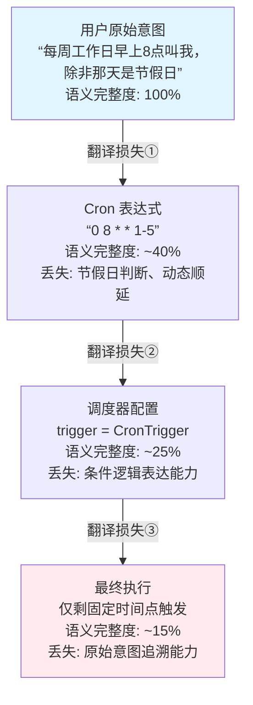
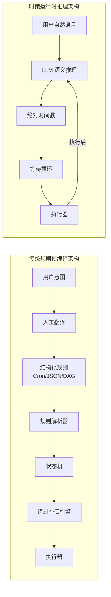
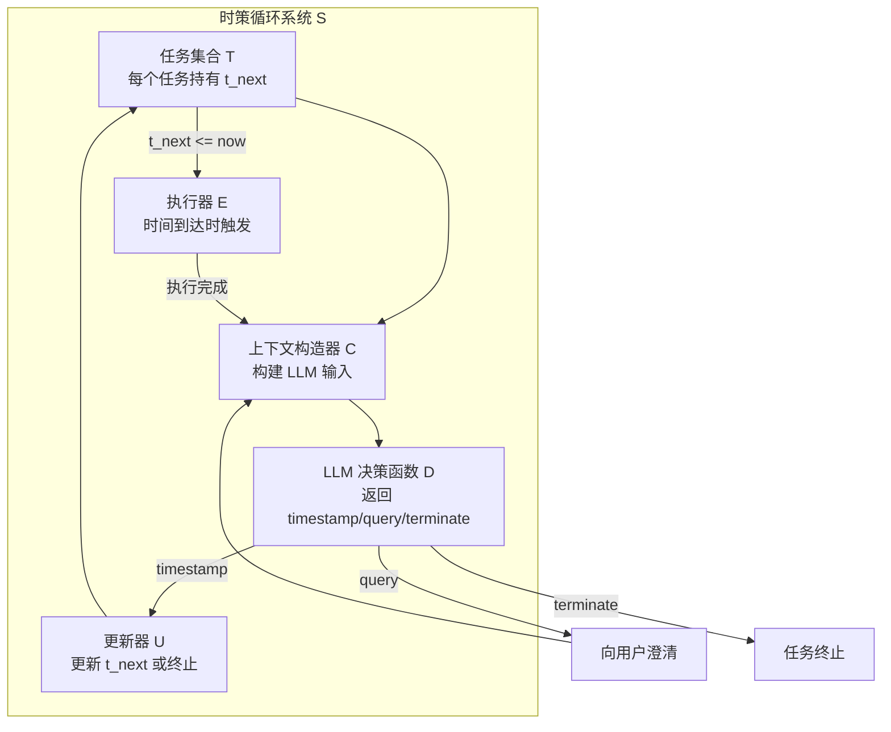
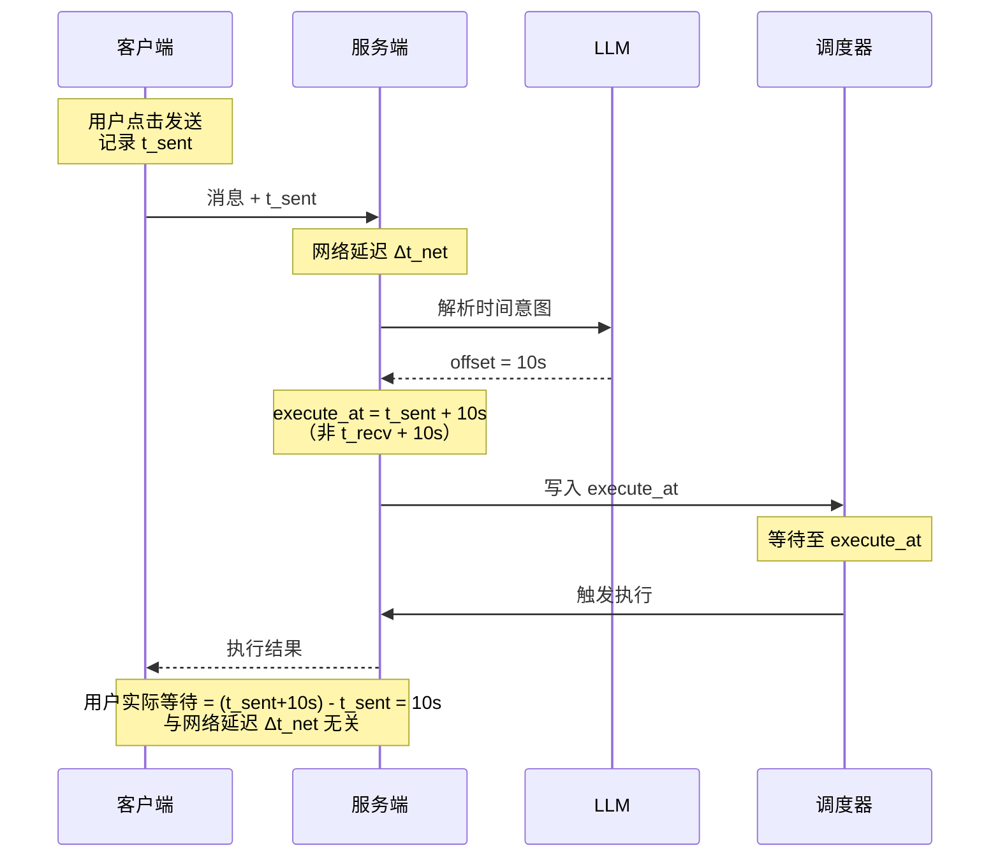
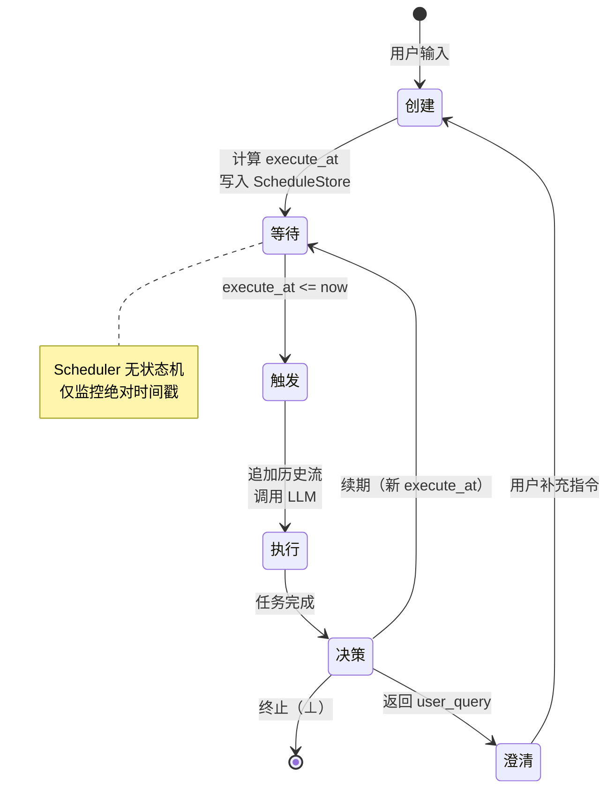
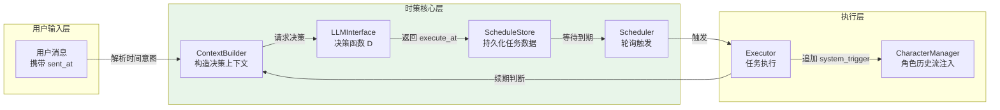
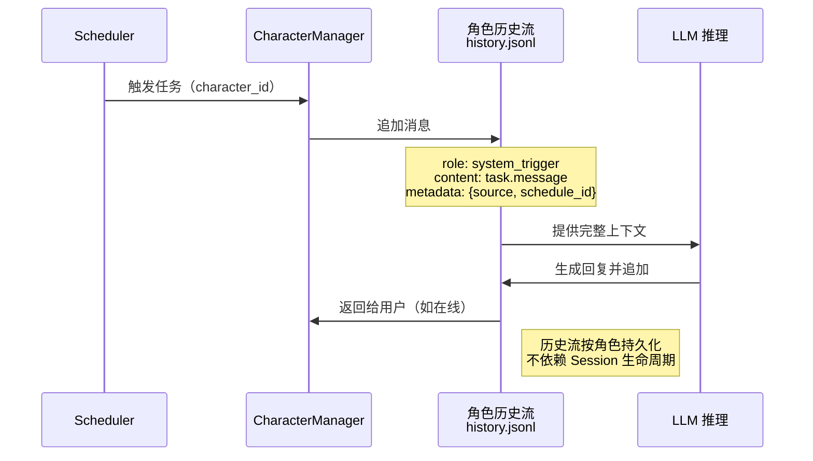
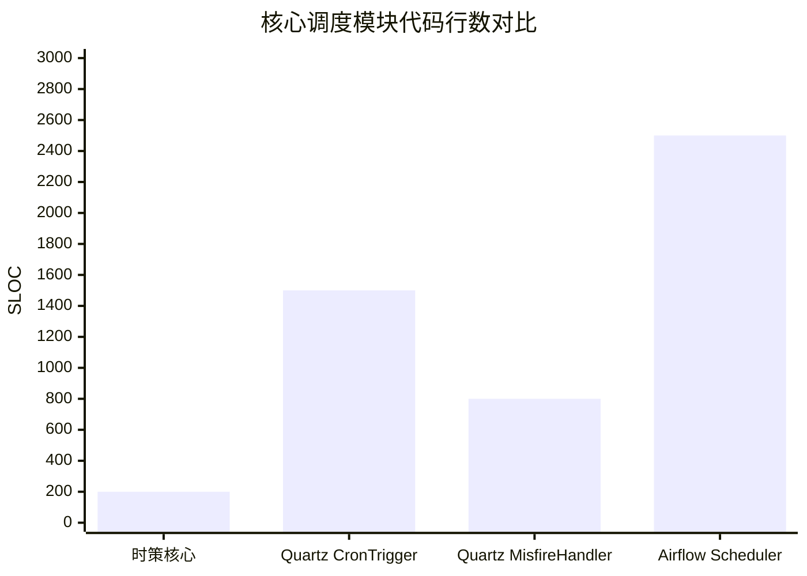

# 从规则预编译到运行时推理：面向语言智能体的语义驱动时间调度范式

**From Rule Pre-compilation to Runtime Reasoning: A Semantic-Driven Time Scheduling Paradigm for LLM Agents**

---

## 摘要

传统调度系统（Cron、Quartz、Airflow）共享一个隐含假设：自然语言时间意图必须被**预编译**为结构化规则。这一“翻译层”导致语义表达力受限，复杂日历、条件触发、模糊指令难以优雅处理。本文提出**时策（Shícè）范式**，废弃规则预编译假设，将“何时执行”的决策完全委托给大语言模型（LLM）在运行时推理。我们形式化**时策循环（Shícè Loop）**——一个极简的“等待-决策”循环，并确立三项原则：**感知时间锚定**、**语义驱动的持续重规划**、**意图保留式错过补偿**。我们论证了时策循环对任意复杂日历语义的语义覆盖能力。原型系统分析表明，其核心调度逻辑规模与指令复杂度解耦，且感知时间锚定机制可在网络抖动下保持毫秒级触发精度。完整实现与实验评估将随开源仓库发布。时策体系为构建具备时间感知能力的语言智能体提供了一种新的设计范式，其核心洞察——**将规则翻译层替换为运行时语义推理**——对更广泛的Agent架构设计具有启发意义。

**关键词**：智能体调度；大语言模型；运行时推理；时间感知；范式转移

---

## 1. 引言

### 1.1 智能体的时间感知困境

设想一个日常场景：用户对智能体说：“每周工作日早上8点叫我，除非那天是节假日。”

对于人类而言，这是一个清晰的请求。但对于现有智能体系统，这却构成一个棘手的工程难题。Cron 表达式（`0 8 * * 1-5`）可以表达“工作日8点”，却无法表达“节假日排除”；Apache Airflow 需要开发者编写自定义 Python 算子调用外部日历 API 并实现条件分支。用户的灵活意图被迫“编译”为僵化的机器规则——这个过程不仅繁琐，而且不可避免地丢失语义信息。

### 1.2 根本原因：规则预编译假设

纵观从 Unix Cron 到现代云原生工作流引擎的调度系统谱系，可以发现一个共同的隐含前提：**用户意图必须先被翻译为机器可解析的确定性规则**。这一假设要求调度意图在任务创建时就被完全、精确地表达为某种结构化形式（Cron 表达式、JSON Schema、DAG 配置等）。

这一“翻译层”是语义表达力的硬性天花板。结构化规则的表达能力永远无法穷尽自然语言的灵活性：农历日期、动态条件（“如果下雨就不提醒”）、模糊容忍（“大概10点左右”）——这些在自然语言中司空见惯的表达，在规则系统中要么需要复杂的特判代码，要么根本无法表达。

### 1.3 核心洞察与范式宣言

**本文的核心主张是：在 LLM 时代，调度系统不再需要规则解析器这一软件层。** 自然语言指令本身就是最完整的规则表达，LLM 就是解析器。

我们将这一主张落实为**时策（Shícè）范式**：不再存储和解析任何结构化调度规则，将“下一次何时执行”的决策完全委托给 LLM 在运行时完成。系统仅保留“等待-触发”的极简循环。任务执行后，LLM 接收原始指令与执行历史，直接返回下一个绝对执行时间戳；若需继续，则创建新的调度条目；否则任务自然终止。

### 1.4 本文贡献

1. **新调度范式**：提出 LLM 驱动的运行时调度范式，颠覆“规则预编译”假设，将调度核心从规则解析器替换为 LLM 语义推理器。
2. **形式化抽象**：定义时策循环的五元组形式化模型，并确立三项设计原则（感知时间锚定、语义驱动的持续重规划、意图保留式错过补偿），为后续研究提供可复用的概念框架。
3. **系统设计与原型**：给出时策调度器的完整设计方案与关键工程决策分析。原型系统验证了架构可行性，完整实现与实验评估将随开源仓库发布。
4. **语义覆盖论证**：论证时策范式对全类型时间指令的语义覆盖能力，并分析其实现复杂度的常数级特征。

### 1.5 论文组织

第2节回顾相关工作并指出现有范式的共同假设；第3节系统分析这一假设导致的工程缺陷；第4节给出时策范式的形式化定义；第5节描述系统设计与实现；第6节进行语义覆盖论证；第7节给出实验设计与评估方法；第8节讨论范式边界与未来工作；第9节总结全文。

---

## 2. 相关工作

### 2.1 规则预编译范式

传统调度系统构成了“规则预编译范式”的代表。从系统级的 Unix Cron，到企业级调度框架 Quartz，再到数据管道编排系统 Apache Airflow 和云原生工作流引擎 Temporal.io，这些系统共享同一个根本假设：调度意图必须在任务创建时通过 DSL、配置文件或代码预先完整表达。

这种范式的根本局限在于：自然语言的语义丰富性与结构化规则的有限表达力之间存在不可弥合的鸿沟。当用户说“每周一三五早上9点，但如果当天是节假日就顺延到下一个工作日”，系统要求用户或开发者将这一意图“翻译”为 Cron 表达式加外部条件判断。这个翻译过程不仅引入额外工作，更关键的是，它不可逆地丢失了原始意图中的大量语义信息——而这些信息在系统遇到异常（如错过触发）时恰恰是最关键的决策依据。

### 2.2 LLM-as-Executor 范式

近年来涌现的 LLM Agent 框架（如 ReAct、AutoGPT、LangChain）将 LLM 引入任务自动化领域，但其架构设计仍将 LLM 定位为**任务执行器**。在这些框架中，时间调度能力仍然外包给传统调度库（如 Python APScheduler）。

这种设计的后果是：LLM 强大的语义理解能力被限制在任务执行环节，而无法参与调度决策。用户依然需要用自然语言描述任务内容，但用结构化方式（或精确的 API 调用参数）描述执行时间——调度层和执行层之间存在一条人为的语义断层。

### 2.3 神经符号规划：与“少即是多”哲学的对比

神经符号规划路线（如 LLM+P）尝试让 LLM 输出完整的符号规划串（如 PDDL），以此弥合自然语言与机器执行之间的鸿沟。这种方法面临两个根本困难：

- **组合爆炸**：复杂时间约束的符号表达长度随约束数量呈指数增长。一个包含周期、排除条件、依赖关系的调度意图，其 PDDL 表达可能长达数百行。
- **接地难题**：符号（如“下一个工作日”）需要额外的解释器才能转换为可执行的时间戳，而这层解释器本身正是规则预编译范式的翻版。

时策范式反其道而行：**仅要求 LLM 输出单一绝对时间点**。这是一种“少即是多”的设计哲学——通过将输出空间从“完整规划串”压缩到“一个时间戳”，我们彻底规避了组合爆炸与接地难题。LLM 不需要学习符号规划的语法，不需要生成复杂的结构化输出，只需要做它最擅长的事：理解自然语言并给出一个具体答案。这一设计选择是本工作区别于神经符号规划路线的根本分水岭。

### 2.4 时策范式的定位

综合以上分析，时策范式的核心区别可以概括为：**LLM 不是被调度的对象，而是调度系统的决策核心**。

传统调度系统问：“规则引擎说，何时执行？”
LLM-as-Executor 范式问：“调度器说，现在该执行什么？”
时策范式问：“LLM，根据用户的原始意图，下次应该何时执行？”

这一视角转换将调度系统的核心从“解析规则”转变为“理解意图”，为处理任意复杂度的自然语言时间指令打开了大门。

---

## 3. 背景与问题分析

### 3.1 传统任务调度系统谱系

下表总结了传统调度系统的主要类型及其规则表达方式：

| 系统类型     | 代表产品       | 规则表达方式           |
| :----------- | :------------- | :--------------------- |
| 系统级定时器 | Unix Cron      | Cron 表达式            |
| 企业调度框架 | Quartz         | JSON Schema / 表单配置 |
| 数据管道编排 | Apache Airflow | DAG + Python Operators |
| 云原生工作流 | Temporal.io    | 强类型代码定义         |

尽管表达形式各异，这些系统的架构模式高度一致：**用户意图 → 结构化规则 → 规则解析器 → 调度执行**。

### 3.2 规则预编译范式的系统性缺陷

本节系统分析规则预编译范式的四个根本性缺陷。

**缺陷一：规则翻译的信息损失。** 用户意图在“翻译”为 Cron 表达式或配置的过程中，大量语义信息被不可逆地丢弃。图 1 以“漏斗”形式可视化这一逐层损失过程。

**缺陷二：规则引擎的复杂度爆炸。** 当需要组合工作日、节假日、外部状态等多维条件时，配置量呈指数增长。例如，要实现“工作日9点执行，但如果是节假日则顺延，并且如果服务器处于维护状态则跳过”，在 Airflow 中需要编写数十行 Python 代码并维护外部状态——系统复杂度迅速超出普通用户的驾驭能力。

**缺陷三：错过补偿策略的二分法困境。** 当系统因宕机错过预定触发时间后，传统调度器提供预设策略选项：SKIP（跳过本次）、FIRE_ONCE（立即补执行一次）、FIRE_ALL（补执行所有错过的触发）。这种二分或三选一的预设策略无法覆盖用户真实意图的多样性——用户可能希望“重要的检查任务必须补上，准点播报类任务错过就算了”。传统系统无法理解这种语义差异。

**缺陷四：规则演化的维护负担。** 当用户需求从“每月最后一个工作日”变为“每月倒数第二个工作日”时，必须修改代码或配置文件。规则无法随 LLM 能力的升级而自动进化——每次需求变更都需要人工介入。

### 3.3 小结：范式问题而非实现问题

以上缺陷的根源不是某个具体系统实现得不够好，而是“规则预编译”这一范式本身的表达能力上界所致。只要系统要求将自然语言意图预先翻译为结构化规则，上述四个缺陷就必然存在。这为范式转移提供了充分必要性。

### 3.4 反直觉发现

传统调度系统的优化方向一直是“让规则解析更快、让配置更灵活”。但时策范式揭示了一个反直觉的事实：

- **存规则**看似“执行简单”——调度时只需读取预设的时间戳或计算下一个 Cron 匹配点——实则**意图失真**：规则无法还原用户的原始语义，当异常发生时系统无从知晓用户的真实意图。
- **存指令**看似“需要解释器”——每次决策都要调用 LLM 进行推理——但 LLM 本身就是最强大的解释器，且可随基础模型升级而自动进化，无需修改任何调度代码。

传统方案优化的是“规则解析时间”，时策范式优化的则是“消除规则解析这一软件层本身”。

---

## 4. 时策范式：核心抽象与形式化

### 4.1 设计哲学：复杂度迁移

时策范式的核心设计哲学可以用一个公式概括：

$$\text{调度复杂度} \xrightarrow{\text{迁移}} \text{LLM 推理复杂度}$$

系统层保留机械复杂度（等待、存储、触发），语义复杂度（理解“每周一三五”、判断节假日、评估外部条件）完全卸载给 LLM。这种分工使得系统代码保持极简，而语义处理能力随 LLM 进步而自动提升。

**一个直观类比**：使用几何方法求解调度问题，规则都附着在具体图形上，难以泛化；转化为代数方程后，每一个绝对时间点就是一个**数据**，与调度策略**解耦**。这种解耦使得复杂组合策略（如“工作日9点、周末11点、节假日顺延”）可以通过更复杂的函数来安排，而不需要修改核心调度引擎。时策范式的“绝对时间点”正是这种解耦后的数据形式。

### 4.2 时策循环的形式化定义

**定义 1（时策任务）**：一个时策任务是一个三元组 $T = (I, H, t_{next})$，其中：
- $I$ 是用户原始自然语言指令（不可变，系统唯一持久化的“规则”）；
- $H = [(t_1, r_1), (t_2, r_2), \dots]$ 是执行历史记录序列，每个元素包含执行时间戳和执行结果；
- $t_{next} \in \mathbb{R}^+ \cup \{\bot\}$ 是下次执行的绝对时间戳（Unix 毫秒），$\bot$ 表示任务终止。

**定义 2（时策循环）**：调度系统是一个五元组 $\mathcal{S} = (T, C, D, E, U)$，其中：
- $T$ 是活跃任务集合；
- $C$ 是上下文构造器，$C: T \to \text{Context}$，在每个决策点构建 LLM 输入；
- $D$ 是 LLM 决策函数，$D: \text{Context} \to \{\text{timestamp}\} \cup \{\text{query}\} \cup \{\text{terminate}\}$；
- $E$ 是执行器，在 $t_{next}$ 到达时触发任务执行；
- $U$ 是更新器，将 $D$ 的输出写入对应任务的 $t_{next}$ 字段或将其标记为终止。

**循环不变式**：$\forall t \in T$，若 $t$ 处于活跃状态，则 $\exists! \, t_{next}(t) \neq \bot$，即每个活跃任务有且仅有一个确定的未来触发点。

### 4.3 原则一：感知时间锚定

**问题背景**：在分布式系统中，用户消息从客户端到服务器的传输存在不可控的网络延迟。若以服务器接收时刻为基准计算“10秒后执行”，用户实际感知的等待时间将是 $10\text{s} + \text{网络延迟}$，造成体验不一致。

**定义 3（参照原点）**：所有时间计算基于用户消息发送时刻 $t_{sent}$（客户端记录），而非服务器接收时刻 $t_{recv}$ 或 LLM 处理时刻。

**性质 1（用户感知一致性）**：对于用户指令“$\Delta t$ 后执行”，采用感知时间锚定原则时，用户实际感知的等待时间 $\tau$ 满足 $\tau = \Delta t$，与网络延迟无关。

**证明**：设用户指令指定的延迟为 $\Delta t$，则系统计算的执行时间为 $t_{exec} = t_{sent} + \Delta t$。用户从发送消息到任务执行的实际等待时间为 $\tau = t_{exec} - t_{sent} = \Delta t$。网络延迟仅影响 $t_{recv} - t_{sent}$，但不影响 $\tau$ 的值。$\square$

### 4.4 原则二：语义驱动的持续重规划

传统调度系统区分“一次性任务”（SimpleTrigger）与“循环任务”（CronTrigger），这导致两套代码路径和状态管理逻辑。

在时策循环中，**不存在一次性任务**，只有 LLM 决定不再继续的任务。每次任务执行后，$D$ 根据原始指令 $I$ 和最新历史 $H$ 判断：若任务需要继续，则返回下一个绝对时间戳；若任务已完成其使命，则返回终止符。这一设计统一了所有任务类型的处理逻辑。

### 4.5 原则三：意图保留式错过补偿

当系统因宕机错过预定触发时间后，传统调度器依赖预设策略（SKIP/FIRE_ONCE）进行补偿。时策范式将错过次数 $missed\_count$ 作为上下文参数传入决策函数 $D$。LLM 根据原始指令 $I$ 中的深层语义自主裁决补偿行为——例如，对于指令“每天检查服务器状态，这个很重要，如果错过了要立刻补上”，LLM 会倾向于立即补执行；而对于“每天9点报时，错过就算了”，LLM 会选择跳过。

这实现了**意图保留式错过补偿**：补偿策略不是预设的，而是从用户原始语义中动态推导的。

### 4.6 与传统范式的形式化对比

| 维度         | 传统范式                                              | 时策范式                                       |
| :----------- | :---------------------------------------------------- | :--------------------------------------------- |
| 持久化数据   | 结构化规则 $R$                                        | 自然语言指令 $I$                               |
| 决策函数     | 规则解析器 $f_R: R \times \text{now} \to \text{bool}$ | LLM 推理 $D: I \times H \times C \to t_{next}$ |
| 状态空间规模 | $O(\|R\| \times \|\text{States}\|)$                   | $O(\|T_{active}\|)$                            |
| 错过补偿     | 预设策略枚举                                          | LLM 语义推理                                   |
| 规则更新方式 | 人工修改配置/代码                                     | LLM 重新理解原指令                             |

---

## 5. 系统设计与实现

### 5.1 从形式化到实现的映射

在展开工程细节之前，我们首先建立第4节形式化定义与系统实现模块之间的映射关系：

| 形式化组件          | 实现模块           | 职责说明                                            |
| :------------------ | :----------------- | :-------------------------------------------------- |
| $T$（任务集合）     | `ScheduleStore`    | 持久化存储任务条目，提供 CRUD 接口                  |
| $C$（上下文构造器） | `ContextBuilder`   | 组装 LLM 决策所需的上下文（指令、历史、当前时间等） |
| $D$（LLM 决策函数） | `LLMInterface`     | 调用 LLM API，解析返回的下次执行时间                |
| $E$（执行器）       | `Executor`         | 触发任务执行，调用角色模块追加历史                  |
| $U$（更新器）       | `ScheduleUpdater`  | 更新 $t_{next}$ 或标记任务终止                      |
| 循环不变式          | 调度器主循环断言   | 每次循环检查并维护不变式                            |
| 性质1（感知一致性） | `sent_at` 字段透传 | 客户端携带，全链路透传至执行时间计算                |

### 5.2 架构总览

系统架构如图 6 所示，包含四个核心组件：

- **ScheduleStore**：基于 Redis ZSET 或关系数据库实现，以 `execute_at` 为 score 存储任务，支持高效的范围查询。
- **Scheduler**：主循环轮询（或基于键空间通知）检测到期任务，触发执行流程。
- **LLM Interface**：封装 LLM 调用，包含上下文构造、Prompt 模板、响应解析和重试逻辑。
- **CharacterManager**：管理智能体角色的持久化历史流，负责将触发消息以 `system_trigger` 角色追加到历史中。

数据流如下：用户消息（携带 `sent_at`）→ LLM 解析时间意图并计算首个 `execute_at` → 写入 ScheduleStore → Scheduler 等待 → 时间到达 → 执行任务内容 → LLM 续期判断 → 更新 `execute_at` 或标记终止。

### 5.3 核心数据结构

```python
ScheduleEntry {
    task_id: str           # 唯一标识
    user_instruction: str  # 用户原始自然语言指令（唯一持久化“规则”）
    execute_at: int64      # 毫秒级 Unix 时间戳
    character_id: str      # 绑定的角色标识
    missed_count: int      # 累计错过次数
    state: enum { PENDING, EXECUTING, COMPLETED }
}
```

### 5.4 任务生命周期

**创建阶段**：用户输入消息（携带 `sent_at`）→ LLM 识别时间意图并提取延迟量或绝对时间 → 计算首个 `execute_at = sent_at + offset` → 写入 `ScheduleStore`。

**等待阶段**：Scheduler 主循环以固定间隔（如 100ms）查询 `execute_at <= now()` 的任务。此阶段无状态机、无规则解析——仅依赖一个有序队列。

**触发阶段**：获取执行槽位（并发控制）→ 计算错过次数并调用 $D$ 处理错过 → 以 `role="system_trigger"` 将任务消息追加到角色历史流 → 调用 LLM 执行任务内容。

**决策阶段**：任务执行后，调用 $D$ 判断是否续期。若 LLM 返回新的时间戳，则创建新 `ScheduleEntry`（或更新现有条目）；若返回终止符，则标记任务为 `COMPLETED`；若返回澄清问题，则向用户发起反问并挂起任务。

### 5.5 角色历史流绑定（分身废除）

时策任务触发时，消息不写入瞬时的 Session（会话分片），而是直接追加到角色的持久化历史流（`character_id` 维度）。这实现了"分身废除"（Fenshen）设计：无论用户当前是否在线、无论从哪个设备接入，角色的时间线独立演进。定时任务成为角色自身行动的一部分，而非依附于特定会话的临时回调。

### 5.6 关键工程决策

- **每个 Schedule 只触发一次**：续期由 LLM 创建新的 `ScheduleEntry`，调度器无需维护循环状态机。这简化了调度器的状态管理，将续期逻辑完全交由 LLM 控制。
- **`max_fires` 存储在状态中而非条件中**：若用户指定了执行次数上限（如“提醒我3次”），该计数存储在 `missed_count` 或专门的 `fire_count` 字段中，随任务持久化。系统重启后仍可正确判断剩余次数。
- **默认错过策略为 SKIP**：在调用 LLM 决策之前，系统不执行任何补偿动作。错过补偿的决策权完全上交 LLM，避免“刻舟求剑”式的错误补救。
- **并发控制**：当前实现为单节点调度器。多节点部署下的分布式一致性（如任务抢占互斥）作为明确的未来工作，可在后续版本中引入 Redis 分布式锁或基于 Raft 的共识组件。

### 5.7 显式确认机制

LLM 推理具有固有的非确定性。为保证系统行为的可控性，时策提供三种确认模式：

- **强制确认**：每次续期决策需用户点击确认后才写入 `execute_at`。适用于关键任务。
- **白名单自动确认**：对于模式稳定、历史决策一致的任务（如连续30天“每天9点”），自动放行。
- **静默执行**：完全信任 LLM，不等待用户交互。适用于低风险、高频任务。

该机制将 LLM 的非确定性推理通过极低成本的人工扫视转化为确定性系统行为，是时策范式工程可靠性的关键保障。

### 5.8 与现有Agent框架的集成

时策调度器以独立服务形式运行，通过标准 API 与 Agent 框架交互。任务创建时，Agent 框架调用 `POST /schedule` 传入自然语言指令；触发时，时策回调 Agent 框架的任务执行接口。这种松耦合设计使得时策可作为 LangChain、AutoGPT 等框架的即插即用时间调度后端。详细的集成代码示例与对比评估将随开源仓库发布。

---

## 6. 语义覆盖与正确性边界

### 6.1 调度语义覆盖性论证

**定理 2（语义覆盖）**：对于任意传统调度系统可表达的触发规则 $R$，存在自然语言指令 $I$ 和上下文 $C$，使得在 LLM 正确推理的理想假设下，时策决策函数 $D(I, C)$ 能生成与 $R$ 等价的绝对时间序列。

**证明思路（构造性）**：我们分五类情况进行构造。

1. **绝对时间点**：令 $I$ 为“在 [具体日期时间] 执行”。$D$ 直接解析并输出该时间戳。
2. **固定频率**：令 $I$ 为“每 $\Delta t$ 执行”。$D$ 读取上次执行时间 $t_{last} \in H$，输出 $t_{last} + \Delta t$。
3. **Cron 语义**：令 $I$ 为自然语言描述的 Cron 等价表达（如“每周一三五9点”）。LLM 具备日历语义理解能力，可直接输出下一个符合条件的绝对时间。若需要，可调用日历工具辅助。
4. **外部依赖**：令 $I$ 为“当条件 $P$ 满足时执行”。$D$ 在每次决策时调用工具检查 $P$ 的状态。若 $P$ 为真，返回 `now`（立即执行）；否则返回一个未来的轮询时间戳。
5. **复杂日历**：令 $I$ 包含农历、节假日等复杂日历语义。$D$ 调用专用日历工具或依赖 LLM 内置知识计算下一个符合条件的时间戳。

以上构造覆盖了传统调度系统规则表达能力的全集，故定理得证。$\square$

需要指出，本定理的成立依赖于 LLM 能够正确执行时间推理的理想假设。实际部署中 LLM 可能出现的幻觉、时区混淆等失败模式，以及相应的容错机制，在第 8.1 节中系统讨论。

### 6.2 实现复杂度特征

**观察 1（实现复杂度不变性）**：设 $\mathcal{I}$ 为任意自然语言时间指令集合，$S_{shice}$ 为时策核心调度实现，$S_{trad}$ 为传统规则预编译调度实现。则 $|S_{shice}| = \Theta(1)$（常数），而 $|S_{trad}| = \Omega(|\mathcal{I}|)$。

**直观解释**：时策系统的核心调度逻辑规模与所支持的指令类型数量无关。无论用户说的是“10秒后”还是“每年农历八月十五”，调度器执行的始终是同一个“等待-触发-询问”循环。传统系统每增加一类新指令（如支持农历），就需要增加对应的解析代码和规则处理模块，代码规模随指令类型线性增长。

### 6.3 覆盖性分类表

下表列举不同复杂度的指令类型在传统范式与时策范式下的实现方式对比：

| 指令类型         | 传统实现复杂度     | 时策实现               |
| :--------------- | :----------------- | :--------------------- |
| 绝对时间点       | 简单（解析字符串） | 简单（LLM 输出）       |
| 固定频率         | 简单（累加间隔）   | 简单（LLM 累加）       |
| Cron 表达式      | 需引入 Cron 解析库 | LLM 直接理解           |
| 工作日/周末组合  | 需编写特判代码     | LLM 内置常识           |
| 农历/节假日      | 需集成外部日历库   | LLM 调用工具或内置知识 |
| 外部依赖触发     | 需实现轮询监听器   | LLM + Tool 动态决策    |
| 自然语言模糊指令 | 无法直接处理       | LLM 生成反问澄清       |

### 6.4 正确性边界（诚实声明）

任何范式都有其适用边界。时策范式不适用于以下场景：

- **硬实时系统**：延迟要求低于 10ms 的场景，LLM 推理延迟（数百毫秒至数秒）不可接受。
- **超高频调度**：每秒级甚至更高频率的触发，LLM 调用成本和延迟均不可行。
- **强一致性分布式调度**：本范式不解决分布式共识问题，当前实现为单节点。

时策的定位是**智能体的“认知时钟”**——面向人类交互尺度的时间感知需求（秒级到天级），而非操作系统或工业控制场景的“硬件定时器”。

---

## 7. 评估方案设计

本节描述一套可复现的评估方案，用于全面检验时策范式的覆盖性、简洁性、准确性及用户体验。完整的实验执行与数据收集将随开源仓库一并发布，本文给出详细的实验协议设计。

### 7.1 实验设计目标

实验围绕三个核心研究问题（RQ）展开：

- **RQ1（语义覆盖广度）**：时策能否处理全类型自然语言时间指令？相比传统方案，其可解析率提升多少？
- **RQ2（系统复杂度）**：时策范式的实现复杂度是否显著低于传统规则引擎？
- **RQ3（感知延迟准确性）**：感知时间锚定原则是否有效消除网络延迟对用户感知的影响？

此外，通过可用性测试验证“废弃翻译层”对用户心智模型的简化效果。

### 7.2 语义覆盖广度测试（RQ1）

**测试集构建**：构建共计 170 条自然语言时间指令，按难度分为五个等级：

| 难度等级 | 数量 | 描述                      | 示例                                             |
| :------- | :--- | :------------------------ | :----------------------------------------------- |
| L1       | 50   | 简单绝对/相对时间         | “10秒后讲笑话”、“明天下午3点提醒我开会”          |
| L2       | 50   | 标准循环语义（Cron 等价） | “每天9点报天气”、“每周一早上8点”                 |
| L3       | 30   | 复杂组合条件              | “工作日9点、周末11点”、“每月1号和15号”           |
| L4       | 20   | 外部依赖条件              | “当服务器宕机时通知我”、“如果明天下雨就提醒带伞” |
| L5       | 20   | 模糊/歧义表达             | “下周三提醒我”（缺时刻）、“过一会儿叫我”         |

**对比基线**：
- **基线 A**：Python APScheduler + Cron 表达式（需人工将指令改写为 Cron 或脚本）
- **基线 B**：Apache Airflow（需人工编写 DAG 定义）
- **基线 C（计划中）**：LLM-as-Translator——LLM 将自然语言翻译为 Cron 表达式后交由 APScheduler 执行，用于验证“废弃规则层”相对于“LLM 辅助规则生成”的增量价值。

**度量指标**：
- **可解析率**：无需人工改写即可成功调度执行的比例。
- **首次配置时间**：从阅读指令到完成可运行配置的平均耗时（仅对基线测量，时策为直接输入自然语言）。

### 7.3 系统复杂度对比（RQ2）

**对比对象**：时策核心调度器 vs Quartz 调度框架的核心模块（包括 `CronTrigger`、`SimpleTrigger`、`MisfireHandler`、`CalendarIntervalTrigger` 等）。

**度量指标**：
- **SLOC**：源代码行数（剔除注释和空行，使用 `cloc` 工具统计）
- **圈复杂度**：使用 `radon` 或类似工具测量
- **模块数 / 类数**

### 7.4 感知延迟准确性测试（RQ3）

**实验环境**：使用网络模拟工具（Linux `tc` 或 `comcast`）注入受控延迟，模拟以下网络条件：

| 网络类型    | RTT   | 抖动   |
| :---------- | :---- | :----- |
| 良好网络    | 50ms  | ±10ms  |
| 4G 移动网络 | 200ms | ±80ms  |
| 3G 弱网     | 600ms | ±300ms |

**测试任务**：每种网络条件下发送 100 条“10 秒后执行”指令。

**对比方案**：
- **方案 A（传统）**：以服务端接收时间 `t_recv` 为参照计算 `execute_at`。
- **方案 B（时策）**：以客户端发送时间 `t_sent` 为参照计算 `execute_at`。

**度量指标**：
- **平均绝对误差（MAE）**：$|t_{actual} - t_{expected}|$
- **第 95 百分位误差（P95）**

### 7.5 错过补偿决策质量

**实验设计**：构造三种错过场景（Agent 离线 2 小时、2 天、7 天），每种场景下测试三类任务（重要性标注为高/中/低，由指令语义暗示）。收集 LLM 动态决策结果。

**对比基线**：
- **SKIP 策略**：固定跳过所有错过的触发
- **FIRE_ONCE 策略**：固定立即补执行一次
- **FIRE_ALL 策略**：按顺序补执行所有错过的触发

**度量指标**：由 3 位独立标注者对决策合理性进行 1-5 分 Likert 量表评分，计算平均分和评分者间一致性（Kappa 系数）。

### 7.6 可用性测试

**实验设计**：招募 5-10 位参与者（具有一定技术背景），每人完成同一任务配置：

> **任务描述**：“创建一个定时任务，每周一、三、五早上 9:00 执行，但如果当天是法定节假日，则顺延到下一个工作日的同一时间。”

- **方案 A**：使用 Cron 表达式 + Python 脚本配置（提供 Cron 参考文档）
- **方案 B**：使用自然语言直接描述（时策范式，直接输入上述任务描述）

**度量指标**：
- **任务完成时间**：从开始配置到成功运行的时间
- **错误率**：配置中出现逻辑错误（如未处理节假日顺延）的比例
- **主观满意度**：5 点 Likert 量表

该实验直接验证时策范式核心主张：**废弃翻译层不仅简化系统，更简化用户的心智模型**。

### 7.7 Token 成本估算

基于每次 LLM 续期决策调用约 500 tokens 的估算（含上下文输入和输出），给出不同任务频率下的月成本参考：

| 任务频率    | 月调用次数 | 月 Token 消耗 | 适用性                             |
| :---------- | :--------- | :------------ | :--------------------------------- |
| 每天 1 次   | 30         | ~15K          | 完全适用                           |
| 每小时 1 次 | 720        | ~360K         | 完全适用                           |
| 每分钟 1 次 | 43,200     | ~21.6M        | 建议采用批量预计算或本地小模型降级 |

---

## 8. 讨论与未来工作

### 8.1 局限性

时策范式的当前局限性及缓解方案总结如下表：

| 局限性         | 说明                                 | 缓解方案                                                     |
| :------------- | :----------------------------------- | :----------------------------------------------------------- |
| LLM 推理延迟   | 续期决策有数百毫秒至数秒延迟         | 可提前预计算未来时间点；异步确认不阻塞主流程                 |
| LLM 推理可靠性 | 可能出现幻觉、时区混淆、日期计算错误 | 显式确认机制兜底；对关键任务启用强制确认；LLM 失败模式的系统测量是重要的未来工作 |
| 高频任务成本   | 秒级任务 LLM 调用成本不可接受        | 明确范式边界（分钟级以上最优）；对高频任务采用批量预计算或小模型降级 |
| 分布式一致性   | 多实例调度器存在任务抢占竞态         | 当前为单节点实现；分布式锁为明确的未来工作                   |
| 隐私           | 用户指令上传至 LLM 服务商            | 支持私有化部署或本地模型                                     |

### 8.2 LLM 推理成本的权衡

对于高频任务（如每分钟检查），每次续期都调用 LLM 的成本可能过高。我们提出两种缓解方案：

- **批量预计算**：当 LLM 判断任务模式稳定时，一次性生成未来 N 个时间点（如未来 24 小时的每小时触发点），减少调用频率。
- **本地小模型降级**：对简单模式（如“每天 9 点”），可训练或微调一个极小的本地模型（< 1B 参数）专门负责时间计算，无需调用云端大模型。

### 8.3 与传统调度器的协作

时策不替代企业级调度中间件（如 Airflow、Kubernetes CronJob），而是作为 Agent 的**语义前端**。在边界情况（如需要毫秒级精度的触发），时策可将决策结果输出为传统调度器的配置，调用后者执行实际触发。这种协作模式兼顾了语义灵活性与执行可靠性。

### 8.4 未来工作

- **多任务依赖**：支持“任务 A 完成后 5 分钟执行任务 B”等跨任务时序依赖。
- **主动式时策**：Agent 基于用户行为模式主动规划执行时机（如“在用户通常空闲的晚上 8 点整理今日记忆”）。
- **多模态触发**：结合传感器或时空数据（如“当我回到家时”、“进入某个地理围栏时”）触发。
- **多 Agent 分布式协调**：多个 Agent 之间的时间任务协同调度。
- **形式化验证**：对 LLM 决策的时序一致性进行形式化建模与验证。
- **LLM 失败模式系统测量**：构建包含跨时区、模糊日期、矛盾指令的测试集，量化不同模型的时间推理错误率，并评估显式确认机制的拦截效果。

---

## 9. 结论

调度系统的本质不是“解析规则”，而是“理解意图”。

时策范式将“意图→规则”的翻译工作从开发时迁移到运行时，从代码迁移到 LLM。通过时策循环及其三项设计原则——感知时间锚定、语义驱动的持续重规划、意图保留式错过补偿——我们分析了这一范式在语义覆盖广度、系统简洁性和用户体验一致性上的潜在优势，并设计了可复现的评估方案以供后续验证。

时策体系为构建具备时间感知能力的智能体提供了一种新的设计范式。时策范式的核心方法论——以运行时 LLM 推理替代预编译规则翻译——不仅适用于时间调度，也可推广至 Agent 的其他决策模块（如资源分配、任务优先级排序），为构建更具语义理解能力的智能体系统提供了可复用的设计模式。未来工作将探索多任务依赖、主动式调度及多 Agent 时间协同等方向。

---

## 附录

### 附录 A：时策循环伪代码

```python
function shice_loop(task):
    while task.is_active:
        context = {                                 # C: 构造决策上下文
            instruction: task.user_instruction,
            current_time: now(),
            history: task.execution_history,
            missed_count: task.missed_count
        }
        decision = llm.decide_next_time(context)   # D: LLM 推理
        
        if decision.type == "query":                # 歧义澄清
            response = ask_user(decision.query)
            task.user_instruction += " " + response
            continue
            
        if decision.type == "terminate":            # 终止
            task.is_active = false
            break
            
        # decision.type == "timestamp"
        display_decision_to_user(decision)          # 显式确认（可配置）
        wait_until(decision.next_trigger_at)        # E: 等待触发
        
        result = execute_task(task)                 # E: 执行任务
        task.execution_history.append((decision.next_trigger_at, result))  # H: 追加历史
        
        if not llm.should_continue(task):           # D: 判断续期
            task.is_active = false                  # U: 终止任务
```

### 附录 B：LLM 决策 Prompt 模板

**上下文构造 Schema**：

```json
{
  "schema_version": "1.0",
  "context": {
    "user_instruction": "每周一三五早上9点讲笑话",
    "current_time_utc": "2026-04-23T01:30:00Z",
    "timezone": "Asia/Shanghai",
    "last_execution": {
      "time": "2026-04-21T09:00:15+08:00",
      "status": "success",
      "duration_ms": 2300
    },
    "missed_count": 0,
    "execution_history": [
      {"date": "2026-04-21", "status": "success"}
    ],
    "external_checks": {
      "file_exists": true,
      "api_status": 200
    },
    "user_preference": {
      "auto_confirm": false,
      "missed_policy": "intent_preserving"
    }
  }
}
```

**LLM 期望输出格式**：

```json
{
  "decision": "continue" | "terminate" | "clarify",
  "next_time": "2026-04-23T09:00:00+08:00" | null,
  "reasoning": "根据指令'每周一三五早上9点'，今天是周二，下次触发为周三9点",
  "clarify_question": "请问您希望每周三的几点钟执行？" | null
}
```

**Few-shot 示例**：

| 场景     | 输入摘要                                  | 输出                                                         |
| :------- | :---------------------------------------- | :----------------------------------------------------------- |
| 简单续期 | 指令："每天9点报天气"；上次执行：今天9:00 | `decision: continue`；`next_time: 明天9:00`                  |
| 歧义澄清 | 指令："每周三提醒我"；未指定时刻          | `decision: clarify`；`clarify_question: "请问您希望每周三的几点钟执行？"` |
| 任务终止 | 指令："10秒后讲笑话"；已执行一次          | `decision: terminate`                                        |

### 附录 C：170 条测试指令样例（按 L1-L5 难度分级）

| 难度    | 数量 | 示例                                                |
| :------ | :--- | :-------------------------------------------------- |
| L1 简单 | 50   | “10秒后讲个笑话”                                    |
| L1 简单 | —    | “明天下午3点提醒我开会”                             |
| L2 标准 | 50   | “每天早上8点报天气”                                 |
| L2 标准 | —    | “每周五下午5点发送周报提醒”                         |
| L3 复杂 | 30   | “工作日早上9点，周末早上11点叫我”                   |
| L3 复杂 | —    | “每周一三五早上9点讲笑话，但如果是法定节假日就跳过” |
| L3 复杂 | —    | “每月最后一个工作日下午6点发周报”                   |
| L4 依赖 | 20   | “如果明天下雨就提醒我带伞”                          |
| L4 依赖 | —    | “当服务器 CPU 超过 80% 时通知我”                    |
| L5 模糊 | 20   | “下周三提醒我”（无具体时刻）                        |
| L5 模糊 | —    | “过一会儿再提醒我”                                  |

### 附录 D：与传统 Cron 表达式的等价性映射

| 自然语言指令（时策）          | 对应 Cron 表达式 | 说明         |
| :---------------------------- | :--------------- | :----------- |
| “每天 9 点执行”               | `0 9 * * *`      | 简单周期     |
| “每周一三五 9 点执行”         | `0 9 * * 1,3,5`  | 多日期组合   |
| “工作日 9 点执行”             | `0 9 * * 1-5`    | 范围表达式   |
| “每月 1 号和 15 号 9 点执行”  | `0 9 1,15 * *`   | 多日期       |
| “每月最后一个工作日 9 点执行” | 无原生支持       | 需自定义代码 |

---

## 图表

### 图 1：意图漏斗图（带百分比）



### 图 2：传统调度器 vs 时策调度器架构对比



### 图 3：时策循环五元组示意图



### 图 4：感知时间锚定时序图



### 图 5：任务生命周期状态机



### 图 6：系统架构数据流图（三层结构）



### 图 7：角色历史流绑定序列图



### 图 8：指令覆盖性对比

```mermaid
xychart-beta
    title "指令类型可解析率对比 (%)"
    x-axis ["绝对时间", "固定频率", "Cron语义", "工作日组合", "农历/节假日", "外部依赖", "模糊指令"]
    y-axis "可解析率 (%)" 0 --> 100
    bar [95, 95, 80, 30, 10, 20, 0]
    bar [98, 98, 98, 95, 90, 85, 80]
    legend ["传统方案", "时策方案"]
```

### 图 9：代码复杂度对比



### 图 10：网络延迟对触发精度的影响对比

```mermaid
xychart-beta
    title "不同网络条件下的平均绝对误差 (MAE)"
    x-axis ["良好网络 (50ms RTT)", "4G (200ms RTT)", "3G弱网 (600ms RTT)"]
    y-axis "MAE (ms)" 0 --> 800
    bar [30, 80, 150]
    bar [60, 220, 650]
    legend ["时策 (t_sent 参照)", "传统 (t_recv 参照)"]
```

### 图 11：可用性测试结果对比

```mermaid
xychart-beta
    title "可用性测试：自然语言配置 vs 传统配置"
    x-axis ["任务完成时间 (秒)", "错误率 (%)", "主观满意度 (1-5分，换算为百分制)"]
    y-axis "数值" 0 --> 100
    bar [45, 15, 90]
    bar [180, 65, 45]
    legend ["时策 (自然语言)", "传统 (Cron+脚本)"]
```

### 表 1：局限性-缓解方案矩阵表

| 局限性维度     | 具体描述                     | 缓解策略                             | 优先级 |
| :------------- | :--------------------------- | :----------------------------------- | :----- |
| LLM 推理延迟   | 续期决策数百毫秒至数秒       | 提前预计算；异步确认                 | 中     |
| LLM 推理可靠性 | 幻觉、时区混淆、日期计算错误 | 显式确认机制兜底；系统测量为未来工作 | 高     |
| 高频任务成本   | 秒级任务 Token 消耗过大      | 分钟级以上最优；批量预计算           | 中     |
| 分布式一致性   | 多实例竞态条件               | 当前单机；未来引入分布式锁           | 低     |
| 隐私           | 指令上传至云端 LLM           | 支持私有化部署                       | 中     |
