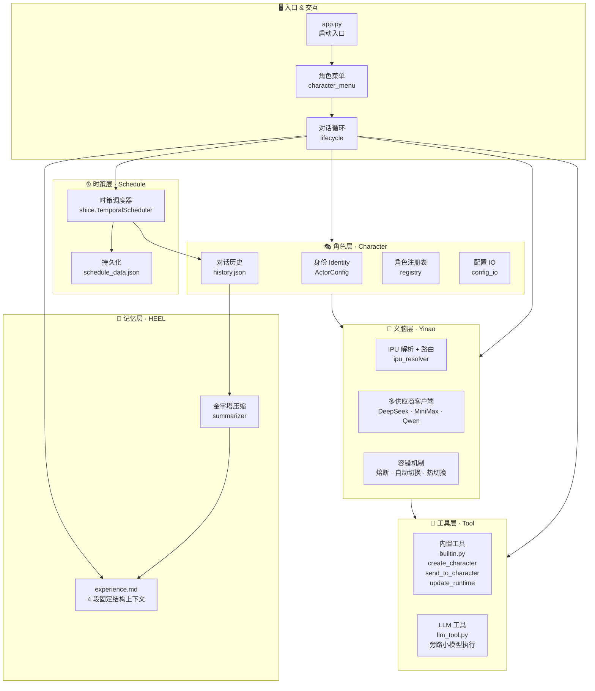

# Jardias项目介绍

## 项目概述

Jardias 是一套 Agent 框架的参考实现，展示自主协作、记忆管理、语义驱动调度等能力的构造性证明。适合研究、实验和二次开发。当前Jardias实现是一个让 AI 不只是回答问题，而是自主协作、记忆成长、时间感知的认知主体框架，最大程度做好底层抽象，为将来的系统进化提供开放接口。

## 运行和开发提示
```Bash
#  Quick Start
git clone https://github.com/xxx/jardias
cd jardias
python -m venv venv && venv\Scripts\activate
pip install -r requirements.txt
# 至少配置一个 LLM （本项目称IPU）供应商的 API Key
cp .env.example .env
# 跑起来
python app.py
```

> 详见 [运行和开发提示文档](doc/运行和开发提示.md)

## 项目名称

**Jardias（佳递叶思）**——Just A Rather Dimension-Free-Updating Intelligent Actor System.

> It doesn't fly, it doesn't fight. But it keeps updating to break the dimensional wall.

## 特色功能演示

概述：
智能体创建角色辩论（自触发深度精炼）
双角色自我手术（智能体递归自主进化）
上下文控制（HEEL记忆架构及ACP）
 时策系统
- 歧义/边界确认
- 语义化错过补偿+根据条件调整定时
- 动态干预

> 演示说明文档（链接）
> 真实运行输出（链接）
> 实际运行录屏（链接）

## 功能特色对照表

Jardias 的功能边界由"哪些能力是别的项目从架构前提上做不到的"来界定。下表把四大特色能力逐项拆解到"实现机制 + 同类项目对照"两层：

| 能力 | 实现机制 | LangChain / CrewAI / AutoGen 是否能做到 |
|---|---|---|
| **智能体创建角色辩论（自触发深度精炼）** | `create_character` 工具让 Agent 在推理中动态创建并配置新角色（指定 provider / ipu / temperature / top_p / thinking），多个角色共享 history 流并行推理 | 不能——多 Agent 角色需用户在框架外预先定义并填配置；Agent 自身没有"创建 Agent"的元操作 |
| **双角色自我手术（递归自主进化）** | `send_to_character` + `update_runtime` 工具链 + `update_identity` 让创建出的角色反过来承担后续对话，并可通过工具调用修改自己或对方的运行时配置 | 部分——能创建多 Agent，但配置（模型/温度/工具集）属于框架外部，Agent 不能读写自己的配置 |
| **上下文控制（HEEL 记忆架构 + ACP）** | O(1) 4 段消息上下文 + L1/L2/L3 摘要 + 关注域判据 + 状态文件锚定目标 $Q$——历史压缩按"加工状态"而非"语义类型"分类 | 不能——主流方案仍按消息序列线性增长上下文，或只做摘要压缩；没有"就绪性-触发度"分离的双层决策 |
| **时策系统（语义驱动调度）** | `shice_schedule_add/list/cancel` 工具 + `TemporalScheduler` 时间戳队列模型——LLM 在运行时推理下一个绝对时间戳并预计算所有触发点，错过由 LLM 语义推导补偿与模式切换。不依赖Cron，而是可以作为Cron及任何成熟方案的策略层。 | 不能——主流调度（Cron / Airflow / Temporal）依赖规则预编译；自然语言意图必须翻译为结构化表达式，意图保真度不可逆地丢失 |
| **歧义/边界确认** | system prompt 注入"用户描述时间若存在歧义/边界不清应主动询问"的硬规则 + LLM 语义识别 | 部分——能加 guardrail，但调度器本身仍要求用户输入精确规则 |
| **语义化错过补偿** | 调度器只管"过期≤60s 立即触发并标记 late_sec"，补偿策略（补哪些、改哪些、要不要切间隔）全部由 LLM 在 system_trigger 消息中语义推导 | 不能——只有预设策略枚举（SKIP / FIRE_ONCE / FIRE_ALL），无法做"重要的检查任务补上、播报类跳过"的语义区分 |
| **动态干预** | 用户的取消信号以普通消息注入 history 流，LLM 识别后调用 `shice_schedule_cancel` 一次性撤销 | 部分——能监听用户输入但需要额外的取消事件总线；不与调度器语义融合 |
| **跨 Session 精确回忆** | L1 段摘要 + O(1) 4 段上下文 + 角色绑定终身记忆库（`character_data/<timestamp>-<name>/`）；Session 只是视图，身份不与会话同生灭 | 部分——能持久化历史，但身份与 Session 通常强绑定；切换 Session 等于身份销毁 |
| **多模型热切换** | `update_runtime` 工具 + IPU_REGISTRY 路由 + `request_switch` 切换标志在工具执行间隙被检测；切换不重启 | 不能——主流方案需重启进程或重连客户端才能切换底层模型 |
| **`··` 快速路由** | `··角色名` / `··工具名` 语法绕过 LLM 决策，确定性执行跨角色切换或工具直调 | 不存在——主流方案没有把内部能力暴露为用户可寻址命令空间的设计 |

## 命名体系

根据《命名即架构》（链接），命名决定了我们对架构的理解（反向同样成立），错误的命名会限制我们突破旧有范式，因此本项目执行以下命名重构方案：

| 原始术语 | 重构后术语 | 说明 |
|---|---|---|
| AI Model（AI 模型） | 智能基元（IPU） | Intelligence Primitive Unit |
| 模型调用管理模块 | 义脑（Yinao） | IPU 路由 + 供应商抽象层 |
| Token（矢量文本） | 保持 token，计量单位：智点（ICP） | Intelligence Count Point |
| Pixel Patch（矢量像素） | 保持 Pixel Patch，计量单位：智点 | 与 token 统一计量 |
| Agent（智能体） | 智能体 / 智能演员（Actor） | 强调自主行动能力 |
| Agent System（智能体系统） | 智能体系统 / 智能演员系统（Actor System） | — |
| 扮演具体设定的智能体 | 角色（character） | 使用时直接称呼具体角色名 |

## 系统架构



## 分层

| 层 | 职责 |
|---|---|
| CLI 入口 | 启动、角色选择、对话循环 |
| 角色层 | 身份管理、对话历史、多角色编排、配置即记忆 |
| 义脑层 | 多供应商抽象、IPU 路由、容错热切换（不重启换模型） |
| 工具层 | 内置工具 + `@llm_tool` 装饰器旁路执行 |
| 记忆层 | HEEL 4 段固定上下文，金字塔压缩 L1→L2→L3，上下文占用 O(1) |
| 时策层 | LLM 语义驱动调度，错过补偿，动态干预 |

> 详细架构见 [开发文档](doc/架构图-详细.md)

## 设计原则

组合优于继承：目前为止项目未使用自定义继承
使用策略表：用 dict 做分发表代替if-elif 链和策略类
AI辅助编程的测试以文本为核心：优先检查终端输出、日志记录，代码稳定的模块使用单元测试。

## 理论支撑——解释项目设计思路

- 《HEEL》——【记忆方案】以"可注入性"为判据，将记忆按加工状态分为历史、经验、外部、逻辑四层
- 《时策》——【定时任务调度架构】LLM 直接作为调度决策核心，语义推导代替规则预编译
- 《配置参数化》——【自指涉平面】模型参数从外部配置移入记忆层，Agent 获得读写自身、创建修改角色的能力
- 《Agent 长程任务执行架构方案》——【长程架构】"上下文占用的永久宽裕"作为记忆方案正确性的架构判据
- 《长程任务与关注域》——【资源调度】可注入性问资格、关注域问激活，二者序贯管理认知资源
- 《AgentOS 范式总纲》——【范式总纲】破壁定理：单标量管多维度时准确率上限 50%，唯一出路是策略升维
- 《AIOS》——【认知 OS】将操作系统设计哲学（进程、虚拟内存、页表）整套迁移到 Agent 架构
- 《Agent OS 范式下的研究议程》——【开放课题】注意力预算、负向记忆、自适应遗忘率等未决问题
- 《Agent Context Protocol》——【协议设计】为会话状态、时间戳、分层记忆设计结构化载体，取代扁平 messages 数组
- 《破壁定理》——【认知如何突破旧有范式】参数优化总会遇到次元壁，需要通过策略升维实现破壁。
- 《维度自由更新（Dimension-Free Updatism）》参数优化是贝叶斯更新，对贝叶斯更新进行递归更新操作，实现范式创新。

> （文档链接）


## 开源协议

> 协议文档（链接）

